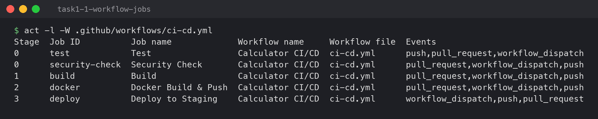
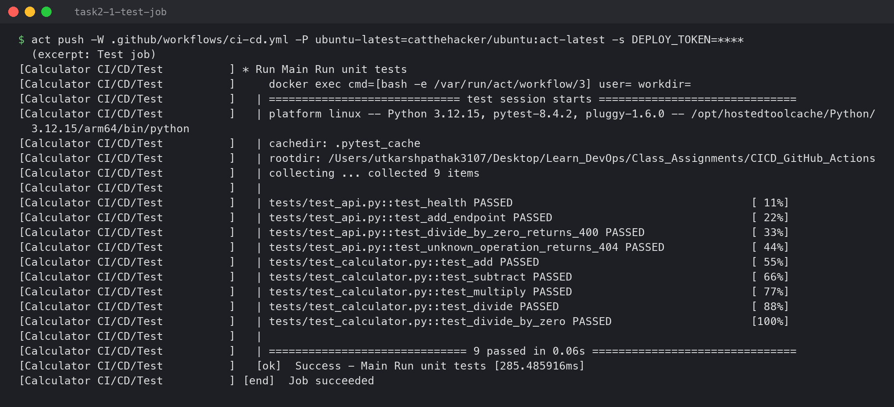
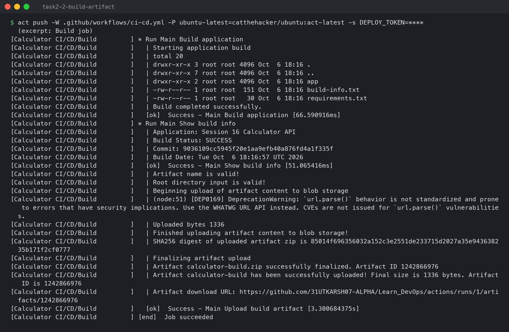
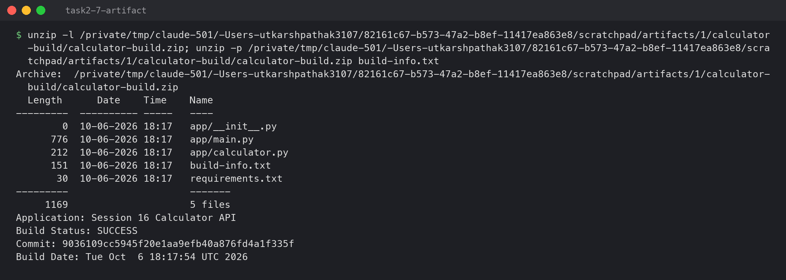
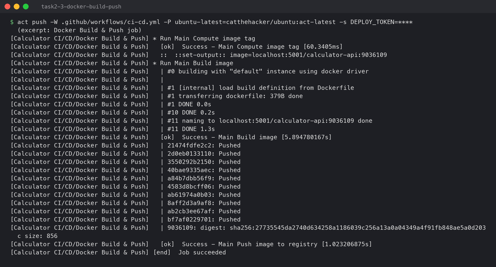
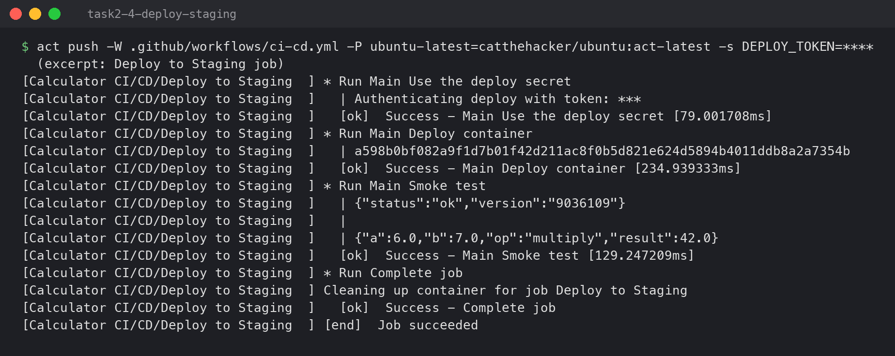
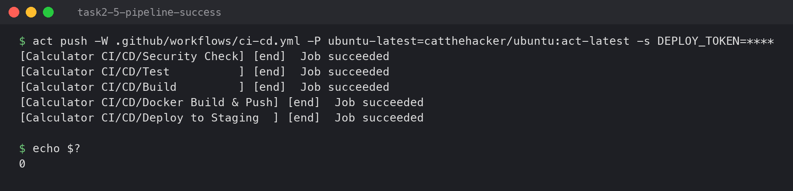
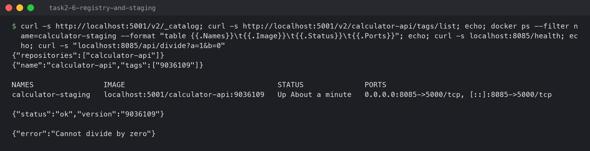
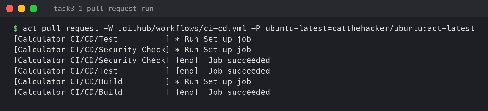
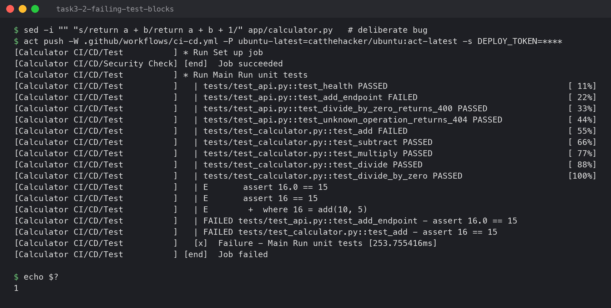

# CI/CD & GitHub Actions (Session 16)

**Name:** Sumit Akhuli
**Enrollment No:** 24bcs10158

A complete CI/CD demo project built on the class example `10-final-cicd-pipeline`: the same
calculator, turned into a small Flask API with a Dockerfile, a GitHub Actions workflow with CI
**and** CD jobs, and real pipeline runs.

**How the pipeline was run:** the assignment repo is not pushed to GitHub yet, so the workflow was
executed with [`act`](https://github.com/nektos/act) `v0.2.89`, which runs a GitHub Actions
workflow locally inside Docker using the same YAML, the same marketplace actions
(`actions/checkout`, `actions/setup-python`, `actions/upload-artifact`) and an Ubuntu runner image
(`catthehacker/ubuntu:act-latest`). The workflow file is unchanged from what GitHub would run;
the only demo-specific choice is that images go to a local `registry:2` on `localhost:5001`
instead of Docker Hub. Full logs are in [`lab/`](lab/) (`act-push-run.log`,
`act-pull-request-run.log`, `act-failing-test-run.log`).

---

## Project structure

```text
CICD_GitHub_Actions/
├── app/
│   ├── calculator.py        # add / subtract / multiply / divide
│   └── main.py              # Flask API: /health, /api/<op>?a=&b=
├── tests/
│   ├── test_calculator.py   # unit tests (from the class repo)
│   └── test_api.py          # API tests
├── requirements.txt         # flask, gunicorn
├── requirements-dev.txt     # + pytest
├── build.sh                 # packages the app into build/
├── Dockerfile               # python:3.12-slim, non-root user, gunicorn
└── .github/workflows/ci-cd.yml
```

## Concepts in this project

| Concept | Where it is in this project |
|---|---|
| **CI** (Continuous Integration) | Every push / PR is automatically tested and built — jobs `test`, `security-check`, `build` |
| **CD** (Continuous Delivery/Deployment) | A passing push to `main` is packaged as an image and deployed — jobs `docker`, `deploy` |
| **Pipeline** | The whole chain: test → build → image → deploy, where each stage only runs if the previous one passed |
| **GitHub Actions** | GitHub's built-in CI/CD service that runs the YAML in `.github/workflows/` |
| **Workflow** | `ci-cd.yml` — triggered by `on: push`, `pull_request`, `workflow_dispatch` |
| **Job** | A group of steps on one fresh machine (5 jobs here). `needs:` sets the order |
| **Step** | One command (`run:`) or one reusable action (`uses:`) inside a job |
| **Runner** | The machine a job runs on — `runs-on: ubuntu-latest` |
| **Secret** | `DEPLOY_TOKEN`, read via `${{ secrets.DEPLOY_TOKEN }}` and masked as `***` in logs |
| **Artifact** | `build/` uploaded by `actions/upload-artifact` so later jobs or people can download it |
| **Build / Test** | `build.sh` + `docker build` / `pytest -v` |

The difference between CI and CD in one line: CI answers "is this commit good?", CD answers "get
the good commit running somewhere". That is why the CD jobs have
`if: github.event_name == 'push' && github.ref == 'refs/heads/main'` — a pull request should be
tested, but must not deploy.

---

## Task 1: The workflow

The job graph `act` read from [`ci-cd.yml`](.github/workflows/ci-cd.yml):

```bash
act -l -W .github/workflows/ci-cd.yml
```

```
Stage  Job ID          Job name             Workflow name     Workflow file  Events
0      test            Test                 Calculator CI/CD  ci-cd.yml      push,pull_request,workflow_dispatch
0      security-check  Security Check       Calculator CI/CD  ci-cd.yml      pull_request,workflow_dispatch,push
1      build           Build                Calculator CI/CD  ci-cd.yml      pull_request,workflow_dispatch,push
2      docker          Docker Build & Push  Calculator CI/CD  ci-cd.yml      pull_request,workflow_dispatch,push
3      deploy          Deploy to Staging    Calculator CI/CD  ci-cd.yml      workflow_dispatch,push,pull_request
```

Stage 0 jobs have no `needs:` so they run **in parallel**; each later stage waits for the one
before. This is the pipeline:

```text
            ┌── test ──────── build ──┐
push ──────►│                         ├──► docker (build + push image) ──► deploy (staging)
            └── security-check ───────┘
            \________ CI ____________/      \______________ CD ______________/
```



---

## Task 2: Successful pipeline run (push to `main`)

```bash
act push -W .github/workflows/ci-cd.yml -P ubuntu-latest=catthehacker/ubuntu:act-latest \
  -s DEPLOY_TOKEN=s16-demo-deploy-token --artifact-server-path <dir>
```

### Test job

```
[Calculator CI/CD/Test          ] ⭐ Run Main Run unit tests
[Calculator CI/CD/Test          ]   | tests/test_api.py::test_health PASSED                                    [ 11%]
[Calculator CI/CD/Test          ]   | tests/test_api.py::test_add_endpoint PASSED                              [ 22%]
[Calculator CI/CD/Test          ]   | tests/test_api.py::test_divide_by_zero_returns_400 PASSED                [ 33%]
[Calculator CI/CD/Test          ]   | tests/test_api.py::test_unknown_operation_returns_404 PASSED             [ 44%]
[Calculator CI/CD/Test          ]   | tests/test_calculator.py::test_add PASSED                                [ 55%]
[Calculator CI/CD/Test          ]   | tests/test_calculator.py::test_subtract PASSED                           [ 66%]
[Calculator CI/CD/Test          ]   | tests/test_calculator.py::test_multiply PASSED                           [ 77%]
[Calculator CI/CD/Test          ]   | tests/test_calculator.py::test_divide PASSED                             [ 88%]
[Calculator CI/CD/Test          ]   | tests/test_calculator.py::test_divide_by_zero PASSED                     [100%]
[Calculator CI/CD/Test          ]   | ============================== 9 passed in 0.06s ===============================
[Calculator CI/CD/Test          ] 🏁  Job succeeded
```

`actions/setup-python` installed Python 3.12 on the runner, then pip installed
`requirements-dev.txt` and pytest ran all nine tests.



### Build job + artifact

```
[Calculator CI/CD/Build         ]   | Application: Session 16 Calculator API
[Calculator CI/CD/Build         ]   | Build Status: SUCCESS
[Calculator CI/CD/Build         ]   | Commit: 9036109cc5945f20e1aa9efb40a876fd4a1f335f
[Calculator CI/CD/Build         ]   | Artifact calculator-build has been successfully uploaded! Final size is 1336 bytes. Artifact ID is 1242866976
[Calculator CI/CD/Build         ] 🏁  Job succeeded
```

Each job runs on a **fresh** runner, so anything one job produces is gone when it ends — an
artifact is how a job hands files to people or to a later job. The commit SHA in
`build-info.txt` comes from the `GITHUB_SHA` variable the runner provides.



The uploaded artifact, downloaded and opened (copy in [`lab/calculator-build.zip`](lab/calculator-build.zip)):

```
  Length      Date    Time    Name
---------  ---------- -----   ----
        0  10-06-2026 18:17   app/__init__.py
      776  10-06-2026 18:17   app/main.py
      212  10-06-2026 18:17   app/calculator.py
      151  10-06-2026 18:17   build-info.txt
       30  10-06-2026 18:17   requirements.txt
---------                     -------
     1169                     5 files
```



### Docker Build & Push job (CD)

```
[Calculator CI/CD/Docker Build & Push]   ⚙  ::set-output:: image=localhost:5001/calculator-api:9036109
[Calculator CI/CD/Docker Build & Push]   | #11 naming to localhost:5001/calculator-api:9036109 done
[Calculator CI/CD/Docker Build & Push]   | 21474fdfe2c2: Pushed
...
[Calculator CI/CD/Docker Build & Push]   | 9036109: digest: sha256:27735545da2740d634258a1186039c256a13a0a04349a4f91fb848ae5a0d203c size: 856
[Calculator CI/CD/Docker Build & Push] 🏁  Job succeeded
```

The image is tagged with the first 7 characters of the commit SHA, not `latest`. That way every
running container can be traced back to the exact commit it was built from, and an old version
can be redeployed by tag. The tag is passed to the next job through a **job output**.



### Deploy to Staging job (CD) — secret + smoke test

```
[Calculator CI/CD/Deploy to Staging  ] ⭐ Run Main Use the deploy secret
[Calculator CI/CD/Deploy to Staging  ]   | Authenticating deploy with token: ***
[Calculator CI/CD/Deploy to Staging  ] ⭐ Run Main Deploy container
[Calculator CI/CD/Deploy to Staging  ]   | a598b0bf082a9f1d7b01f42d211ac8f0b5d821e624d5894b4011ddb8a2a7354b
[Calculator CI/CD/Deploy to Staging  ] ⭐ Run Main Smoke test
[Calculator CI/CD/Deploy to Staging  ]   | {"status":"ok","version":"9036109"}
[Calculator CI/CD/Deploy to Staging  ]   | {"a":6.0,"b":7.0,"op":"multiply","result":42.0}
[Calculator CI/CD/Deploy to Staging  ] 🏁  Job succeeded
```

The step deliberately `echo`es the secret, and the log shows `***` — the runner masks every
secret value wherever it appears in output. The smoke test calls the freshly deployed container:
`/health` reports version `9036109`, the same commit the image was built from.



### Whole run

```
[Calculator CI/CD/Security Check] 🏁  Job succeeded
[Calculator CI/CD/Test          ] 🏁  Job succeeded
[Calculator CI/CD/Build         ] 🏁  Job succeeded
[Calculator CI/CD/Docker Build & Push] 🏁  Job succeeded
[Calculator CI/CD/Deploy to Staging  ] 🏁  Job succeeded
```



### After the pipeline: what is actually running

```bash
curl -s http://localhost:5001/v2/_catalog
curl -s http://localhost:5001/v2/calculator-api/tags/list
docker ps --filter name=calculator-staging
curl -s localhost:8085/health
curl -s "localhost:8085/api/divide?a=1&b=0"
```

```
{"repositories":["calculator-api"]}
{"name":"calculator-api","tags":["9036109"]}

NAMES                IMAGE                                   STATUS              PORTS
calculator-staging   localhost:5001/calculator-api:9036109   Up About a minute   0.0.0.0:8085->5000/tcp, [::]:8085->5000/tcp

{"status":"ok","version":"9036109"}

{"error":"Cannot divide by zero"}
```



---

## Task 3: The pipeline protecting `main`

A pipeline is only useful if it **stops** bad changes. Two runs show that.

### Pull request — CI runs, CD does not

```bash
act pull_request -W .github/workflows/ci-cd.yml -P ubuntu-latest=catthehacker/ubuntu:act-latest
```

```
[Calculator CI/CD/Security Check] 🏁  Job succeeded
[Calculator CI/CD/Test          ] 🏁  Job succeeded
[Calculator CI/CD/Build         ] 🏁  Job succeeded
```

Only three jobs ran. `docker` and `deploy` were skipped by their `if:` condition — reviewers get
test results on the PR, but nothing is deployed until it is merged.



### A failing test stops the pipeline

I introduced a bug (`return a + b + 1`) and ran the push pipeline again:

```
[Calculator CI/CD/Test          ]   | tests/test_api.py::test_add_endpoint FAILED                              [ 22%]
[Calculator CI/CD/Test          ]   | tests/test_calculator.py::test_add FAILED                                [ 55%]
[Calculator CI/CD/Test          ]   | E       assert 16.0 == 15
[Calculator CI/CD/Test          ]   | E       assert 16 == 15
[Calculator CI/CD/Test          ]   | FAILED tests/test_api.py::test_add_endpoint - assert 16.0 == 15
[Calculator CI/CD/Test          ]   | FAILED tests/test_calculator.py::test_add - assert 16 == 15
[Calculator CI/CD/Test          ]   ❌  Failure - Main Run unit tests [253.755416ms]
[Calculator CI/CD/Test          ] 🏁  Job failed
```

`Test` failed, so `Build`, `Docker Build & Push` and `Deploy` never started (`needs: test`), and
`act` exited with code `1`. The broken code never became an image and never reached staging.
The bug was reverted afterwards.



---

## Running it

```bash
# locally, without GitHub
docker run -d --name demo-registry -p 5001:5000 registry:2
act push -W .github/workflows/ci-cd.yml -P ubuntu-latest=catthehacker/ubuntu:act-latest \
  -s DEPLOY_TOKEN=<any-value> --artifact-server-path /tmp/artifacts
```

On GitHub: move `.github/workflows/ci-cd.yml` to the repository root (GitHub only reads workflows
from there), add `DEPLOY_TOKEN` under *Settings → Secrets and variables → Actions*, and change
`REGISTRY` to `ghcr.io/<user>` with a `docker/login-action` step.

In the screenshots, the emoji `act` prints (⭐ ✅ ❌ 🏁) are drawn as `*`, `[ok]`, `[x]`,
`[end]` because the terminal font has no emoji; the logs in `lab/` have the originals.
