# Cloud & Terraform in Action (Session 19)

**Name:** Sumit Akhuli
**Enrollment No:** 24bcs10158

An end-to-end AWS infrastructure built from one Terraform project: a VPC with a public subnet,
internet gateway and route table, a security group, an EC2 web server with an IAM role, and an
S3 bucket that the server reads its web page from. 13 resources and 2 data sources, created
with one `apply` and removed with one `destroy`.

All output is from a real run — Terraform `v1.16.4`, AWS provider `v6.67.0`, macOS on Apple
Silicon. As in Session 18, the AWS API was **LocalStack** (`localstack/localstack:4.0`, an AWS
emulator running in Docker on `localhost:4566`), because I don't have working AWS credentials
here. LocalStack's EC2 is a simulation: it really creates the VPC, subnet, routes, security
group and instance as API objects with IDs and IPs, but no virtual machine actually boots, so
the `user_data` script doesn't run. Setting `use_localstack = false` in `terraform.tfvars` deploys
the same code to real AWS. Raw transcript: [`lab/transcript.txt`](lab/transcript.txt).

---

## Architecture

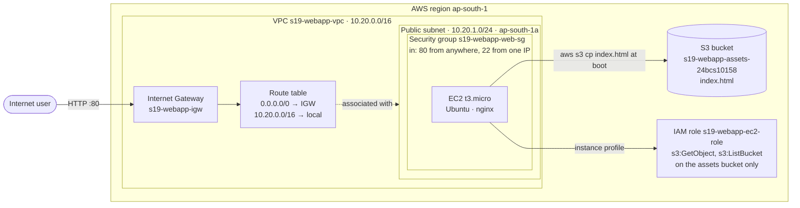

The same thing as text:

```text
Terraform
│
├── VPC 10.20.0.0/16 ──────────────────────────────── network.tf
│   ├── Internet Gateway ─── attached to the VPC
│   ├── Route table ──────── 0.0.0.0/0 → IGW  (this is what makes the subnet "public")
│   └── Subnet 10.20.1.0/24 (ap-south-1a, public IP on launch) ── associated with the route table
│
├── Security Group ── in: tcp/80 from 0.0.0.0/0, tcp/22 from 203.0.113.10/32 ── security.tf
│                      out: everything
├── IAM role + inline policy + instance profile ─── read-only on the assets bucket
│
├── EC2 t3.micro ── newest Canonical Ubuntu AMI (data source), in the subnet,  ── compute.tf
│                   with the SG and the instance profile, user_data installs nginx
│
└── S3 bucket + public access block + index.html ─────────────────────────── storage.tf
```

**Why each piece is there:**

- **VPC:** our own isolated network. Nothing can get in or out unless we add a way.
- **Internet gateway + route `0.0.0.0/0 → IGW`:** the way out. A subnet is "public" only
  because its route table sends internet traffic to an IGW; there is no "public" checkbox.
- **Security group:** a firewall on the instance itself. Web traffic is open to everyone, SSH
  only to one admin IP.
- **IAM role:** gives the instance permission to read the bucket without storing access keys
  on the server, and limits that permission to this one bucket (least privilege).
- **S3:** keeps the content separate from the server, so a replaced server still serves the
  same page.

## Project files

```text
terraform-infra/
├── versions.tf        terraform + provider version constraints
├── provider.tf        aws provider, LocalStack switch, default_tags
├── variables.tf       7 inputs (region, CIDRs, instance type, SSH CIDR, ...)
├── terraform.tfvars   values for this run
├── network.tf         VPC, AZ data source, subnet, IGW, route table, association
├── security.tf        security group, IAM role, role policy, instance profile
├── compute.tf         AMI data source, EC2 instance
├── storage.tf         S3 bucket, public access block, index.html object
└── outputs.tf         9 outputs (IDs, IPs, AMI used, bucket name)
```

## Terraform concepts in this project

| Concept | Where |
|---|---|
| **Provider** | `provider "aws"` in [`provider.tf`](terraform-infra/provider.tf), pinned to `~> 6.0` in [`versions.tf`](terraform-infra/versions.tf) |
| **Variables** | [`variables.tf`](terraform-infra/variables.tf) declares them, [`terraform.tfvars`](terraform-infra/terraform.tfvars) sets them, `-var` overrides them (Task 3) |
| **Resources** | 13 `resource` blocks across `network.tf`, `security.tf`, `compute.tf`, `storage.tf` |
| **Data sources** | `data.aws_ami.ubuntu` (look up the newest Ubuntu AMI instead of hard-coding an ID), `data.aws_availability_zones.available` |
| **Outputs** | [`outputs.tf`](terraform-infra/outputs.tf) — VPC/subnet/SG/instance IDs, IPs, AMI, bucket |
| **Implicit dependencies** | Any reference, e.g. `subnet_id = aws_subnet.public.id`, makes Terraform create the subnet first |
| **Explicit dependency** | `depends_on = [aws_s3_object.index, aws_route_table_association.public]` on the instance: `user_data` downloads the object at boot, but only mentions the bucket *name*, so without `depends_on` Terraform could start the instance before the file exists |
| **State** | `terraform.tfstate` — the mapping from `aws_vpc.main` to `vpc-a788f4e9` (Task 2) |

---

## Task 1: init, fmt, validate

```bash
terraform init
terraform fmt -check
terraform validate
```

```
./compute.tf
./network.tf
./outputs.tf
./provider.tf
./security.tf
./storage.tf
./terraform.tfvars
./variables.tf
./versions.tf
Initializing the backend...
Initializing provider plugins...
- Reusing previous version of hashicorp/aws from the dependency lock file
Terraform has been successfully initialized!
fmt: all files formatted
Success! The configuration is valid.
```

Terraform loads **every** `.tf` file in the folder as one configuration, so splitting resources
into `network.tf` / `compute.tf` / ... is purely for people. Order between files doesn't matter;
references do.

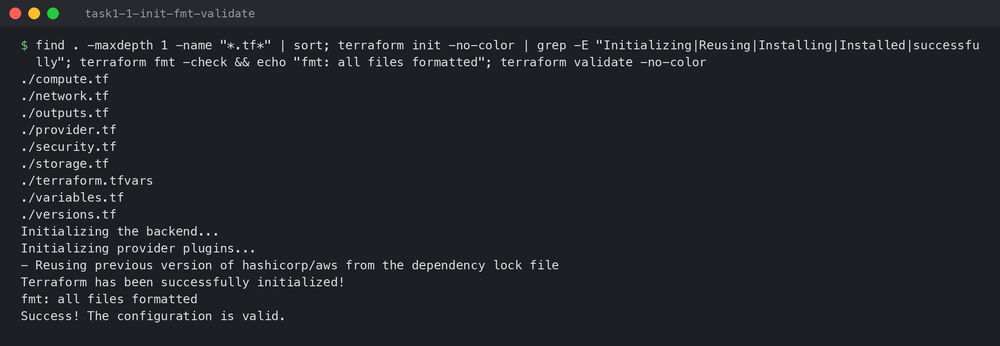

---

## Task 2: plan, apply, verify, state

### `terraform plan`

```
data.aws_availability_zones.available: Reading...
data.aws_ami.ubuntu: Reading...
data.aws_availability_zones.available: Read complete after 0s [id=ap-south-1]
data.aws_ami.ubuntu: Read complete after 0s [id=ami-1e749f67]
  # aws_iam_instance_profile.web will be created
  # aws_iam_role.web will be created
  # aws_iam_role_policy.read_assets will be created
  # aws_instance.web will be created
      + ami                                  = "ami-1e749f67"
      + instance_type                        = "t3.micro"
  # aws_internet_gateway.main will be created
  # aws_route_table.public will be created
  # aws_route_table_association.public will be created
  # aws_s3_bucket.assets will be created
  # aws_s3_bucket_public_access_block.assets will be created
  # aws_s3_object.index will be created
  # aws_security_group.web will be created
  # aws_subnet.public will be created
      + availability_zone                              = "ap-south-1a"
      + cidr_block                                     = "10.20.1.0/24"
  # aws_vpc.main will be created
      + cidr_block                           = "10.20.0.0/16"
Plan: 13 to add, 0 to change, 0 to destroy.
```

Data sources are read **during plan**, which is why the AMI ID is already known.
(LocalStack's image catalogue is a small fixed sample from 2017, so "newest Ubuntu" there is
14.04. On real AWS the same filter returns the current Ubuntu LTS.)

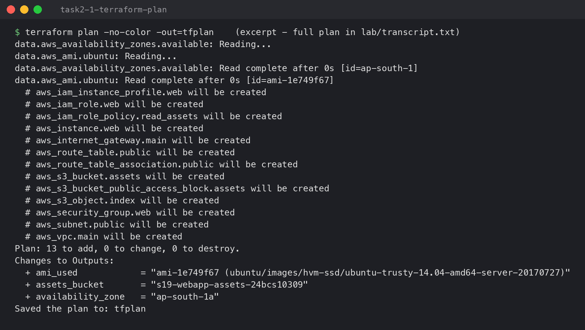

### `terraform apply`

```
aws_iam_role.web: Creating...
aws_vpc.main: Creating...
aws_s3_bucket.assets: Creating...
aws_vpc.main: Creation complete after 0s [id=vpc-a788f4e9]
...
aws_subnet.public: Creation complete after 10s [id=subnet-8ad741b3]
aws_route_table_association.public: Creating...
aws_route_table_association.public: Creation complete after 0s [id=rtbassoc-47b90b2e]
aws_instance.web: Creating...
aws_instance.web: Creation complete after 10s [id=i-fffcb0bc585566ee6]
Apply complete! Resources: 13 added, 0 changed, 0 destroyed.
Outputs:
ami_used = "ami-1e749f67 (ubuntu/images/hvm-ssd/ubuntu-trusty-14.04-amd64-server-20170727)"
assets_bucket = "s19-webapp-assets-24bcs10158"
availability_zone = "ap-south-1a"
instance_id = "i-fffcb0bc585566ee6"
instance_private_ip = "10.20.1.4"
instance_public_ip = "54.214.199.118"
public_subnet_id = "subnet-8ad741b3"
security_group_id = "sg-779ebd1578d34acd2"
vpc_id = "vpc-a788f4e9"
```

The order is the dependency graph. The VPC, IAM role and bucket have no dependencies and start
together. Everything inside the VPC waits for it. The instance is created **last**, because it
needs the subnet, SG, instance profile, the uploaded object and the route association. The
private IP `10.20.1.4` is the first usable address in `10.20.1.0/24`, since AWS reserves `.0`–`.3`.

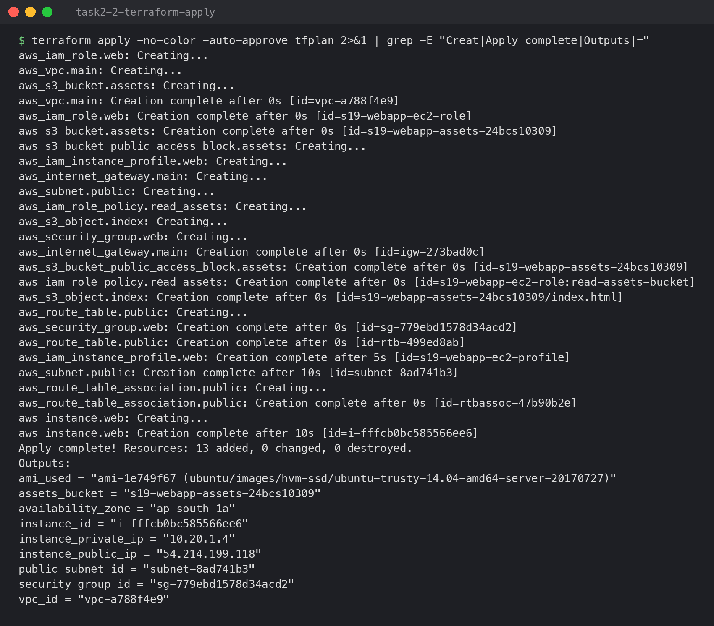

### Dependency graph

```bash
terraform graph | dot -Tpng > images/task2-7-terraform-graph.png
```

Arrows point from a resource to what it depends on. Read from the right: the VPC has no
dependencies and is created first; `aws_instance.web` on the left depends on almost everything
and is created last. `destroy` walks the same graph backwards.

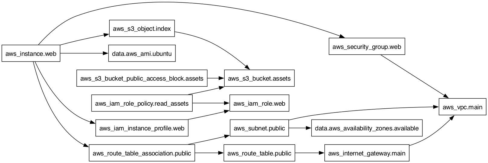

### Checking the infrastructure with the AWS CLI

```bash
V=$(terraform output -raw vpc_id)
aws ec2 describe-vpcs --vpc-ids $V
aws ec2 describe-subnets --filters Name=vpc-id,Values=$V
aws ec2 describe-route-tables --filters Name=association.subnet-id,Values=<subnet>
aws ec2 describe-internet-gateways --filters Name=attachment.vpc-id,Values=$V
```

```
|  vpc-a788f4e9|  10.20.0.0/16  |  available  |
|  subnet-8ad741b3 |  10.20.1.0/24 |  ap-south-1a |  True |  250  |
|  10.20.0.0/16 |  local         |  active |
|  0.0.0.0/0    |  igw-273bad0c  |  active |
|  igw-273bad0c|  vpc-a788f4e9  |  available  |
```

`250` free addresses: a `/24` has 256, AWS reserves 5 per subnet, and the instance uses 1. The
route table has two routes, `local` (traffic inside the VPC stays inside) and `0.0.0.0/0 → igw`.

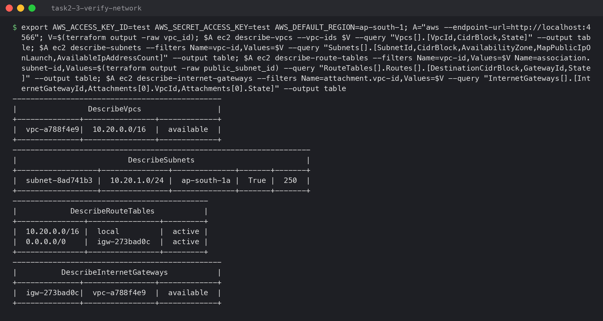

```
|  tcp|  22 |  22 |  203.0.113.10/32  |  SSH from admin IP only  |
|  tcp|  80 |  80 |  0.0.0.0/0        |  HTTP                    |
|  i-fffcb0bc585566ee6|  t3.micro |  running |  10.20.1.4 |  54.214.199.118 |  subnet-8ad741b3 |  arn:aws:iam::000000000000:instance-profile/s19-webapp-ec2-profile   |
```

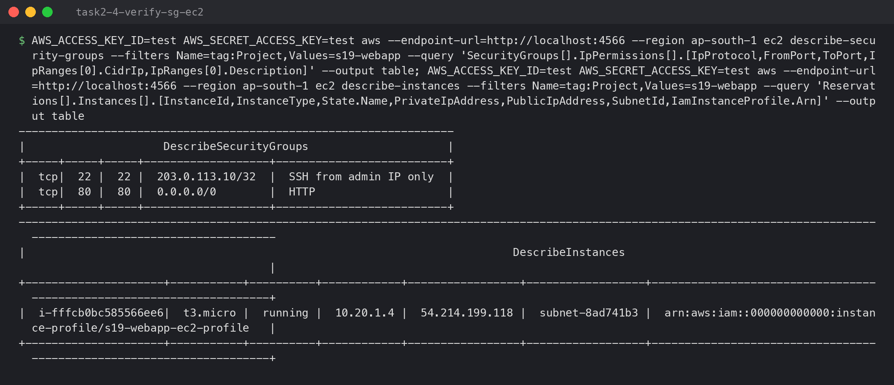

```
2026-10-07 00:25:05         44 index.html
<h1>Session 19 - deployed by Terraform</h1>
{
    "Version": "2012-10-17",
    "Statement": [
        {
            "Action": ["s3:GetObject", "s3:ListBucket"],
            "Effect": "Allow",
            "Resource": [
                "arn:aws:s3:::s19-webapp-assets-24bcs10158",
                "arn:aws:s3:::s19-webapp-assets-24bcs10158/*"
            ]
        }
    ]
}
```

The role's policy allows exactly two read actions on exactly one bucket. `ListBucket` applies
to the bucket ARN and `GetObject` to the objects (`/*`), which is why both ARNs are needed.

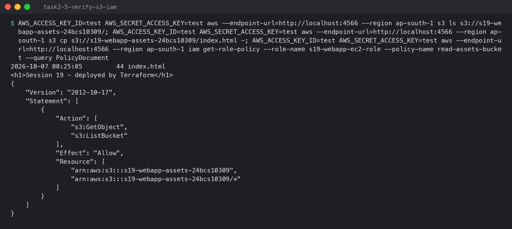

### Terraform state

```bash
terraform state list
terraform state show aws_subnet.public
```

```
data.aws_ami.ubuntu
data.aws_availability_zones.available
aws_iam_instance_profile.web
aws_iam_role.web
...
aws_vpc.main

resource "aws_subnet" "public" {
    availability_zone                              = "ap-south-1a"
    cidr_block                                     = "10.20.1.0/24"
    map_public_ip_on_launch                        = true
    vpc_id                                         = "vpc-a788f4e9"

-rw-r--r--@ 1 utkarshpathak3107  staff  31174  7 Oct 00:25 terraform.tfstate
```

The state is how Terraform knows that `aws_vpc.main` in the code **is** `vpc-a788f4e9` in AWS.
Without it, the next `apply` would try to create a second VPC. If the state is lost, Terraform
loses track of all 13 resources. That's why teams keep it in a remote backend (S3 + locking),
not on a laptop. It is in `.gitignore` here.

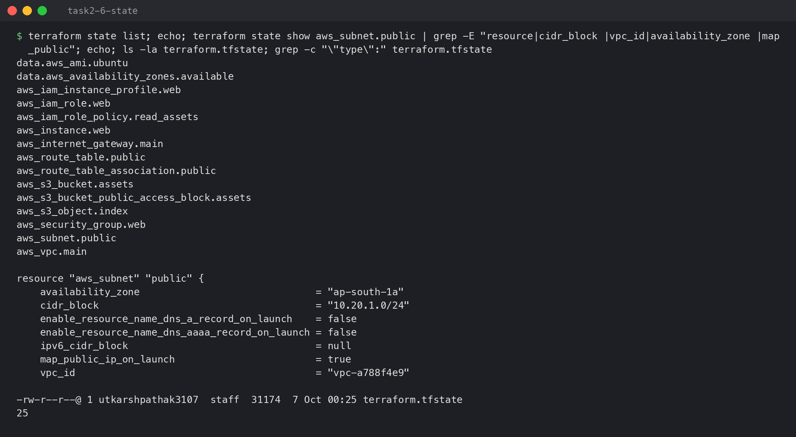

---

## Task 3: Changing a variable, then destroy

### Plan with different variable values

```bash
terraform plan -var instance_type=t3.small -var ssh_allowed_cidr=198.51.100.7/32
```

```
  # aws_instance.web will be updated in-place
      ~ instance_type                        = "t3.micro" -> "t3.small"
      ~ public_ip                            = "54.214.199.118" -> (known after apply)
  # aws_security_group.web will be updated in-place
              - cidr_blocks      = [
                  - "203.0.113.10/32",
              + cidr_blocks      = [
                  + "198.51.100.7/32",
  # aws_s3_bucket.assets will be updated in-place
  # aws_subnet.public will be updated in-place
Plan: 0 to add, 4 to change, 0 to destroy.
```

The same code with two different inputs gives a different plan. That's the point of variables:
one configuration, many environments. Changing the instance type is an in-place update: AWS
stops the instance, resizes it and starts it again. That's why the public IP would change, since
an auto-assigned public IP isn't kept across a stop. The bucket and subnet "updates" in this plan
are only their tags, which LocalStack ignored at create time (the same LocalStack 4.0 issue found
in Session 18). I didn't apply this plan.

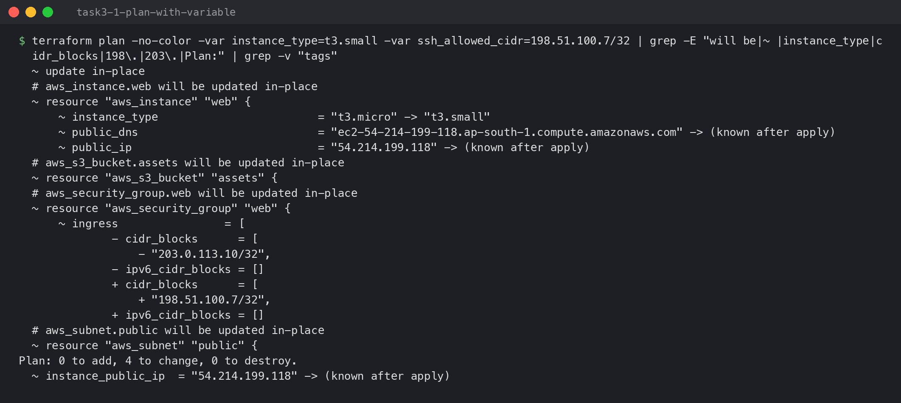

### `terraform destroy`

```
aws_s3_bucket_public_access_block.assets: Destroying...
aws_iam_role_policy.read_assets: Destroying...
aws_instance.web: Destroying... [id=i-fffcb0bc585566ee6]
aws_instance.web: Destruction complete after 10s
aws_route_table_association.public: Destroying...
...
aws_internet_gateway.main: Destroying... [id=igw-273bad0c]
aws_vpc.main: Destroying... [id=vpc-a788f4e9]
aws_vpc.main: Destruction complete after 0s
Destroy complete! Resources: 13 destroyed.
resources left in state:        0
i-fffcb0bc585566ee6	terminated
```

Exactly the reverse of apply: the instance goes first and the VPC last. AWS would refuse to
delete a VPC that still has a subnet, gateway or instance in it, and Terraform's ordering
handles that automatically.

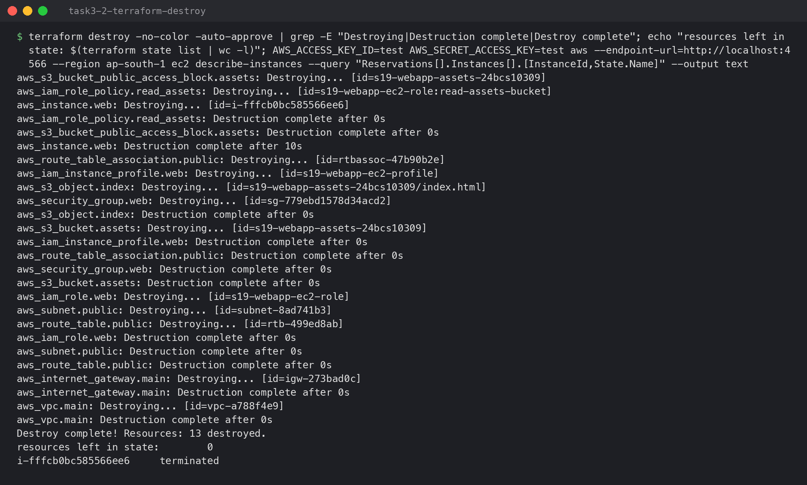

---

## Running it

```bash
docker run -d --name localstack -p 4566:4566 -e SERVICES=s3,ec2,iam,sts localstack/localstack:4.0
cd terraform-infra
terraform init && terraform plan -out=tfplan && terraform apply tfplan
terraform destroy
```

For real AWS: set `use_localstack = false`, set `ssh_allowed_cidr` to your own IP, run
`aws configure`, and remember the instance and its public IPv4 address are billed while they
exist.
