# Complete CI/CD & DevSecOps (Session 17)

**Name:** Sumit Akhuli
**Enrollment No:** 24bcs10158

A complete CI/CD + DevSecOps pipeline for the class demo app (`session-17-devsecops/demo`, the
Flask "DevSecOps Hub" dashboard). Every stage in the expected flow is a separate GitHub Actions
job, and nothing reaches the registry or the cluster unless every security check passes.

```text
Code → Build → Unit Test → SAST → SCA → Secret Scan → Docker Build → Container Image Scan
     → Security Gate → Push Image → Deploy to Kubernetes
```

**How it was run:** the workflow ran locally with [`act`](https://github.com/nektos/act)
`v0.2.89`, which runs GitHub Actions workflows in Docker using the same YAML and marketplace
actions. The container registry is a local `registry:2` (`localhost:5001`) and the Kubernetes
cluster is a `kind` cluster (`devsecops`, Kubernetes `v1.37.0`), with its kubeconfig passed to the
pipeline as the secret `KUBE_CONFIG` — the same way a real cluster's credentials are given to
GitHub Actions. Machine: macOS on Apple Silicon. The four full pipeline logs are in [`lab/`](lab/).

**What the four runs show:** the first three runs each hit a different real problem, and the
gate stopped the release every time. These were not set up in advance: the class app really
shipped with `debug=True`, and my cached base image really had 20 HIGH/CRITICAL CVEs. Run 4
plants a fake secret and an old dependency on purpose, to show the last two scanners working.

| Run | What happened | Blocked by |
|---|---|---|
| 1 | App code as given in class (`debug=True`) | **SAST** (Bandit) |
| 2 | Code fixed, but base image had 20 fixable HIGH/CRITICAL CVEs | **Image scan** (Trivy) |
| 3 | OS packages patched | **Nothing — pushed and deployed** |
| 4 | Planted fake AWS key + `Flask==2.2.2` | **Secret scan** (Gitleaks) + **SCA** (pip-audit) |

---

## Project structure

```text
DevSecOps/
├── app/                      # Flask app from the class demo (app.py, templates, static)
├── tests/test_app.py         # 8 unit tests
├── requirements.txt          # Flask 3.1.3, gunicorn 23.0.0
├── requirements-dev.txt      # + pytest, pytest-cov
├── Dockerfile                # python:3.12-slim, OS security updates, non-root user, gunicorn
├── k8s/
│   ├── deployment.yaml       # 2 replicas, runAsNonRoot, drop ALL capabilities, probes, limits
│   └── service.yaml          # NodePort 30001
└── .github/workflows/devsecops.yml
```

## Security tools

| Stage | Tool | What it looks for | Fails the job when |
|---|---|---|---|
| **SAST** (Static Application Security Testing) | Bandit 1.8.6 | Dangerous patterns in *our own* Python code | MEDIUM+ severity with MEDIUM+ confidence |
| **SCA** (Software Composition Analysis) | pip-audit 2.9.0 | Known CVEs in the *libraries we depend on* | Any known vulnerability (`--strict`) |
| **Secret scanning** | Gitleaks 8.30.1 | API keys, passwords, tokens committed in files | Any finding |
| **Container image scanning** | Trivy 0.75.0 | CVEs in the OS packages and libraries inside the built image | HIGH/CRITICAL with a fix available |
| **Security gate** | workflow job | Result of all of the above | Any check failed or was skipped |

The class workflow uses CodeQL for SAST; CodeQL only runs on GitHub's own infrastructure, so I
used Bandit, which runs anywhere and is Python-specific. SAST and SCA cover different code: SAST
reads the code we wrote, SCA checks the code we downloaded — and most of an application is
downloaded code.

---

## Task 1: The pipeline catching real problems

### Run 1 — SAST blocks `debug=True`

```bash
act push -W .github/workflows/devsecops.yml -P ubuntu-latest=catthehacker/ubuntu:act-latest \
  --network kind --secret-file s17.secrets --artifact-server-path <dir>
```

```
>> Issue: [B201:flask_debug_true] A Flask app appears to be run with debug=True, which exposes the Werkzeug debugger and allows the execution of arbitrary code.
   Severity: High   Confidence: Medium
   Location: app/app.py:234:4
234	    app.run(host="0.0.0.0", port=5001, debug=True)
>> Issue: [B104:hardcoded_bind_all_interfaces] Possible binding to all interfaces.
   Severity: Medium   Confidence: Medium
   Location: app/app.py:234:17
...
SAST         : failure
Image Scan   : skipped
SECURITY GATE: FAILED - image will NOT be pushed or deployed
```

The Flask debugger is a web page that lets whoever sees an error page run Python on the
server — on a public app, that means anyone. The fix ([`app/app.py`](app/app.py)): no debug, and
`app.run()` binds to `127.0.0.1` unless `APP_HOST` says otherwise. It is only used for local
development anyway; the container runs `gunicorn` (see the [Dockerfile](Dockerfile)).

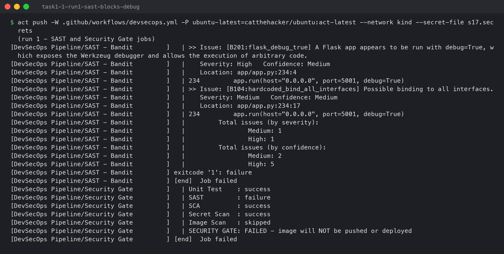

### Run 2 — Trivy blocks a vulnerable base image

With the code fixed, SAST, SCA and secret scanning passed and the image was built — then Trivy
scanned it:

```
session17-python:9036109 (debian 13.6)
Total: 20 (HIGH: 17, CRITICAL: 3)
│ Library        │  Vulnerability  │ Severity │ Status │ Installed Version │  Fixed Version   │
│ gzip           │ CVE-2026-41992  │ HIGH     │ fixed  │ 1.13-1            │ 1.13-1+deb13u1   │
│ libpcre2-8-0   │ CVE-2026-103111 │          │        │ 10.46-1~deb13u1   │ 10.46-1~deb13u3  │
│ libsqlite3-0   │ CVE-2026-11822  │          │        │ 3.46.1-7+deb13u1  │ 3.46.1-7+deb13u2 │
│ libssl3t64     │ CVE-2026-75804  │          │        │ 3.5.7-1~deb13u2   │ 3.5.7-1~deb13u3  │
│ perl-base      │ CVE-2026-13221  │ CRITICAL │        │ 5.40.1-6          │ 5.40.1-6+deb13u1 │
...
Image Scan   : failure
SECURITY GATE: FAILED - image will NOT be pushed or deployed
```

None of these are in my code or my Python libraries — they are Debian packages inside the
`python:3.12-slim` base image, which had been sitting in my local Docker cache. Every one has a
fixed version available, which is exactly why the scan uses `--ignore-unfixed`: fail on problems
we *can* fix. Two fixes:

1. `Dockerfile`: `apt-get update && apt-get upgrade -y` so the image gets Debian's security updates.
2. Workflow: `docker build --pull` so a stale cached base image is never reused.

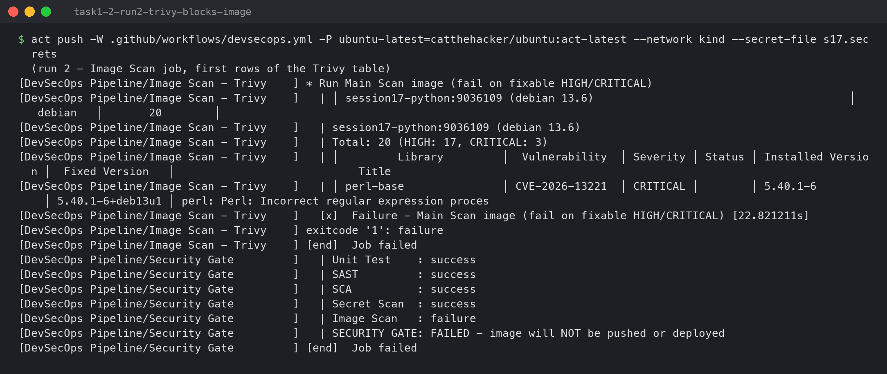

---

## Task 2: Run 3 — the full pipeline passing

### Build and unit tests

```
[DevSecOps Pipeline/Build]   | Build OK - all modules compiled
[DevSecOps Pipeline/Unit Test             ]   | tests/test_app.py::test_home PASSED                                      [ 12%]
[DevSecOps Pipeline/Unit Test             ]   | tests/test_app.py::test_health PASSED                                    [ 25%]
...
[DevSecOps Pipeline/Unit Test             ]   | tests/test_app.py::test_status PASSED                                    [100%]
[DevSecOps Pipeline/Unit Test             ]   | TOTAL               102     32    69%
```

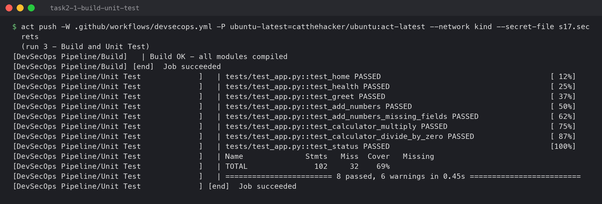

### SAST

```
[DevSecOps Pipeline/SAST - Bandit         ]   | 	No issues identified.
	Total issues (by severity):
		Low: 5
		Medium: 0
		High: 0
```

The 5 Low findings are `random.choice()` (B311: "not suitable for cryptography"). The app uses
it to pick a greeting message, which is not security-sensitive, so the threshold of MEDIUM lets
them through.

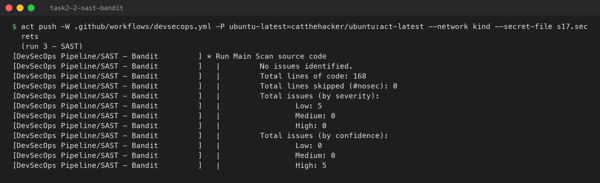

### SCA and secret scan

```
[DevSecOps Pipeline/SCA - pip-audit       ]   | No known vulnerabilities found
[DevSecOps Pipeline/Secret Scan - Gitleaks]   | scanned ~218699 bytes (218.70 KB) in 36ms
[DevSecOps Pipeline/Secret Scan - Gitleaks]   | no leaks found
```

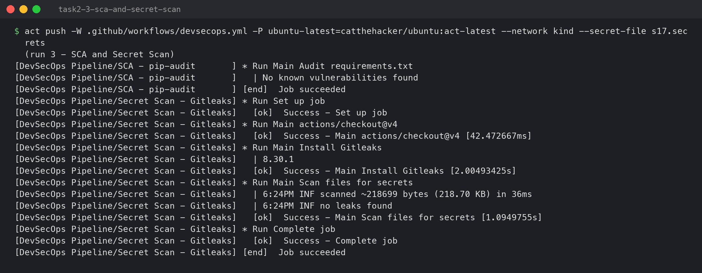

### Docker build and image scan

```
[DevSecOps Pipeline/Docker Build          ]   | session17-python:9036109   635d57f7dcfd        226MB         49.1MB
[DevSecOps Pipeline/Docker Build          ]   | Artifact docker-image has been successfully uploaded! Final size is 48665470 bytes.
[DevSecOps Pipeline/Image Scan - Trivy    ]   | │ session17-python:9036109 (debian 13.7)                                       │   debian   │        0        │
[DevSecOps Pipeline/Image Scan - Trivy    ]   | │ usr/local/lib/python3.12/site-packages/flask-3.1.3.dist-info/METADATA        │ python-pkg │        0        │
...
```

Same image name, but now on Debian 13.7 with **0** vulnerabilities. Each GitHub Actions job runs
on a fresh machine, so the built image is passed between jobs as an artifact (`docker save` →
`upload-artifact` → `download-artifact` → `docker load`). The image that gets scanned is the
exact image that gets pushed.

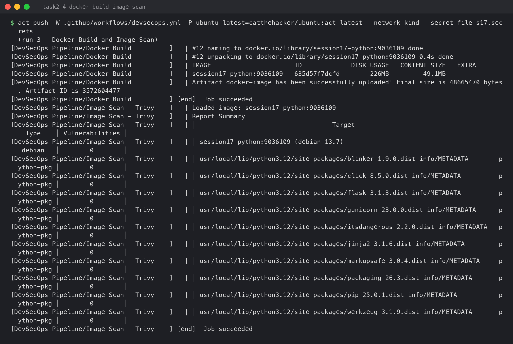

### Security gate and push

```
[DevSecOps Pipeline/Security Gate         ]   | Unit Test    : success
[DevSecOps Pipeline/Security Gate         ]   | SAST         : success
[DevSecOps Pipeline/Security Gate         ]   | SCA          : success
[DevSecOps Pipeline/Security Gate         ]   | Secret Scan  : success
[DevSecOps Pipeline/Security Gate         ]   | Image Scan   : success
[DevSecOps Pipeline/Security Gate         ]   | SECURITY GATE: PASSED
[DevSecOps Pipeline/Push Image            ]   | 9036109: digest: sha256:635d57f7dcfd40f49a4867228c5876e0602be5fe2945dc2fb39e261e3ee76e32 size: 856
```

The gate uses `if: always()`, so it runs even when an earlier job failed or was skipped, and it
fails on `failure`, `cancelled` *and* `skipped`. Without `always()`, a failed scan would simply
skip the gate, and a skipped gate prints no clear verdict. `push` then `needs: security-gate`,
so there is exactly one place that decides whether an image ships.

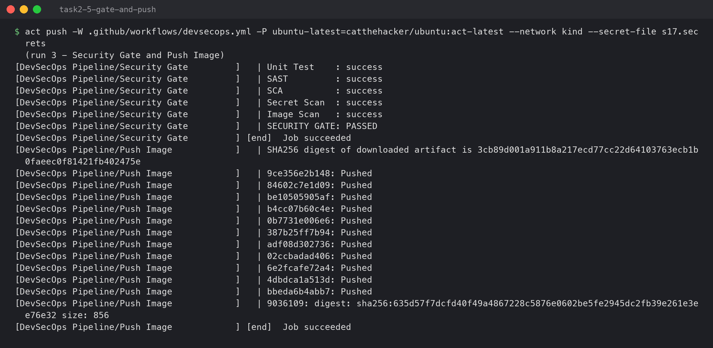

### Deploy to Kubernetes

```
[DevSecOps Pipeline/Deploy to Kubernetes  ]   | devsecops-control-plane   Ready    control-plane   5m6s   v1.37.0
[DevSecOps Pipeline/Deploy to Kubernetes  ]   | deployment.apps/session17-python created
[DevSecOps Pipeline/Deploy to Kubernetes  ]   | service/session17-python created
[DevSecOps Pipeline/Deploy to Kubernetes  ]   | deployment "session17-python" successfully rolled out
[DevSecOps Pipeline/Deploy to Kubernetes  ]   | deployment.apps/session17-python   2/2     2            2           4s    session17-python   localhost:5001/session17-python:9036109
[DevSecOps Pipeline/Deploy to Kubernetes  ]   | pod/session17-python-68996cf4c9-74wrh   1/1     Running   0          4s    10.244.0.6   devsecops-control-plane
[DevSecOps Pipeline/Deploy to Kubernetes  ]   | pod/session17-python-68996cf4c9-mngtl   1/1     Running   0          4s    10.244.0.5   devsecops-control-plane
[DevSecOps Pipeline/Deploy to Kubernetes  ]   | {"status":"healthy","timestamp":"2026-10-06T18:26:45.388681Z","uptime_seconds":4.24}
[DevSecOps Pipeline/Deploy to Kubernetes  ]   | {"app":"DevSecOps Dashboard","platform":"Linux","python_version":"3.12.15","status":"running",...}
```

The job writes the `KUBE_CONFIG` secret to `~/.kube/config`, replaces `__IMAGE__` in
`k8s/deployment.yaml` with the tag that was just pushed, applies the manifests, waits for the
rollout, and smoke-tests `/health` and `/api/status` through a port-forward.

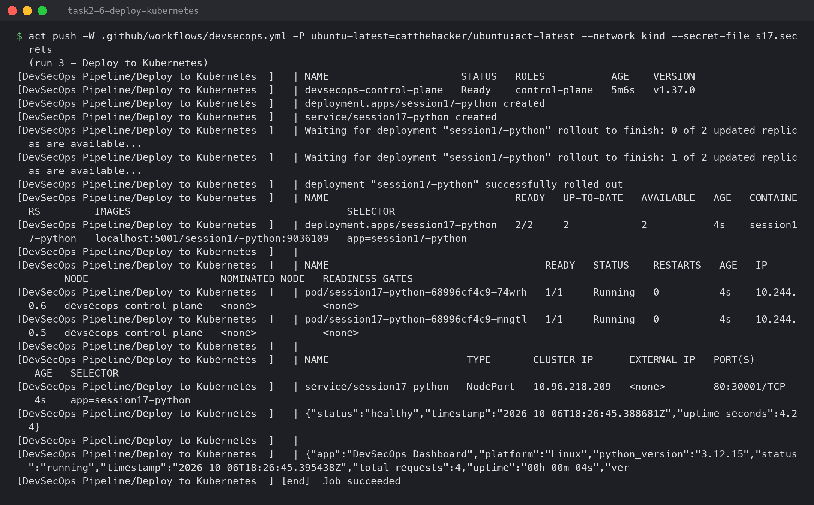

### Whole run

```
[DevSecOps Pipeline/Build] 🏁  Job succeeded
[DevSecOps Pipeline/Secret Scan - Gitleaks] 🏁  Job succeeded
[DevSecOps Pipeline/SAST - Bandit         ] 🏁  Job succeeded
[DevSecOps Pipeline/Unit Test             ] 🏁  Job succeeded
[DevSecOps Pipeline/SCA - pip-audit       ] 🏁  Job succeeded
[DevSecOps Pipeline/Docker Build          ] 🏁  Job succeeded
[DevSecOps Pipeline/Image Scan - Trivy    ] 🏁  Job succeeded
[DevSecOps Pipeline/Security Gate         ] 🏁  Job succeeded
[DevSecOps Pipeline/Push Image            ] 🏁  Job succeeded
[DevSecOps Pipeline/Deploy to Kubernetes  ] 🏁  Job succeeded
```

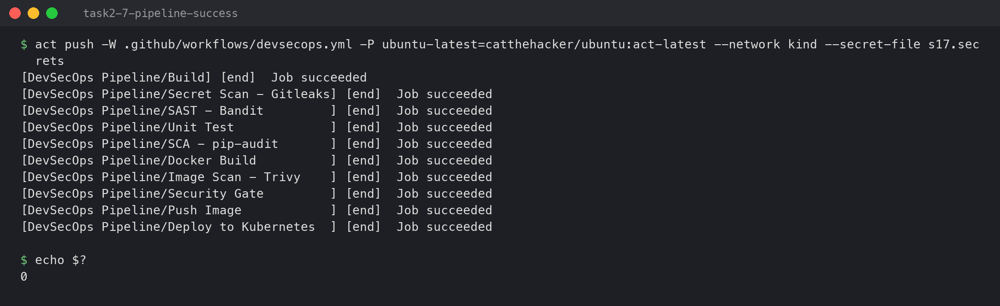

### Checking the result from outside the pipeline

```bash
kubectl --context kind-devsecops get deploy,pods,svc -l app=session17-python
kubectl --context kind-devsecops get deploy session17-python -o jsonpath="{.spec.template.spec.containers[0].image}"
curl -s localhost:5001/v2/session17-python/tags/list
kubectl --context kind-devsecops exec deploy/session17-python -- id
```

```
NAME                               READY   UP-TO-DATE   AVAILABLE   AGE
deployment.apps/session17-python   2/2     2            2           2m1s

NAME                                    READY   STATUS    RESTARTS   AGE
pod/session17-python-68996cf4c9-74wrh   1/1     Running   0          2m1s
pod/session17-python-68996cf4c9-mngtl   1/1     Running   0          2m1s

NAME                       TYPE       CLUSTER-IP      EXTERNAL-IP   PORT(S)        AGE
service/session17-python   NodePort   10.96.218.209   <none>        80:30001/TCP   2m1s

localhost:5001/session17-python:9036109
{"name":"session17-python","tags":["9036109"]}

uid=10001(appuser) gid=10001(appuser) groups=10001(appuser)
```

The last line confirms the hardening: the app runs as `appuser` (uid 10001), not root. If someone
did break into the app, they would not be root inside the container.

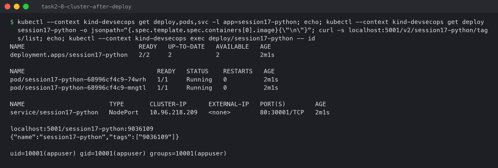

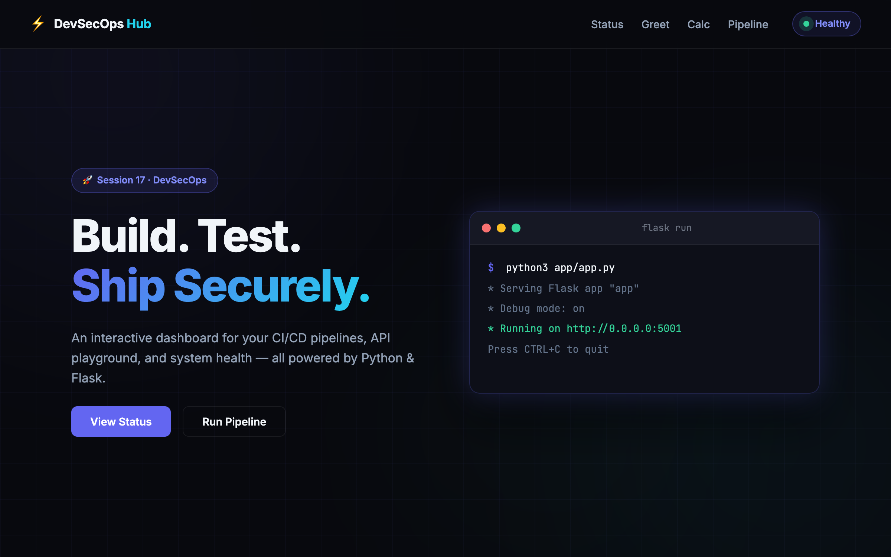

(The "Debug mode: on" box on the page is a static illustration in the class app's HTML, not
the real server state. The pod runs gunicorn with debug off.)

---

## Task 3: Run 4 — secret and vulnerable dependency

To prove the other two scanners work, I added a file with a **fake** AWS key (random characters
in the AWS key format) and downgraded Flask to `2.2.2`:

```
[DevSecOps Pipeline/Secret Scan - Gitleaks]   | Finding:     aws_access_key_id = REDACTED
[DevSecOps Pipeline/Secret Scan - Gitleaks]   | RuleID:      aws-access-token
[DevSecOps Pipeline/Secret Scan - Gitleaks]   | File:        app/settings.py
[DevSecOps Pipeline/Secret Scan - Gitleaks]   | Finding:     aws_secret_access_key = REDACTED
[DevSecOps Pipeline/Secret Scan - Gitleaks]   | RuleID:      generic-api-key
[DevSecOps Pipeline/Secret Scan - Gitleaks]   | leaks found: 2
[DevSecOps Pipeline/SCA - pip-audit       ]   | Found 2 known vulnerabilities in 1 package
[DevSecOps Pipeline/SCA - pip-audit       ]   | flask 2.2.2   PYSEC-2023-62   2.2.5,2.3.2  Flask is a lightweight WSGI web application framework...
[DevSecOps Pipeline/SCA - pip-audit       ]   | flask 2.2.2   PYSEC-2026-2151 3.1.3        Flask is a web server gateway interface (WSGI)...
[DevSecOps Pipeline/Unit Test             ]   | E   ImportError: cannot import name 'url_quote' from 'werkzeug.urls'
[DevSecOps Pipeline/Security Gate         ]   | Unit Test    : failure
[DevSecOps Pipeline/Security Gate         ]   | SCA          : failure
[DevSecOps Pipeline/Security Gate         ]   | Secret Scan  : failure
[DevSecOps Pipeline/Security Gate         ]   | SECURITY GATE: FAILED - image will NOT be pushed or deployed
```

- Gitleaks matched the AWS key format, and `--redact` kept the value out of the log. Printing a
  leaked secret in CI logs would leak it a second time.
- pip-audit reported both CVEs for Flask 2.2.2, along with the versions that fix them.
- The unit tests failed too: old Flask doesn't work with the current Werkzeug. That's a reminder
  that pinning only top-level packages isn't enough.

Both changes were reverted after the run.

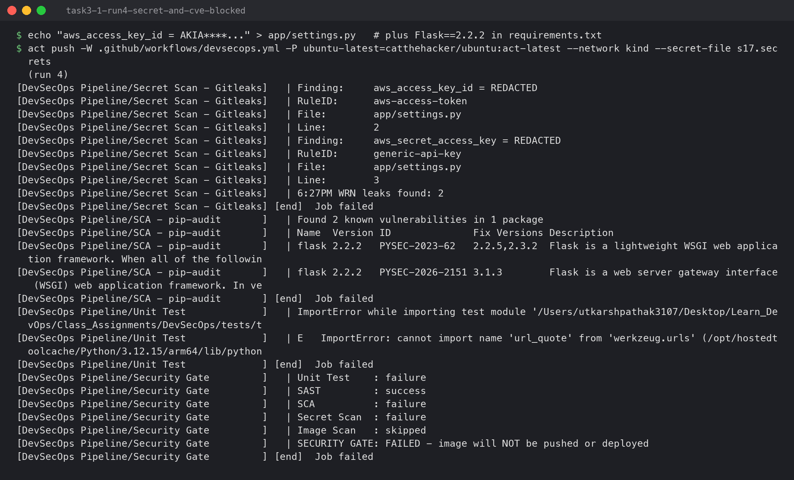

---

## Running it

```bash
kind create cluster --name devsecops --config kind-config.yaml   # containerd config_path enabled
docker run -d --name demo-registry -p 5001:5000 registry:2
docker network connect kind demo-registry                        # nodes pull localhost:5001 via demo-registry
echo "KUBE_CONFIG=$(kind get kubeconfig --name devsecops --internal | base64)" > s17.secrets
act push -W .github/workflows/devsecops.yml -P ubuntu-latest=catthehacker/ubuntu:act-latest \
  --network kind --secret-file s17.secrets --artifact-server-path /tmp/artifacts
```

On GitHub: move the workflow to the repository root's `.github/workflows/`, add `KUBE_CONFIG`
as a repository secret, and point `REGISTRY` at Docker Hub or GHCR with a `docker/login-action`
step.

In the screenshots the emoji `act` prints are drawn as ASCII (`*`, `[ok]`, `[x]`, `[end]`)
because the terminal font has no emoji; the logs in `lab/` have the originals.
