# Session 21: Final DevOps Project and Troubleshooting

**TaskBoard** is a small SaaS-style task manager (React + FastAPI + PostgreSQL). This project takes it all the way from a developer laptop to a monitored, GitOps-managed Kubernetes deployment. It covers every stage of the course: Git → GitHub → CI → build and test → security scanning → Docker image → registry → Kubernetes → Helm → monitoring → GitOps, with the cloud infrastructure provisioned by Terraform.

Every command in this README was actually run. The screenshots in [`screenshots/`](screenshots/) are the real terminal output, captured from a local `minikube` cluster (profile `session21`), Docker Desktop on Apple Silicon, and a Moto mock AWS endpoint.

---

## Table of contents

1. [Project overview](#1-project-overview)
2. [Architecture diagram](#2-architecture-diagram)
3. [Technologies used](#3-technologies-used)
4. [Repository structure](#4-repository-structure)
5. [Application setup](#5-application-setup)
6. [Docker setup](#6-docker-setup)
7. [Kubernetes deployment](#7-kubernetes-deployment)
8. [Helm deployment](#8-helm-deployment)
9. [Terraform infrastructure](#9-terraform-infrastructure)
10. [CI/CD pipeline](#10-cicd-pipeline)
11. [DevSecOps implementation](#11-devsecops-implementation)
12. [Monitoring](#12-monitoring)
13. [GitOps](#13-gitops)
14. [Troubleshooting challenge](#14-troubleshooting-challenge)
15. [Screenshots index](#15-screenshots-index)
16. [Lessons learned](#16-lessons-learned)

---

## 1. Project overview

| Layer | What was built |
|---|---|
| Application | FastAPI REST API (`/api/tasks` CRUD, `/stats`, `/health`, `/ready`, `/metrics`), SQLAlchemy + Alembic, and a React/Vite dashboard (dashboard, my tasks, kanban board, activity; full create/edit/delete) served by nginx |
| Quality | flake8, 15 pytest tests at **100% coverage**; CI fails under 90% |
| Docker | Multi-stage, non-root images with healthchecks, plus a Compose stack with health-gated startup |
| Security | SAST, SCA, secret scanning, Dockerfile lint, image scanning, and a **security gate** that blocks the release |
| CI/CD | GitHub Actions: CI (test → scan → build → push to GHCR) and CD (GitOps image-tag bump, optional Helm deploy) |
| Infrastructure | Terraform: AWS VPC (2 AZs), NAT, security groups, KMS, **EKS** + managed node group, **ECR** |
| Kubernetes | Namespace, Deployments, StatefulSet + PVC, Services, ConfigMap, Secret, Ingress, HPA, startup/liveness/readiness probes |
| Helm | `taskboard` chart with dev/prod values, `helm test`, upgrade, rollback |
| Monitoring | Prometheus (app + cAdvisor metrics, 3 alert rules), Grafana dashboard provisioned from a ConfigMap, `kubectl logs` |
| GitOps | Argo CD with automated sync, prune and self-heal |
| Troubleshooting | 9 intentionally broken scenarios, each investigated, root-caused, fixed and verified |

---

## 2. Architecture diagram

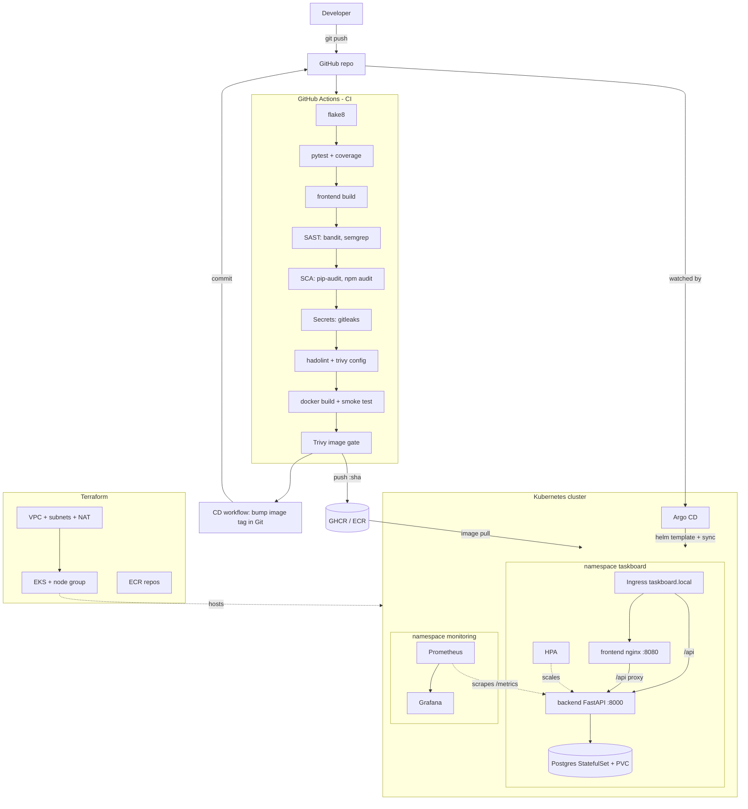
```mermaid
flowchart TB
    dev[Developer] -->|git push| gh[GitHub repo]
    gh --> ci

    subgraph ci[GitHub Actions - CI]
      direction LR
      lint[flake8] --> test[pytest + coverage] --> fe[frontend build]
      fe --> sast[SAST: bandit, semgrep] --> sca[SCA: pip-audit, npm audit]
      sca --> sec[Secrets: gitleaks] --> df[hadolint + trivy config]
      df --> build[docker build + smoke test] --> scan[Trivy image gate]
    end

    scan -->|push :sha| ghcr[(GHCR / ECR)]
    scan --> cd[CD workflow: bump image tag in Git]
    cd -->|commit| gh

    subgraph infra[Terraform]
      vpc[VPC + subnets + NAT] --> eks[EKS + node group]
      ecr[ECR repos]
    end

    subgraph k8s[Kubernetes cluster]
      argo[Argo CD] -->|helm template + sync| app
      subgraph app[namespace taskboard]
        ing[Ingress taskboard.local] --> fesvc[frontend nginx :8080]
        ing -->|/api| be[backend FastAPI :8000]
        fesvc -->|/api proxy| be
        be --> pg[(Postgres StatefulSet + PVC)]
        hpa[HPA] -.scales.-> be
      end
      subgraph mon[namespace monitoring]
        prom[Prometheus] --> graf[Grafana]
      end
      prom -.scrapes /metrics.-> be
    end

    gh -->|watched by| argo
    ghcr -->|image pull| app
    eks -.hosts.-> k8s
```

The same flow as text (from the assignment):

```text
Application → Git → GitHub → CI pipeline → Build & Test → Security scanning → Docker image
  → Container registry → Kubernetes → Helm → Monitoring → GitOps          (infra: Terraform)
```

---

## 3. Technologies used

| Area | Tools |
|---|---|
| App | Python 3.12, FastAPI, SQLAlchemy 2, Alembic, PostgreSQL 16, React 19, Vite 8, nginx (unprivileged) |
| Test / lint | pytest, pytest-cov, flake8 |
| Containers | Docker (multi-stage), Docker Compose |
| CI/CD | GitHub Actions, GHCR, actionlint |
| DevSecOps | bandit, semgrep, pip-audit, npm audit, gitleaks, hadolint, Trivy, Checkov |
| IaC | Terraform 1.16, AWS provider 5.x, Moto (local AWS mock) |
| Orchestration | Kubernetes 1.37 (minikube), Kustomize, ingress-nginx, metrics-server |
| Packaging | Helm 4 |
| Observability | Prometheus, Grafana |
| GitOps | Argo CD v3.5 |

---

## 4. Repository structure

```text
final-devops-project/
├── application/
│   ├── backend/            FastAPI app, Alembic migrations, tests, Dockerfile
│   ├── frontend/           React/Vite UI, nginx.conf, Dockerfile
│   └── load-test.sh
├── docker/                 docker-compose.yml (full local stack)
├── kubernetes/             plain manifests (Kustomize) + load generator
├── helm/taskboard/         Helm chart (values, values-dev, values-prod)
├── terraform/              AWS root + modules/taskboard-infra + environments/local-mock
├── .github/workflows/      ci.yml, cd.yml
├── security/               run-security-scans.sh (security gate) + scanner configs
├── monitoring/             Prometheus/Grafana values, dashboard JSON, promql.sh
├── gitops/                 Argo CD Application/AppProject, env values, local git helper
├── troubleshooting/        9 broken/fixed scenarios + investigation write-up
├── screenshots/            real terminal captures (01-97)
└── README.md
```

Each folder has its own `README.md` with more detail.

> **GitHub Actions location:** GitHub only runs workflows from the repository root. The same workflows therefore also live at
> [`/.github/workflows/session21-ci.yml`](../../.github/workflows/session21-ci.yml) and [`session21-cd.yml`](../../.github/workflows/session21-cd.yml),
> with a `paths:` filter on this folder. The copies in `final-devops-project/.github/workflows/` are the standalone-repo version.

---

## 5. Application setup

The backend exposes:

```text
GET  /            GET /health (liveness)     GET /ready (readiness, runs a DB query)     GET /metrics (Prometheus)
GET  /api/tasks   GET /api/tasks/{id}   POST /api/tasks   PUT /api/tasks/{id}   DELETE /api/tasks/{id}   GET /api/tasks/stats
```

```bash
cd application/backend
python3 -m venv .venv && source .venv/bin/activate
pip install -r requirements-dev.txt
flake8                                     # lint
pytest --cov=app --cov-fail-under=90       # 15 tests, 100% coverage (uses SQLite, no Postgres needed)

cd ../frontend
npm ci && npm run build                    # pinned deps + package-lock.json
```

Fixes made while setting this up:
- The original test suite had a failing test because the table was never created. `TestClient` was used without its context manager, so the startup hook never ran. Startup now uses FastAPI's `lifespan` handler (`on_event` is deprecated).
- CORS was `*` and is now driven by the `CORS_ORIGINS` setting.
- Frontend dependencies were all `"latest"` and are now pinned with a lockfile.

### The TaskBoard UI

The React app ([`application/frontend/src`](application/frontend/src)) only ever calls `/api/...` on its own origin. nginx (Compose) or the Ingress (Kubernetes) routes those calls to the backend.

| View | What it does |
|---|---|
| **Dashboard** (`#/dashboard`) | KPI cards from `GET /api/tasks/stats`, the task table with status filters and search, recent activity and the delivery pipeline |
| **My tasks** (`#/my-tasks`) | Tasks assigned to the signed-in user, with their own counts |
| **Board** (`#/board`) | Kanban columns for To do / In progress / Done. Drag a card to another column to change its status (`PUT /api/tasks/{id}`) |
| **Activity** (`#/activity`) | Task creation times come from the API. Edits, status moves and deletes are logged in the browser |

- **Create / edit:** one modal (`POST` or `PUT`). On success the modal closes and the list refreshes straight away, with no page reload. On failure the API error is shown in the modal and it stays open.
- **Delete:** the trash icon asks for confirmation inline, then calls `DELETE /api/tasks/{id}`.
- **Status:** change it from the pill on any row or card.
- The sidebar uses hash routes, so it works behind nginx's `try_files` with no server changes. The UI follows the OS light/dark setting, and on phones the sidebar collapses into a top bar and table rows stack as cards.

Fixes in this round:
- **New tasks didn't appear until a page refresh.** `create()` called `e.currentTarget.reset()` after an `await`. React clears `currentTarget` once the handler yields, so that line threw, and `setShowForm(false)` and the reload never ran. The form is now controlled state, with no DOM access after `await`.
- **No way to delete tasks.** The backend already had `DELETE /api/tasks/{id}`, but the UI never called it.
- **The sidebar links did nothing.** They were `<a>` tags with no `href` or handler. They are now real routes.

To try it locally: run the backend (`uvicorn app.main:app`, SQLite is fine via `DATABASE_URL=sqlite:///./dev.db`), then `npm run dev` in `application/frontend`. Vite proxies `/api` to `:8000`.

| | |
|---|---|
| 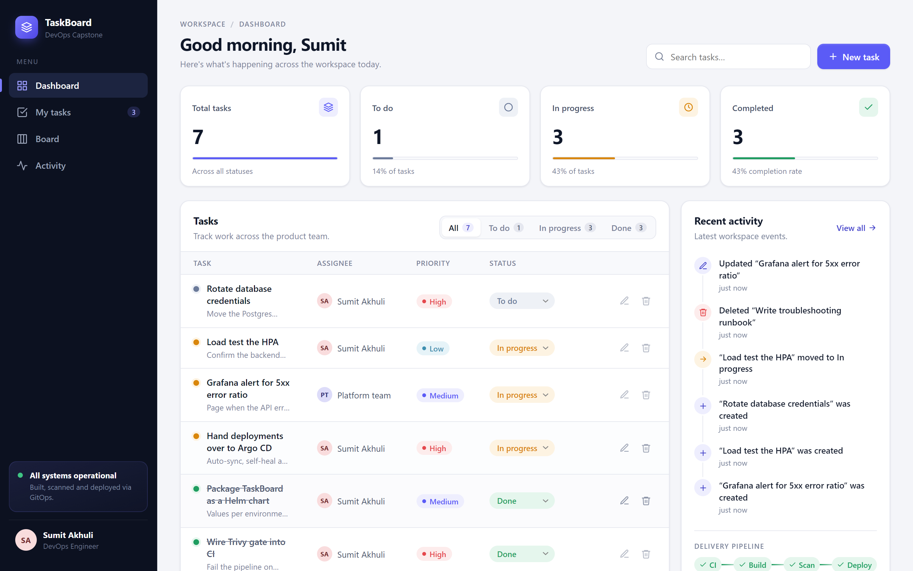 | 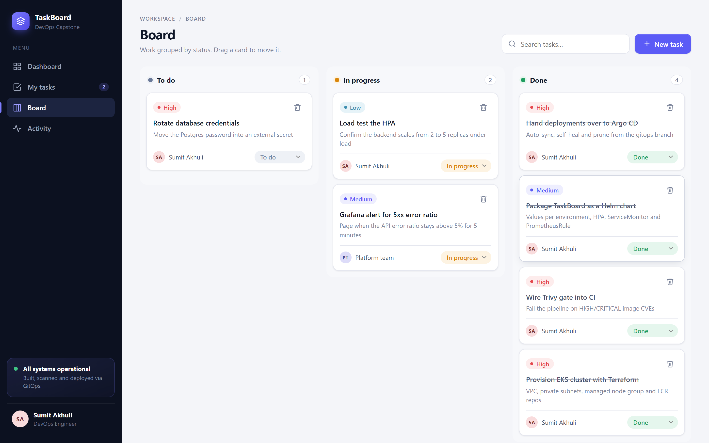 |
| 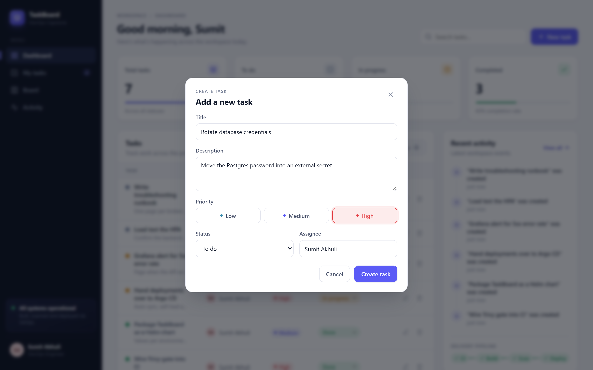 | 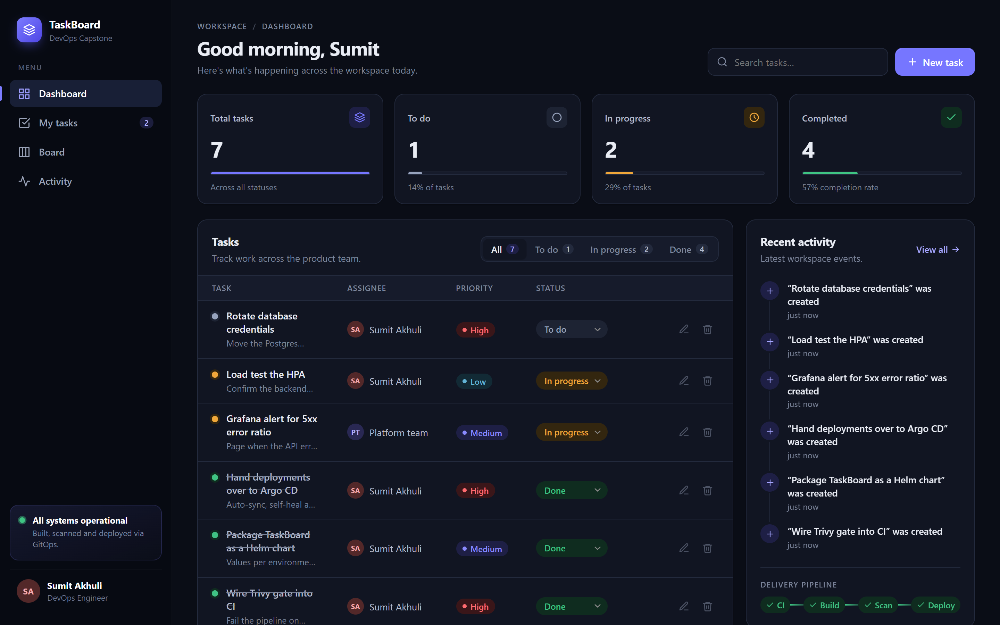 |

| | |
|---|---|
| 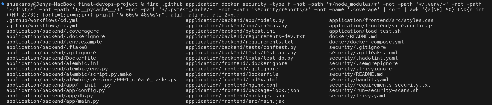 | 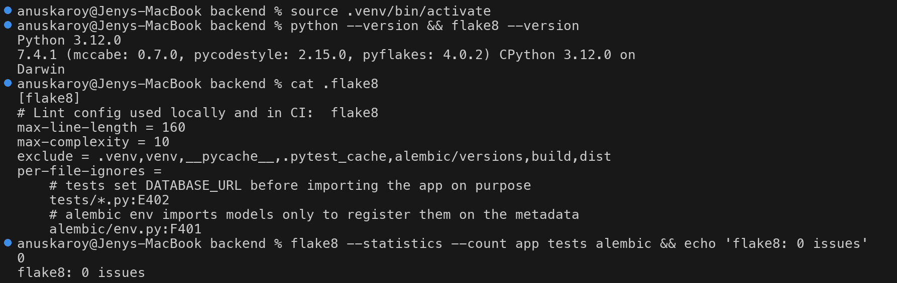 |
| 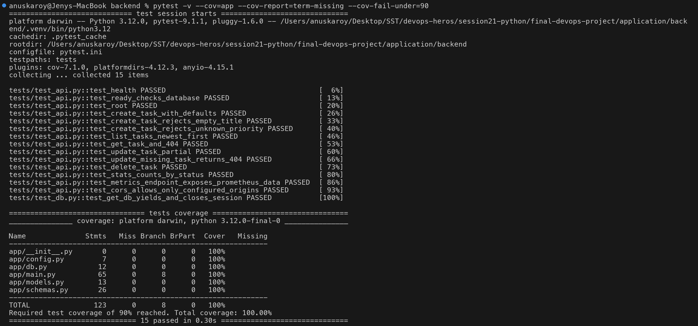 | 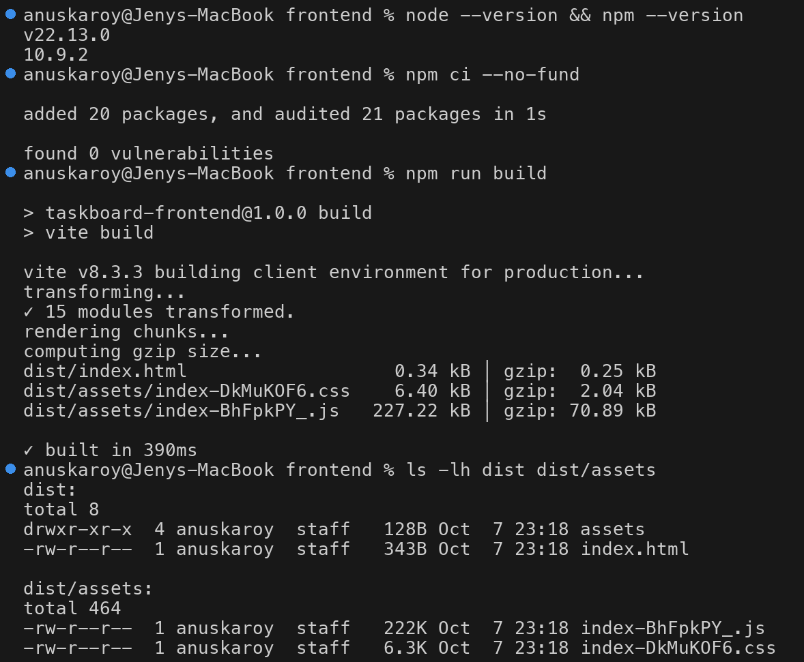 |

---

## 6. Docker setup

- **Backend:** multi-stage build (venv builder → runtime) on `python:3.12-alpine`. pip is removed from the runtime image, it runs as **uid 10001**, and it has a `HEALTHCHECK` on `/health`.
- **Frontend:** `node:24-alpine` build stage, then `nginxinc/nginx-unprivileged` (**uid 101, port 8080**). nginx proxies `/api/` to `http://backend:8000`, adds security headers and exposes a `/healthz` endpoint.
- **Compose:** Postgres → backend → frontend. Each service waits for the previous one to be **healthy** (`depends_on: condition: service_healthy`).

```bash
cd docker
docker compose up -d --build --wait
curl localhost:8000/health && curl localhost:8000/ready
curl -X POST localhost:8000/api/tasks -H 'Content-Type: application/json' -d '{"title":"Ship it"}'
curl localhost:3000/api/tasks              # through the nginx reverse proxy
open http://localhost:3000
docker compose down -v
```

Moving the backend from Debian slim to Alpine took Trivy from **44 HIGH CVEs (all unfixed) to 0** and the image from 339 MB to 210 MB.

| | |
|---|---|
| 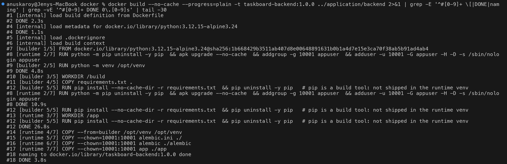 | 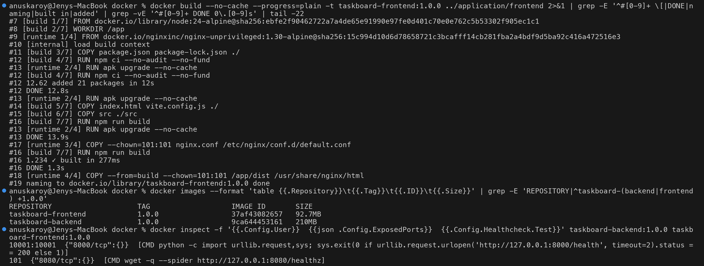 |
| 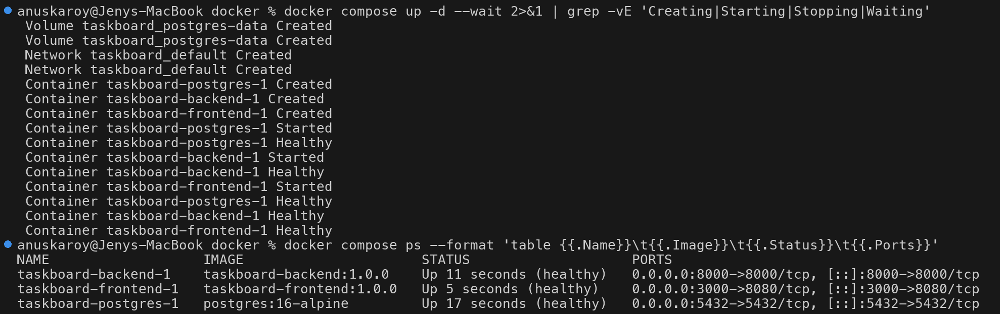 | 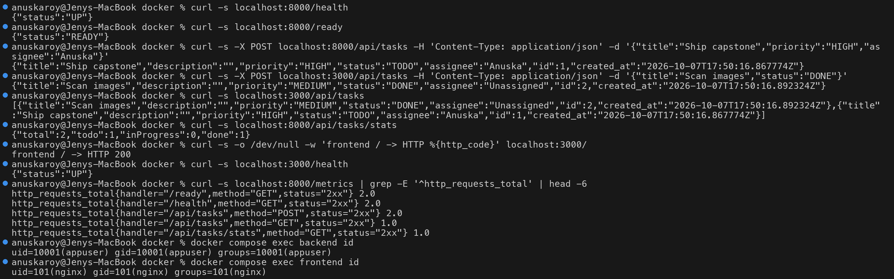 |
| 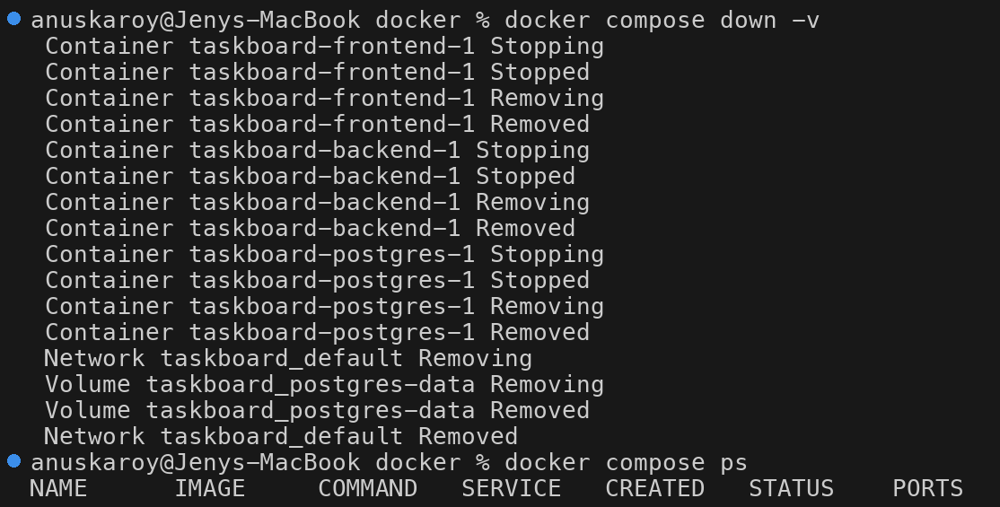 | |

---

## 7. Kubernetes deployment

[`kubernetes/`](kubernetes/) contains plain manifests applied with Kustomize to namespace `taskboard`:

| Requirement | Implementation |
|---|---|
| Deployment | `backend` (FastAPI) and `frontend` (nginx); backend has a `wait-for-db` init container |
| Service | `backend:8000`, `frontend:80→8080`, headless `postgres` |
| ConfigMap | app settings (DB host, CORS, log level) |
| Secret | DB credentials (`DATABASE_URL`, `POSTGRES_PASSWORD`) |
| Ingress | `taskboard.local`: `/api` goes to the backend, `/` goes to the frontend |
| HPA | backend, 1-4 replicas at 50% CPU |
| Probes | startup + liveness on `/health`, readiness on `/ready` (fails when the DB is down) |
| Storage | Postgres **StatefulSet** with a 1Gi `volumeClaimTemplate` (PVC Bound) |
| Hardening | non-root, `readOnlyRootFilesystem`, all capabilities dropped, requests/limits |

```bash
minikube start -p session21 --driver=docker --cpus=2 --memory=2900
minikube -p session21 addons enable ingress && minikube -p session21 addons enable metrics-server
docker build -t taskboard-backend:1.0.0 application/backend && minikube -p session21 image load taskboard-backend:1.0.0
docker build -t taskboard-frontend:1.0.0 application/frontend && minikube -p session21 image load taskboard-frontend:1.0.0

kubectl apply -k kubernetes/
kubectl -n ingress-nginx port-forward svc/ingress-nginx-controller 8080:80 &
curl --resolve taskboard.local:8080:127.0.0.1 http://taskboard.local:8080/api/tasks
kubectl apply -f kubernetes/load-generator.yaml && kubectl -n taskboard get hpa -w
```

Verified behaviour:
- **Readiness probe:** with Postgres scaled to 0, `/ready` returns 500 and the backend leaves the Service endpoints. It comes back by itself, and the data survives on the PVC.
- **HPA:** under load, CPU reached **391%** of the request and the backend scaled **1 → 4**. When the load stopped it went back to 1.

| | |
|---|---|
| 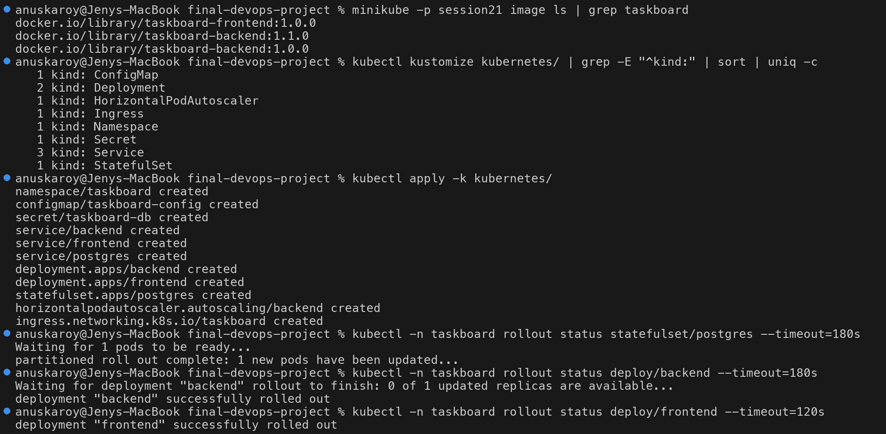 | 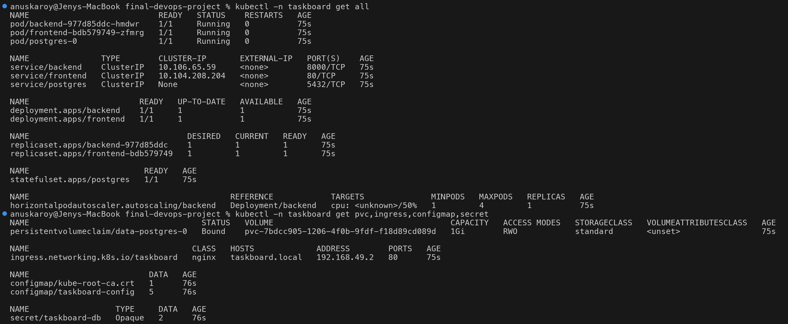 |
| 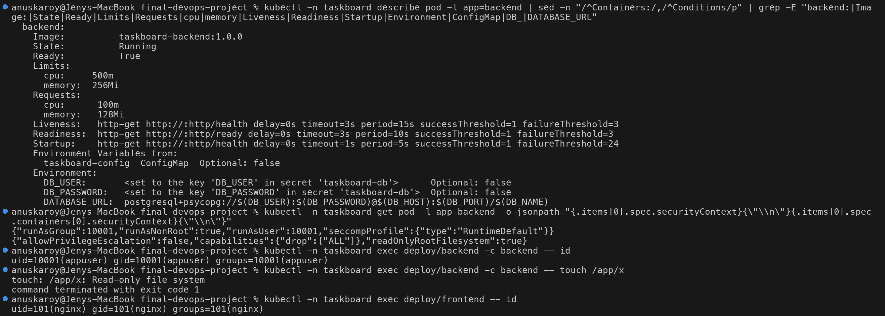 | 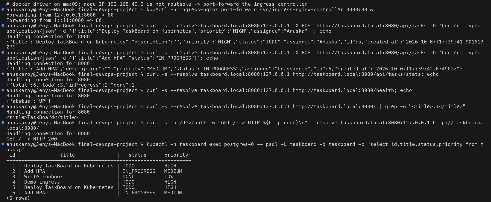 |
| 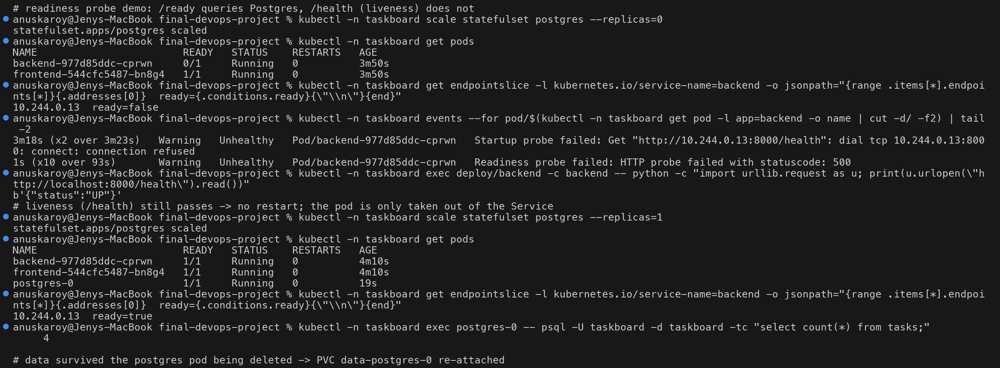 | 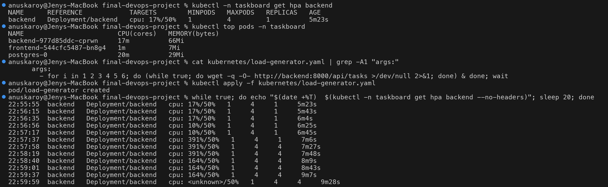 |
| 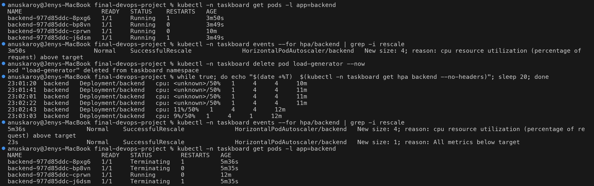 | 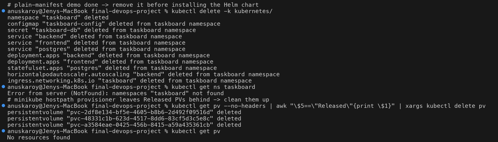 |

---

## 8. Helm deployment

[`helm/taskboard`](helm/taskboard/) (chart 1.1.0) packages the same stack:
- `values.yaml`, `values-dev.yaml` and `values-prod.yaml`. Prod uses GHCR images, HPA 2-6, TLS and an `existingSecret`.
- ConfigMap/Secret templates. Checksum annotations **roll the pods automatically** when config changes.
- Postgres StatefulSet + PVC, Ingress, HPA. Optional `ServiceMonitor` / `PrometheusRule` toggles.
- `NOTES.txt` and a `helm test` connection hook.
- Fixed an upstream bug: the Ingress pointed at a Service that didn't exist, on the wrong port.

```bash
helm lint helm/taskboard -f helm/taskboard/values-dev.yaml
helm template taskboard helm/taskboard | kubectl apply --dry-run=client -f -
helm install taskboard helm/taskboard -n taskboard --create-namespace
helm test taskboard -n taskboard
helm upgrade taskboard helm/taskboard -n taskboard --reset-then-reuse-values --set backend.image.tag=1.1.0
helm history taskboard -n taskboard
helm rollback taskboard 1 -n taskboard
```

> Gotcha: `--reuse-values` ignores new defaults added to the chart. Use `--reset-then-reuse-values`.

| | |
|---|---|
| 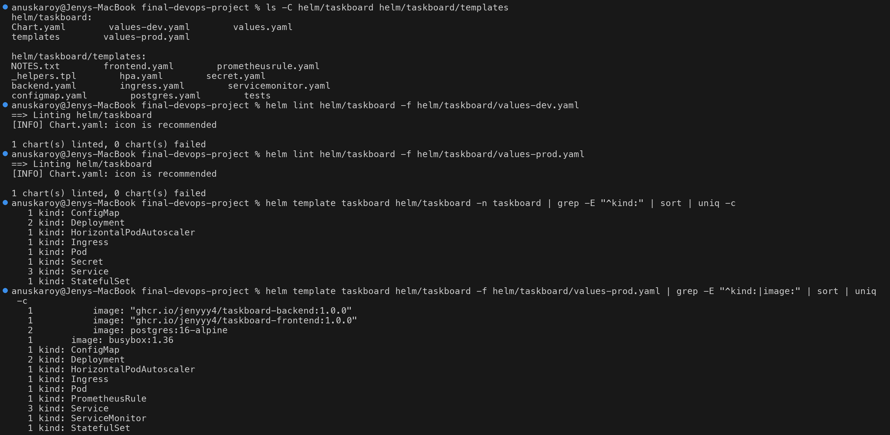 | 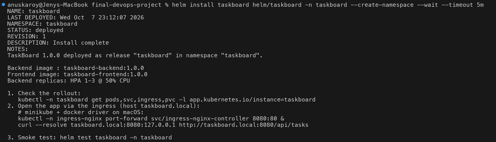 |
| 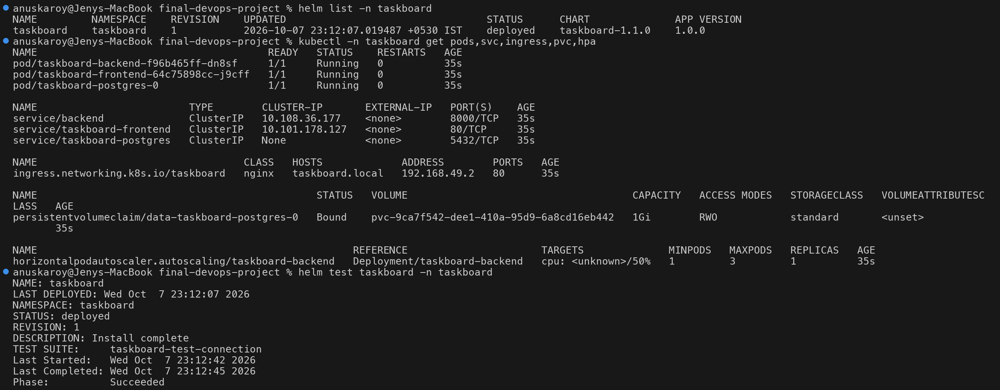 | 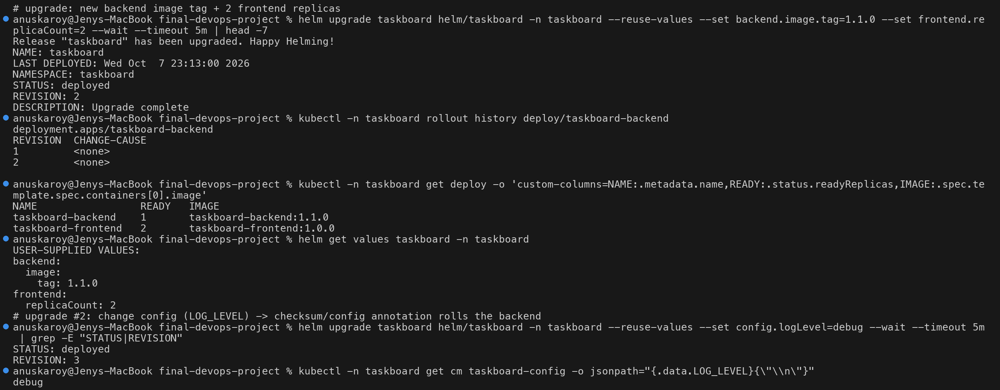 |
| 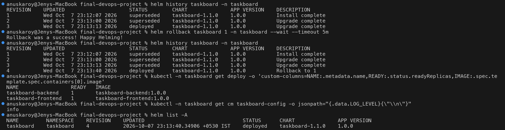 | 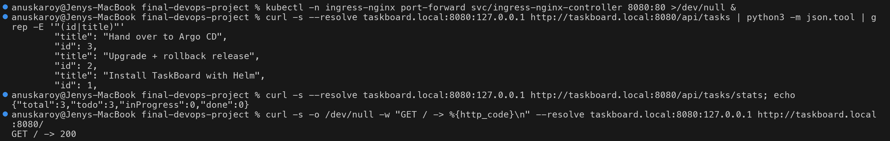 |

---

## 9. Terraform infrastructure

[`terraform/`](terraform/) provisions the AWS infrastructure. All resources are in one module, `modules/taskboard-infra`, built from plain `aws_*` resources:

- **Network:** a VPC across **2 AZs** with public and private subnets (tagged for ELB), an IGW, a NAT gateway with an EIP, route tables, VPC flow logs and a locked-down default security group.
- **Security:** cluster and node security groups, a KMS key with rotation, and IAM roles.
- **EKS 1.31:** control-plane logs, secrets encrypted with KMS, and a **managed node group** (2-4 × t3.medium) using a launch template with IMDSv2 and encrypted gp3 volumes.
- **ECR:** `taskboard-backend` and `taskboard-frontend` with scan-on-push, immutable tags and lifecycle policies.
- Remote state (S3 + DynamoDB lock) is documented in `backend.tf`.

Two root modules use it:

| Root | Purpose |
|---|---|
| `terraform/` | Real AWS: `aws configure && terraform init && terraform apply`, then `$(terraform output -raw configure_kubectl)`. Costs about **USD 5-6/day**, so run `terraform destroy` when done. |
| `terraform/environments/local-mock/` | The same module with the AWS provider pointed at a **Moto** container (`localhost:4577`), so the full workflow runs without an AWS account |

```bash
docker run -d --name moto-aws -p 4577:5000 -e MOTO_IAM_LOAD_MANAGED_POLICIES=true motoserver/moto
cd terraform/environments/local-mock
terraform init && terraform validate
terraform plan -out tfplan              # Plan: 47 to add
terraform apply tfplan                  # Apply complete! Resources: 47 added
terraform output && terraform state list
python3 verify_moto.py                  # boto3: VPC, subnets, NAT, EKS ACTIVE, nodegroup, ECR exist
terraform destroy -auto-approve         # 47 destroyed
```

**Checkov** IaC scan: 146 passed, **0 failed**, 17 skipped, each skip with a reason inline. Its one real finding was fixed: the node security group wasn't attached to anything, and the launch template now attaches it.

| | |
|---|---|
| 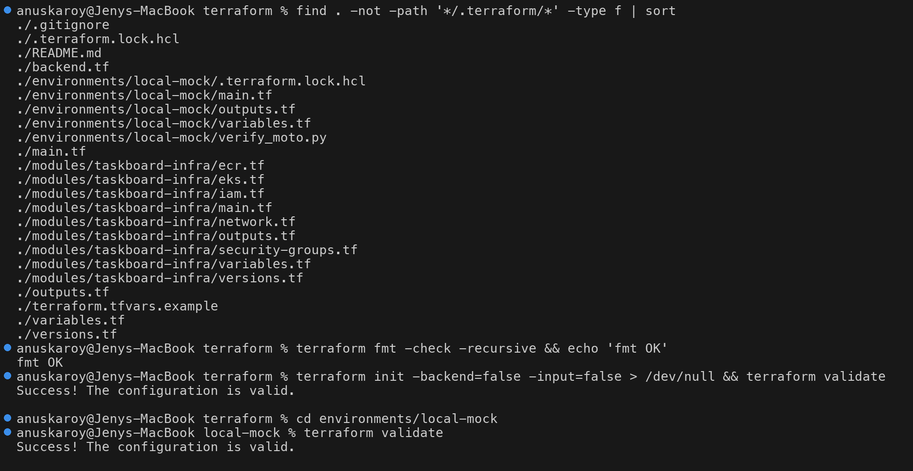 | 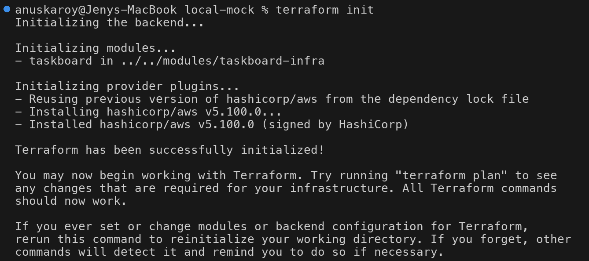 |
| 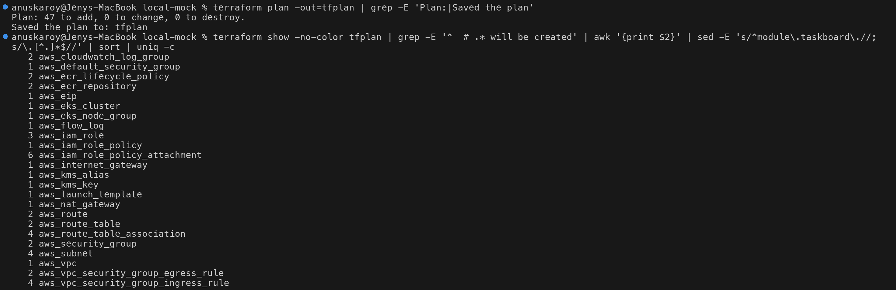 | 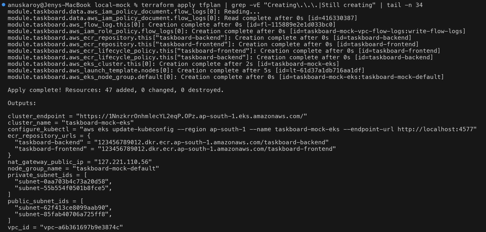 |
| 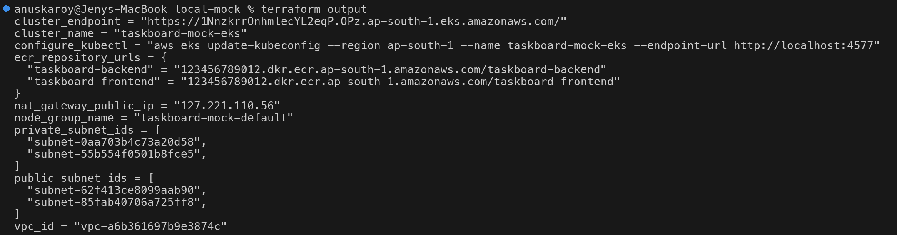 | 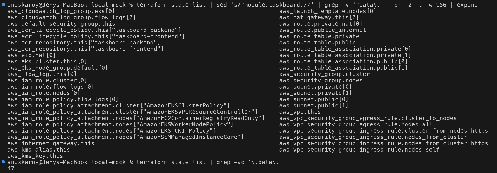 |
| 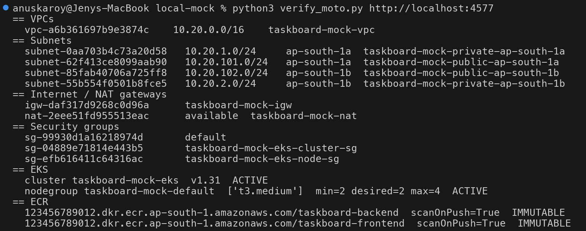 | 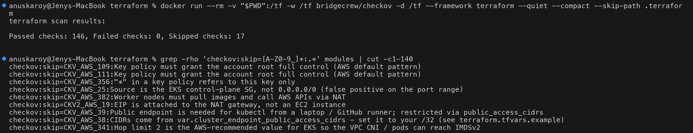 |
| 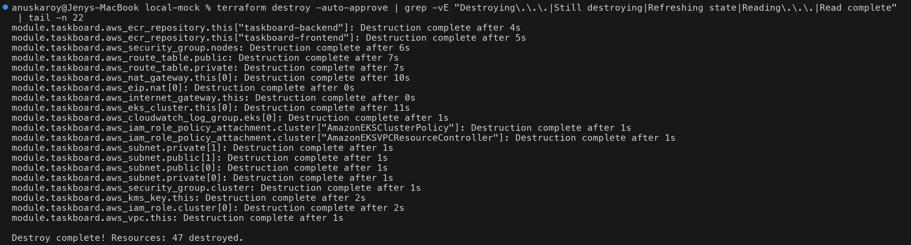 | 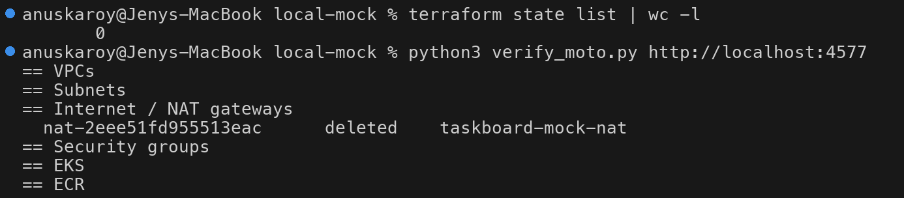 |

---

## 10. CI/CD pipeline

**CI**: [`ci.yml`](.github/workflows/ci.yml), runs on push and PR:

```text
lint → pytest + coverage → frontend build → SAST → SCA → gitleaks (tree + history)
     → hadolint / trivy config → docker build + compose smoke test → Trivy image gate
     → push ghcr.io/<owner>/taskboard-{backend,frontend}:<commit-sha> (+ :latest)   [main only]
```

**CD**: [`cd.yml`](.github/workflows/cd.yml), runs only after a **successful** CI run on `main`:
1. `gitops-update`: pins `<sha>` as `.backend.image.tag` / `.frontend.image.tag` in `helm/taskboard/values-prod.yaml` and commits `chore(gitops): deploy taskboard <sha7> [skip ci]`. Argo CD then syncs the cluster, so **the pipeline never needs cluster credentials**.
2. `helm-deploy` (optional): `helm upgrade --install --atomic`, which runs only if a `KUBECONFIG` secret exists.

Because every image is tagged with the commit SHA, each running pod can be traced to an exact commit.

All four workflow files pass **actionlint** with 0 errors. Before pushing, the same stages were also run locally (screenshots 26-27).

### Real runs on GitHub Actions

| Run | Result |
|---|---|
| [CI #1](https://github.com/sumit akhuli 10158/devops-heros/actions/runs/37687160487) (`c246ec7`) | ❌ **Blocked by the secret-scanning gate.** gitleaks' custom DB-URL rule matched an example URL in `security/README.md`. The job failed, so nothing was built or pushed, and CD was skipped. |
| Fix | Reworded the example. The historical fingerprint was reviewed and added to `security/.gitleaksignore`, which the history scan reads through `--gitleaks-ignore-path`. |
| [CI #2](https://github.com/sumit akhuli 10158/devops-heros/actions/runs/37687498287) | ✅ All 12 jobs green: lint, tests, frontend, SAST, SCA, secrets, Dockerfile lint, build + smoke, Trivy (backend and frontend), **push to GHCR** with image tag `86cb243…` |
| [CD](https://github.com/sumit akhuli 10158/devops-heros/actions/runs/37687968090) | ✅ `gitops-update` pinned `86cb243…` in `values-prod.yaml` and pushed the change back to `main` as `github-actions[bot]`. `helm-deploy` skipped (no `KUBECONFIG` secret). Argo CD did the deploy, see [GitOps](#13-gitops). |
| [CI #3](https://github.com/sumit akhuli 10158/devops-heros/actions/runs/37767562646) (`6fc08e3`) | ✅ All jobs green again on the final commit |

> The intermediate commits from these runs were later squashed into `6fc08e3`, so the SHAs shown in the screenshots (e.g. `86cb243`, `bee0ddb`, `9bc8f5b`) are no longer on `main`. The image tag `86cb243…` is still the one pinned in `values-prod.yaml` and stored in GHCR.

| | |
|---|---|
| 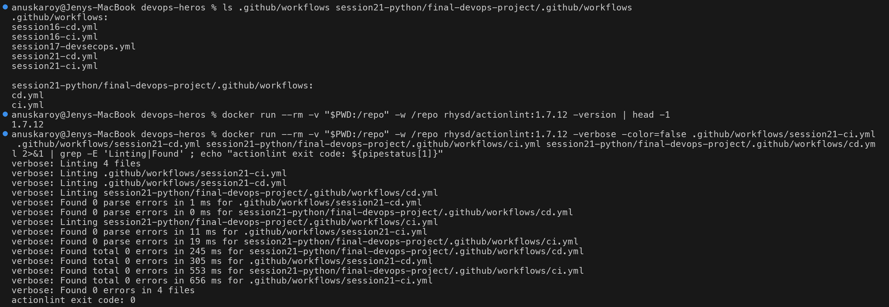 | 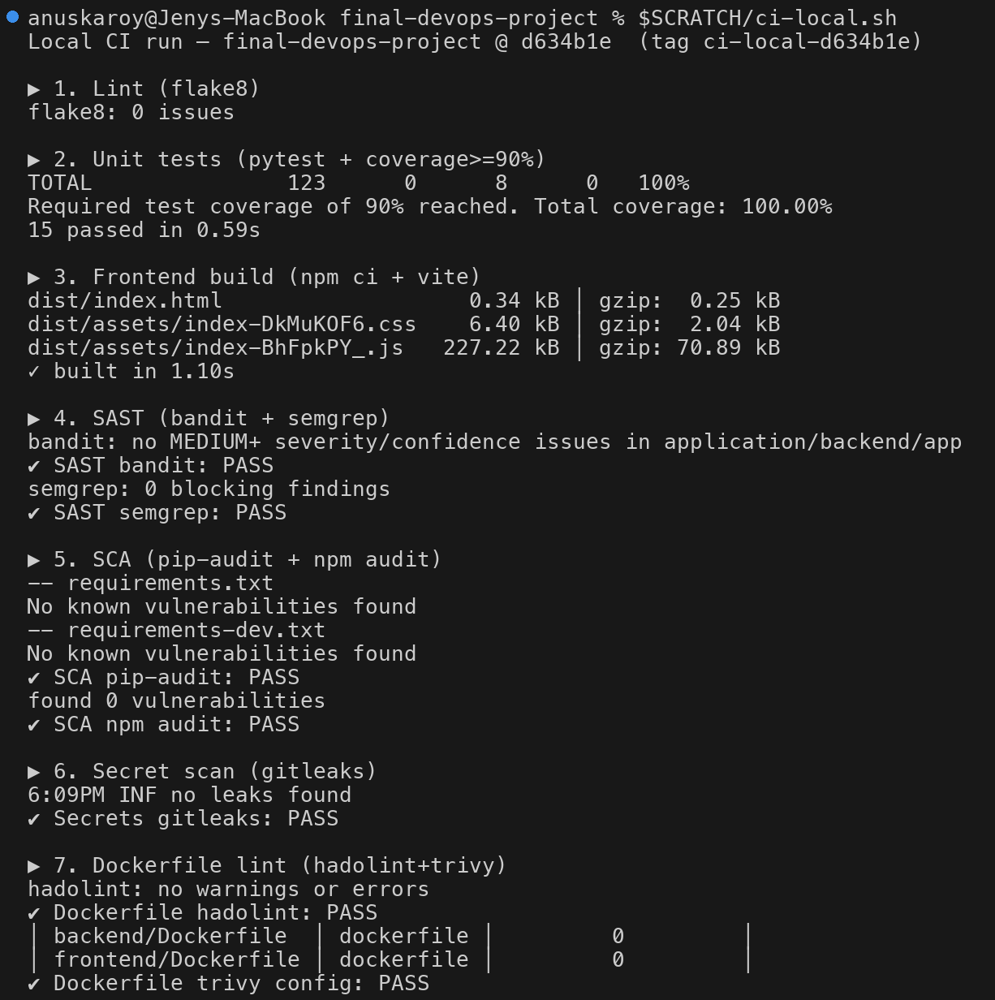 |
| 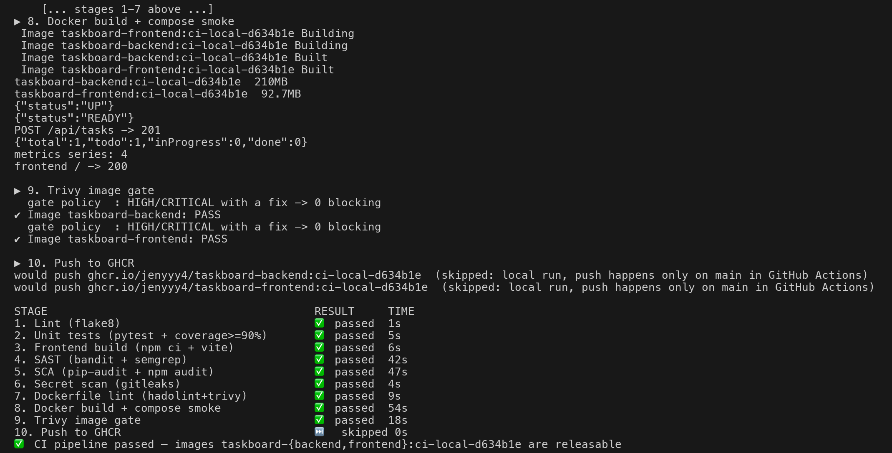 | 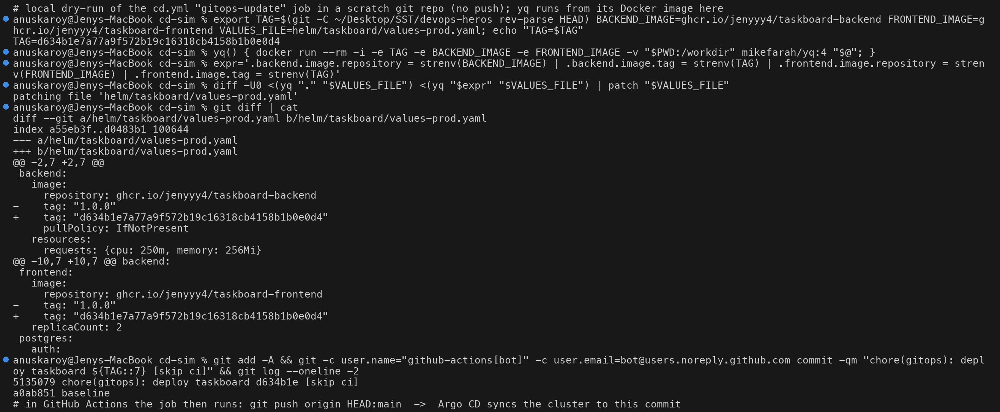 |
| 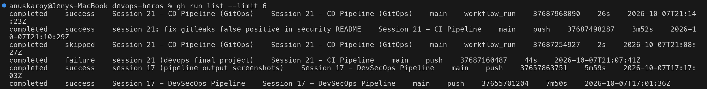 | 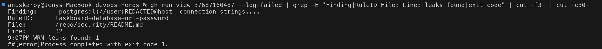 |
| 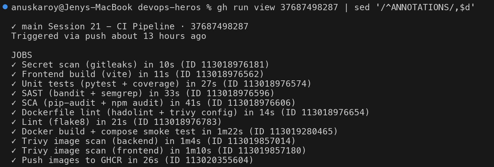 | 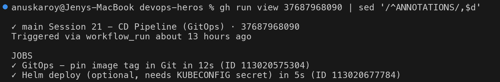 |
| 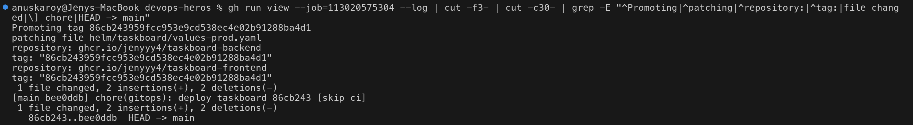 | 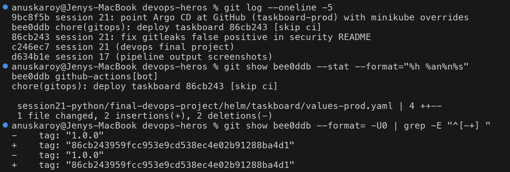 |

---

## 11. DevSecOps implementation

[`security/run-security-scans.sh`](security/run-security-scans.sh) is the **security gate**. It runs the same checks as CI, and every tool runs from a Docker image or a local venv:

| Control | Tool | Gate (exit 1 if…) |
|---|---|---|
| SAST | bandit, semgrep (python/js/dockerfile rules) | any MEDIUM+ bandit issue / blocking semgrep finding |
| SCA | pip-audit, npm audit | any known Python vuln / HIGH+ npm advisory |
| Secret scanning | gitleaks + custom `.gitleaks.toml` rule (DB URLs with passwords) | **any** secret |
| Dockerfile lint | hadolint, `trivy config` | any error / misconfiguration |
| Image scanning | Trivy on both images | any **HIGH/CRITICAL CVE that has a fix** |

**The gate was tested both ways:**
- On a throwaway copy with a planted AWS key, `shell=True`, `yaml.load` and vulnerable pins, **5/9 checks failed** and the release was **BLOCKED** (exit 1).
- On the real project, **9/9 pass**.

Real findings fixed along the way:
- 16 dependency vulnerability records (starlette, pytest), fixed by upgrading the pins.
- 44 HIGH CVEs in the Debian base image, fixed by moving to Alpine.
- Wildcard CORS.
- nginx running as root.
- Unpinned npm dependencies.
- pip left in the runtime image.

| | |
|---|---|
| 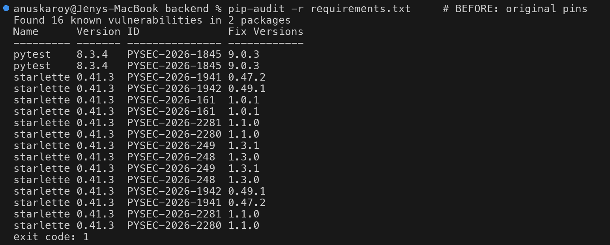 | 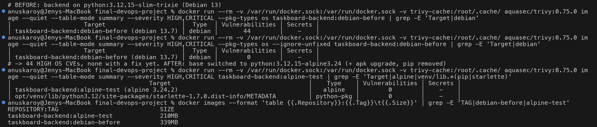 |
|  |  |
|  |  |
|  |  |
|  |  |
|  |  |
|  |  |
|  | |

---

## 12. Monitoring

- **Metrics:** Prometheus (`prometheus-community/prometheus`, server only) scrapes:
  - the backend's `/metrics` through `prometheus.io/*` pod annotations: request rate, status codes and latency histograms;
  - pod CPU and memory through a trimmed cAdvisor job.
- **Dashboards:** Grafana loads the **"TaskBoard - Service Overview"** dashboard (10 panels) from a ConfigMap through its sidecar.
- **Alerts:** `TaskBoardBackendDown`, `TaskBoardHighErrorRate` and `TaskBoardHighLatencyP95`. The first two were **triggered for real**: once by scaling the backend to 0, once by a DB outage that caused 5xx errors.
- **Logs:** `kubectl logs` (uvicorn access logs). Loki was left out because the 4 GB laptop VM had no memory left.

```bash
helm upgrade --install prometheus prometheus-community/prometheus -n monitoring --create-namespace -f monitoring/prometheus-values.yaml
helm upgrade --install grafana grafana/grafana -n monitoring -f monitoring/grafana-values.yaml
kubectl apply -k monitoring/
./monitoring/promql.sh 'sum by (handler,status) (rate(http_requests_total{namespace="taskboard"}[1m]))'
kubectl -n monitoring port-forward svc/grafana 3000:80
```

> kube-prometheus-stack was tried first and saturated the 2-vCPU node (API server timeouts), so it was replaced with the lean charts. See [`monitoring/README.md`](monitoring/README.md).

| | |
|---|---|
|  |  |
|  |  |
|  |  |


---

## 13. GitOps

Argo CD deploys the Helm chart from Git with `syncPolicy.automated: {prune: true, selfHeal: true}`. Git is the single source of truth.

| File | Use |
|---|---|
| `gitops/argocd-application.yaml` | **Applied** in the local demo. The source is a local git repo served by `git daemon` (`git://host.minikube.internal/taskboard-gitops`), the same approach as Session 20; values come from `values.yaml` + `gitops/apps/taskboard/values-local.yaml` |
| `gitops/argocd-application-github.yaml` | **Applied** (namespace `taskboard-prod`). Watches `session21-python/final-devops-project/helm/taskboard` on **GitHub** with `values-prod.yaml`, the file the CD workflow bumps, plus `gitops/apps/taskboard/values-prod-minikube.yaml`. That file holds laptop-only overrides (no cert-manager, no Prometheus Operator CRDs, smaller PVC and requests) and is dropped on EKS |
| `gitops/project.yaml` | AppProject that restricts the allowed source repos and destinations |

What was demonstrated:
1. Handover from Helm to Argo: `helm uninstall` (PVC kept), then the Application is applied and shows **Synced / Healthy**.
2. A Git commit (backend 1.1.0, 2 frontend replicas) makes the app OutOfSync, then **auto-sync** brings it back to Healthy.
3. **Self-heal:** `kubectl scale --replicas=0` and a manual ConfigMap edit are both reverted by Argo.
4. **Prune:** disabling the HPA in Git deletes it from the cluster.
5. `git log` matches Argo's sync history.

| | |
|---|---|
|  |  |
|  |  |
|  |  |
|  | |

### End to end: GitHub → CI → GHCR → CD → Argo CD → Kubernetes

The final step closes the loop with real artifacts. Argo CD on the cluster tracks the GitHub repo and deploys the exact images CI pushed to GHCR, using the tag the CD bot committed:

```bash
kubectl create namespace taskboard-prod
kubectl -n taskboard-prod create secret generic taskboard-db-prod \
  --from-literal=DB_USER=taskboard --from-literal=DB_PASSWORD="$(openssl rand -hex 16)"   # prod: External/Sealed Secrets
kubectl apply -f gitops/project.yaml -f gitops/argocd-application-github.yaml
```

Result: `taskboard-prod` is **Synced / Healthy** at the latest `main` revision (`6fc08e3`; screenshot 108 shows the pre-squash revision), running `ghcr.io/sumit akhuli 10158/taskboard-{backend,frontend}:86cb243…`, the images built and scanned by CI. A task created through the `taskboard-prod.local` ingress was stored in Postgres (PVC Bound).

The first backend pull from GHCR failed with `ImagePullBackOff` (`DeadlineExceeded` on a slow network). Pre-pulling the same GHCR image on the node with `crictl pull` and deleting the pod fixed it. See [Real issues](#real-issues-hit-while-building-the-project).

| | |
|---|---|
|  |  |
|  |  |

---

## 14. Troubleshooting challenge

There are nine issues, each intentionally introduced in [`troubleshooting/scenarios/`](troubleshooting/scenarios/). They run in their own namespace, `tb-debug`, because Argo CD's self-heal would undo any breakage in `taskboard` straight away.

Every scenario follows the same process: **Identify → Investigate (get / describe / logs / events / endpoints) → Root cause → Fix → Verify**. The full write-up, with the real command output, is in [`troubleshooting/README.md`](troubleshooting/README.md).

| # | Symptom | Root cause | Fix |
|---|---|---|---|
| 01 | `ImagePullBackOff` | Image tag `9.9.9` doesn't exist | Use tag `1.0.0` |
| 02 | `CrashLoopBackOff` | Wrong DB password in the Secret (Postgres logs show `password authentication failed`) | Correct the Secret + `rollout restart` |
| 03 | Service has no endpoints | Selector `app=backend` doesn't match the pod labels | Fix the selector |
| 04 | Pod Running but never Ready | Readiness probe hits `/readyz`, which returns 404 | Probe `/ready` |
| 05 | `CreateContainerConfigError` | `configMapKeyRef` points at a missing key | Correct the key name |
| 06 | `OOMKilled` (exit 137) | 40Mi memory limit; the app needs about 72Mi | Limit 256Mi |
| 07 | Ingress returns 503 | Ingress backend port 8080, but the Service listens on 8000 | Port 8000 |
| 08 | PVC stuck `Pending` | StorageClass `fast-ssd` doesn't exist | Recreate the PVC with `standard` (the PVC spec can't be edited) |
| 09 | HPA target `<unknown>` | Container has no CPU request | Add `resources.requests.cpu` |

| Broken + investigation | Fixed + verified |
|---|---|
|  |  |
|  |  |
|  |  |
|  |  |
|  |  |
|  |  |
|  |  |
|  |  |
|  |  |

### Real issues hit while building the project

These weren't planted. They happened during the build and were debugged the same way:

| Issue | Root cause | Fix |
|---|---|---|
| Original pytest suite failed (`no such table: tasks`) | `TestClient` was used without `with`, so the startup hook never ran | `lifespan` handler + `with TestClient(app)` fixture |
| Helm Ingress returned 503 | Chart Ingress pointed at a nonexistent Service on the wrong port | Fixed the template |
| API server `TLS handshake timeout`, metrics-server and repo-server crash-looping | kube-prometheus-stack plus image scans on a ~4 GB Docker VM; node load average reached 54 and it was swapping | Lean Prometheus/Grafana charts, unused Argo components scaled to 0, more CPU and memory for the minikube container |
| `minikube image build` failed | `.dockerignore` excludes `Dockerfile` | `docker build` on the host + `minikube image load` |
| Terraform on Moto failed with `NoSuchEntity` | Moto doesn't load AWS-managed IAM policies by default | Start Moto with `MOTO_IAM_LOAD_MANAGED_POLICIES=true` |
| Trivy: 44 HIGH CVEs with no fix | Debian slim base image | Switched to the Alpine base |
| First GitHub CI run failed at `Secret scan (gitleaks)` | The custom DB-URL rule matched an example URL in `security/README.md` (a false positive, but the gate did its job) | Reworded the doc; added the reviewed historical fingerprint to `security/.gitleaksignore` |
| `taskboard-prod` backend `ImagePullBackOff`; events show `DeadlineExceeded` pulling from GHCR | Slow network: the 27 MB layer didn't finish within kubelet's pull deadline (frontend, 26 MB, had just made it) | `crictl pull` of the same GHCR image on the node, then `kubectl delete pod`. Argo then reported Healthy once the HPA got metrics |

---

## 15. Screenshots index

| Range | Topic |
|---|---|
| 01-04 | Application: tree, lint, tests, frontend build |
| 05-09 | Docker build and Compose |
| 10-24 | DevSecOps scanners and security gate (fail and pass) |
| 25-28 | CI/CD: actionlint, local CI run, CD GitOps tag bump |
| 30-39 | Terraform (Moto): init / plan / apply / verify / Checkov / destroy |
| 40-47 | Kubernetes manifests, probes, ingress, HPA |
| 50-55 | Helm lifecycle |
| 60-66 | Prometheus, alerts, Grafana |
| 70-76 | Argo CD GitOps |
| 80-97 | Troubleshooting scenarios |
| 100-105 | Real GitHub Actions runs: CI blocked, CI green, CD GitOps commit |
| 106-109 | Argo CD tracking GitHub, GHCR images running, prod smoke test |
| 110-113 | TaskBoard UI: dashboard, board, create-task modal, dark mode |

---

## 16. Lessons learned

1. **Shift left pays off.** Tests and scanners in CI caught a broken test suite, 16 vulnerable dependency records and 44 base-image CVEs before any image would have shipped. Changing the base image fixed more than any number of package bumps.
2. **A security gate needs a failing test too.** It isn't enough that the gate passes. Planting a secret and vulnerable packages showed that it really blocks the release.
3. **Liveness ≠ readiness.** `/health` keeps the pod alive, while `/ready` (which checks the DB) takes it out of the Service while the database is down. Mixing them up turns a DB blip into a restart loop.
4. **An HPA needs resource requests.** Without a CPU request, its target is `<unknown>`, and it fails silently.
5. **GitOps changes how you debug.** With `selfHeal` on, Argo reverts `kubectl edit` within seconds, so experiments belong in a separate namespace and real fixes belong in Git.
6. **Tag images with the commit SHA,** never just `latest`. That's what makes rollback (`helm rollback` or `git revert`) and auditing possible.
7. **Size the tools for the cluster.** kube-prometheus-stack is the standard choice, but on a 2-vCPU laptop node it took down the API server. Lean charts did the job.
8. **Mock what you can't afford to run.** Running Terraform against Moto exercised the full init → plan → apply → destroy cycle for 47 resources without an AWS bill. Real AWS still has to be validated separately: Moto doesn't emulate every API, and a re-plan on the mock showed spurious drift.
9. **Troubleshooting order:** `get` → `describe` (events) → `logs --previous` → endpoints/EndpointSlices → exec into the pod. Nearly every issue here showed up in the `Events:` section of `describe`.
