# Helm (Session 15)

**Name:** Sumit Akhuli
**Enrollment No:** 24bcs10158

Every command and output below was captured from a real run on my machine — Helm `v4.3.0`,
Minikube with Kubernetes `v1.37.0` (`docker` driver), macOS on Apple Silicon. The mini project
uses the `notes-chart` from the class repo, `session-15-helm/mini-project`. The full raw
transcript is in [`lab/transcript.txt`](lab/transcript.txt).

Up to Session 14 every app was a pile of separate YAML files applied one by one. Helm turns that
pile into one **chart** (templates + a `values.yaml`), and every install or upgrade of it becomes a
numbered **revision** that can be listed and rolled back. That last part is the real reason to use
it: `kubectl apply` has no "undo", `helm rollback` does.

```text
Chart (templates + values)  --helm install-->  Release "web"  (revision 1)
                            --helm upgrade-->                 (revision 2, 3, ...)
                            --helm rollback-->                (new revision = copy of an old one)
```

---

## Task 1: Helm commands

### `helm version` — tools used

```bash
helm version --short; kubectl version; kubectl get nodes
```

```
v4.3.0+gbec5b06
Client Version: v1.37.0
Kustomize Version: v5.8.1
Server Version: v1.37.0
NAME       STATUS   ROLES           AGE   VERSION
minikube   Ready    control-plane   41m   v1.37.0
```

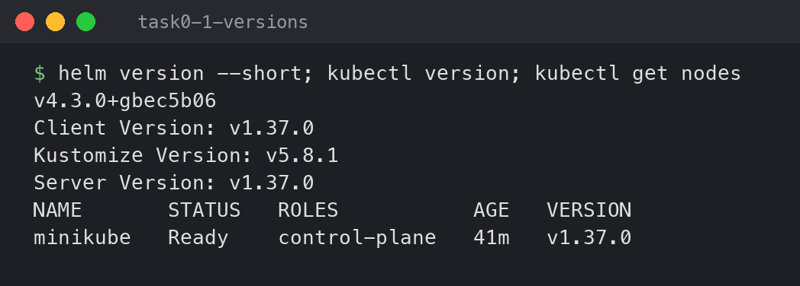

### `helm create` — generate a chart skeleton

```bash
helm create web-chart && find web-chart -type f | sort
```

```
Creating web-chart
web-chart/.helmignore
web-chart/Chart.yaml
web-chart/templates/_helpers.tpl
web-chart/templates/deployment.yaml
web-chart/templates/hpa.yaml
web-chart/templates/httproute.yaml
web-chart/templates/ingress.yaml
web-chart/templates/NOTES.txt
web-chart/templates/service.yaml
web-chart/templates/serviceaccount.yaml
web-chart/templates/tests/test-connection.yaml
web-chart/values.yaml
```

`helm create` writes a working nginx chart. `Chart.yaml` is the chart's name and version,
`values.yaml` holds every setting the templates read, and `templates/` holds Kubernetes YAML with
`{{ .Values.x }}` placeholders. The only change I made was pinning `image.tag: "1.25"` in
[`web-chart/values.yaml`](web-chart/values.yaml), so the upgrade later has something visible to change.

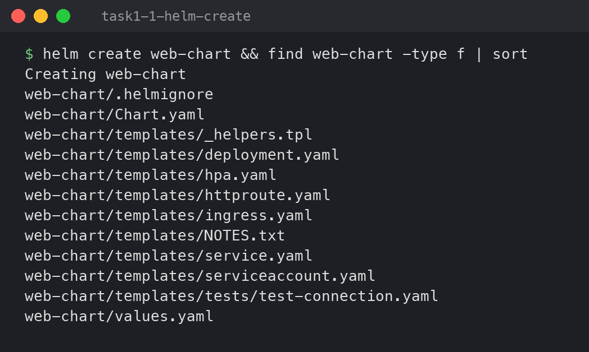

Before installing, `helm lint` checks the chart and `helm template` shows the YAML Helm *would*
send, without touching the cluster:

```bash
helm lint web-chart; helm template demo web-chart | grep -E "^kind:|image:|replicas:"
```

```
==> Linting web-chart
[INFO] Chart.yaml: icon is recommended

1 chart(s) linted, 0 chart(s) failed
kind: ServiceAccount
kind: Service
kind: Deployment
  replicas: 1
          image: "nginx:1.25"
kind: Pod
      image: busybox
```

The `busybox` Pod is the chart's `helm test` hook (`templates/tests/`), not part of the app.

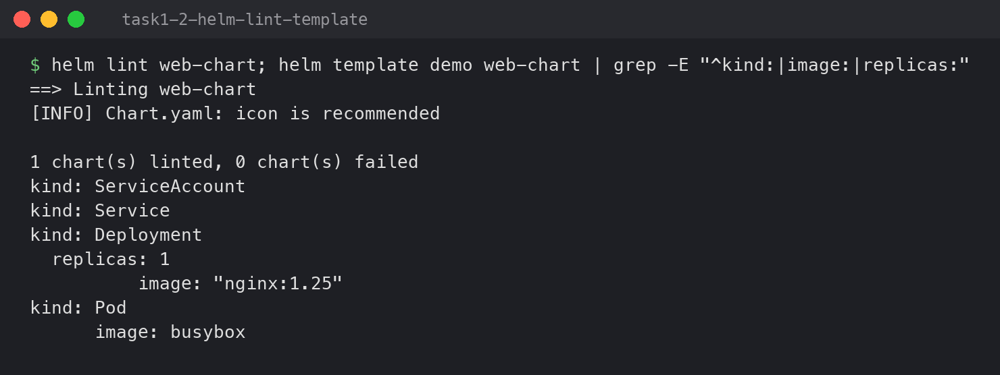

### `helm install`

```bash
kubectl create namespace helm-lab
helm install web web-chart -n helm-lab --wait --timeout 3m
```

```
namespace/helm-lab created
NAME: web
LAST DEPLOYED: Tue Oct  6 23:38:39 2026
NAMESPACE: helm-lab
STATUS: deployed
REVISION: 1
DESCRIPTION: Install complete
NOTES:
1. Get the application URL by running these commands:
  ...
```

`web` is the **release name** — one chart can be installed many times under different names.
`--wait` makes Helm wait until the Pods are actually Ready before reporting success, instead of
returning as soon as the YAML is accepted.

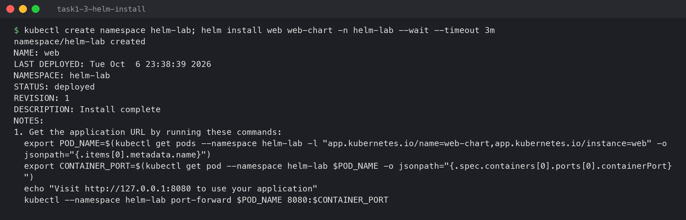

### `helm list` and `helm status`

```bash
helm list -n helm-lab
helm status web -n helm-lab
kubectl get deploy,pods,svc -n helm-lab
```

```
NAME	NAMESPACE	REVISION	UPDATED                             	STATUS  	CHART          	APP VERSION
web 	helm-lab 	1       	2026-10-06 23:38:39.624376 +0530 IST	deployed	web-chart-0.1.0	1.16.0

NAME: web
STATUS: deployed
REVISION: 1
...
NAME                            READY   UP-TO-DATE   AVAILABLE   AGE
deployment.apps/web-web-chart   1/1     1            1           15s

NAME                                 READY   STATUS    RESTARTS   AGE
pod/web-web-chart-849df6fbdd-46x96   1/1     Running   0          15s

NAME                    TYPE        CLUSTER-IP      EXTERNAL-IP   PORT(S)   AGE
service/web-web-chart   ClusterIP   10.102.250.13   <none>        80/TCP    15s
```

`helm list` shows releases, `helm status` shows one release plus the resources it owns. Note
`APP VERSION 1.16.0`: that comes from `Chart.yaml`, not from the running image — it is only a
label, which is why the image tag is set separately in `values.yaml`.

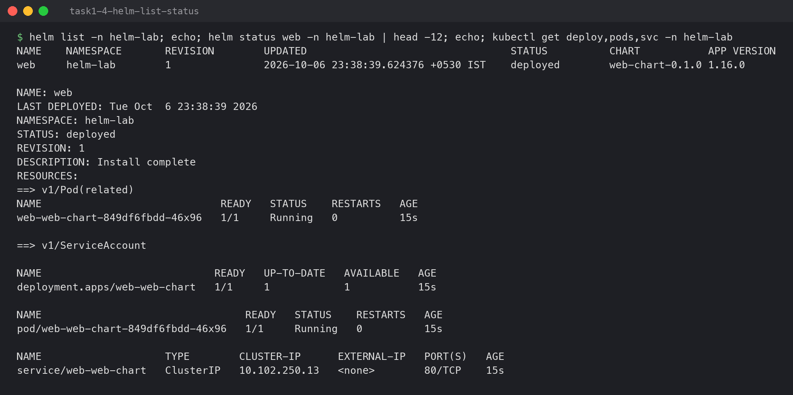

### `helm get` — what Helm stored for the release

```bash
helm get values web -n helm-lab --all | head -12
helm get manifest web -n helm-lab | grep -E "^# Source|image:|replicas:"
```

```
COMPUTED VALUES:
affinity: {}
autoscaling:
  enabled: false
  maxReplicas: 100
  ...
# Source: web-chart/templates/serviceaccount.yaml
# Source: web-chart/templates/service.yaml
# Source: web-chart/templates/deployment.yaml
  replicas: 1
          image: "nginx:1.25"
```

`get values` shows the settings the release was built with; `get manifest` shows the exact YAML
that was sent to the cluster. Helm keeps both for every revision (as a Secret in the namespace),
which is what makes rollback possible.

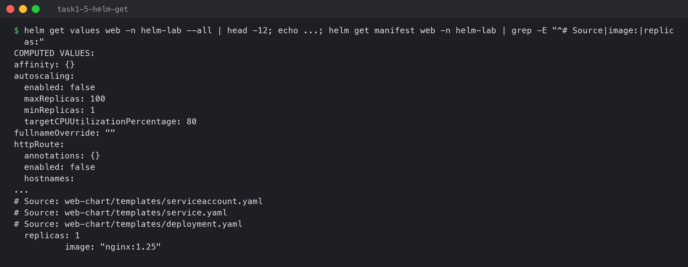

### `helm repo` — add chart repositories

```bash
helm repo add bitnami https://charts.bitnami.com/bitnami
helm repo add prometheus-community https://prometheus-community.github.io/helm-charts
helm repo update
helm repo list
```

```
"bitnami" already exists with the same configuration, skipping
"prometheus-community" has been added to your repositories
Hang tight while we grab the latest from your chart repositories...
...Successfully got an update from the "prometheus-community" chart repository
...Successfully got an update from the "bitnami" chart repository
Update Complete. ⎈Happy Helming!⎈
NAME                	URL
bitnami             	https://charts.bitnami.com/bitnami
prometheus-community	https://prometheus-community.github.io/helm-charts
```

A repo is just a URL with an index of published charts — like `apt` sources for Kubernetes apps.
`helm repo update` downloads the latest index.

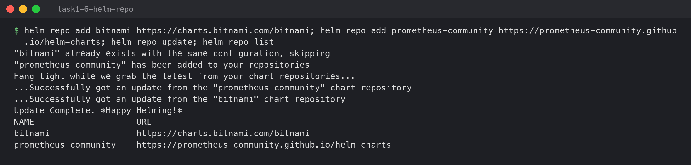

### `helm search` — find charts

```bash
helm search repo nginx | head -6
helm search repo prometheus-community/kube-prometheus-stack --versions | head -4
helm search hub argo-cd --max-col-width 60 | head -5
```

```
NAME                                          	CHART VERSION	APP VERSION	DESCRIPTION
bitnami/nginx                                 	25.2.1       	1.31.6     	NGINX Open Source is a web server that can be a...
bitnami/nginx-ingress-controller              	12.0.7       	1.13.1     	NGINX Ingress Controller is an Ingress controll...
...
prometheus-community/kube-prometheus-stack	91.9.0       	v0.94.1    	kube-prometheus-stack collects Kubernetes manif...
...
https://artifacthub.io/packages/helm/argo-cd-oci/argo-cd    	10.9.6       	v3.5.3     	A Helm chart for Argo CD, a declarative, GitOps continuou...
```

`search repo` only looks in repos I added; `search hub` searches Artifact Hub, the public
catalogue of every published chart.

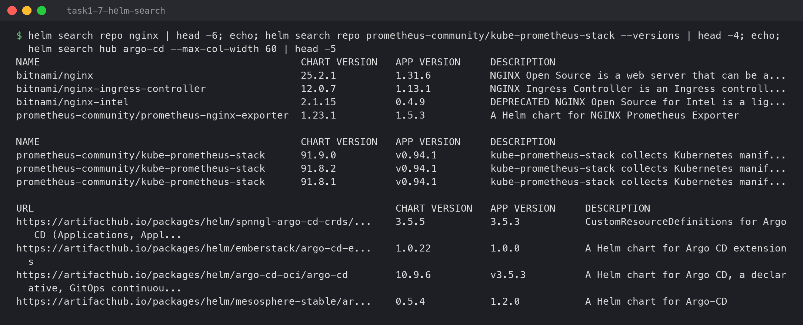

`helm upgrade`, `helm history` and `helm rollback` are covered in Task 2, and `helm uninstall`
at the end of this task list:

### `helm uninstall`

```bash
helm uninstall web -n helm-lab --wait
helm list -A
kubectl get all -n helm-lab
```

```
release "web" uninstalled
NAME 	NAMESPACE	REVISION	UPDATED                             	STATUS  	CHART            	APP VERSION
notes	notes    	3       	2026-10-06 23:41:50.039007 +0530 IST	deployed	notes-chart-0.1.0	1.0
NAME                                 READY   STATUS      RESTARTS   AGE
pod/web-web-chart-5c6695df77-qcx9h   0/1     Completed   0          2m56s
pod/web-web-chart-5c6695df77-zwfrq   0/1     Completed   0          2m41s
```

One command removed the Deployment, Service and ServiceAccount together — no need to remember
which files created what. The two pods shown are the last ones shutting down (`Completed`).
I ran this after Task 2 and the mini project, which is why `notes` is still listed.

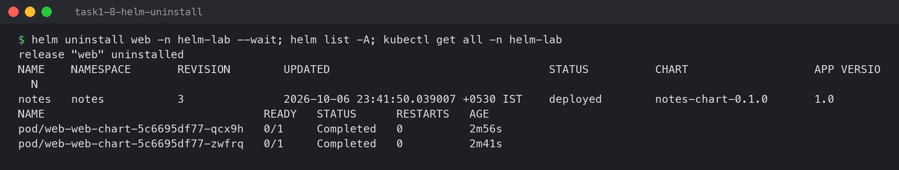

---

## Task 2: Rollback workflow

Install → Upgrade → Verify → Upgrade again → Verify → Rollback → Verify. To make the rollback
mean something, the second upgrade is a **bad release**: an image tag that does not exist.

### 1. Install and verify (revision 1)

Revision 1 was the install from Task 1 (`nginx:1.25`, 1 replica).

```bash
kubectl get deploy web-web-chart -n helm-lab -o jsonpath="image=...  replicas=...  ready=..."
kubectl run curl-check -n helm-lab --rm -i --restart=Never --image=curlimages/curl:8.10.1 -q -- curl -sI http://web-web-chart
```

```
image=nginx:1.25  replicas=1  ready=1
HTTP/1.1 200 OK
Server: nginx/1.25.5
```

The `Server:` header is the proof — it comes from the nginx actually answering inside the
cluster, not from the YAML.

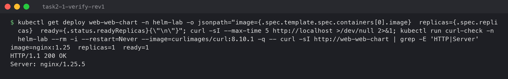

### 2. Upgrade (revision 2)

```bash
helm upgrade web web-chart -n helm-lab --set image.tag=1.26 --set replicaCount=2 --wait --timeout 3m
```

```
Release "web" has been upgraded. Happy Helming!
NAME: web
LAST DEPLOYED: Tue Oct  6 23:39:18 2026
NAMESPACE: helm-lab
STATUS: deployed
REVISION: 2
DESCRIPTION: Upgrade complete
```

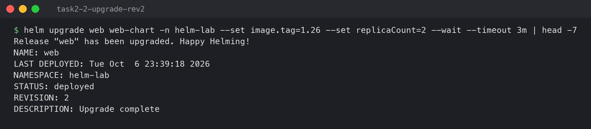

### 3. Verify revision 2

```
image=nginx:1.26  replicas=2  ready=2
NAME                             READY   STATUS      RESTARTS   AGE
web-web-chart-5c6695df77-qcx9h   1/1     Running     0          16s
web-web-chart-5c6695df77-zwfrq   1/1     Running     0          1s
web-web-chart-849df6fbdd-46x96   0/1     Completed   0          55s
HTTP/1.1 200 OK
Server: nginx/1.26.3
```

Two new pods on `1.26`, and the old `1.25` pod (`849df6fbdd`) shutting down — a rolling update.
(The `couldn't attach` warning in the screenshot is a harmless `kubectl run` race: the pod
finished before kubectl attached, so it printed the logs instead, which is why the response
appears twice.)

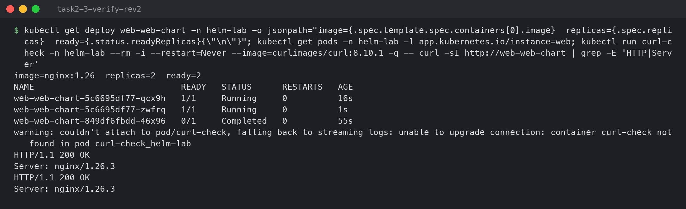

### 4. Upgrade again — a broken release (revision 3)

```bash
helm upgrade web web-chart -n helm-lab --set image.tag=1.99-doesnotexist --set replicaCount=2 --wait --timeout 60s
```

```
level=WARN msg="upgrade failed" name=web error="resource Deployment/helm-lab/web-web-chart not ready. status: InProgress, message: Updated: 1/2\ncontext deadline exceeded"
Error: UPGRADE FAILED: resource Deployment/helm-lab/web-web-chart not ready. status: InProgress, message: Updated: 1/2
context deadline exceeded
```

Because of `--wait`, Helm noticed the new pods never became Ready and marked the release
`failed` instead of reporting success.

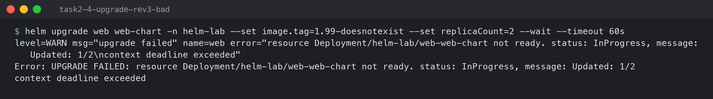

### 5. Verify revision 3

```
image=nginx:1.99-doesnotexist  replicas=2  ready=2
NAME                             READY   STATUS         RESTARTS   AGE
web-web-chart-5c6695df77-qcx9h   1/1     Running        0          79s
web-web-chart-5c6695df77-zwfrq   1/1     Running        0          64s
web-web-chart-686df668f-6z27h    0/1     ErrImagePull   0          61s
NAME	NAMESPACE	REVISION	UPDATED                             	STATUS	CHART          	APP VERSION
web 	helm-lab 	3       	2026-10-06 23:39:36.681148 +0530 IST	failed	web-chart-0.1.0	1.16.0
```

The new pod is stuck in `ErrImagePull`. The site is still up only because the Deployment's
rolling update refuses to kill old pods until new ones are Ready — but the Deployment spec now
points at a broken image, so any restart would take the site down.

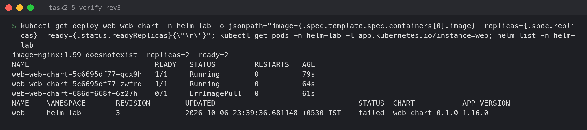

### 6. History and rollback

```bash
helm history web -n helm-lab
helm rollback web 2 -n helm-lab --wait --timeout 3m
```

```
REVISION	UPDATED                 	STATUS    	CHART          	APP VERSION	DESCRIPTION
1       	Tue Oct  6 23:38:39 2026	superseded	web-chart-0.1.0	1.16.0     	Install complete
2       	Tue Oct  6 23:39:18 2026	deployed  	web-chart-0.1.0	1.16.0     	Upgrade complete
3       	Tue Oct  6 23:39:36 2026	failed    	web-chart-0.1.0	1.16.0     	Upgrade "web" failed: resource Deployment/...
Rollback was a success! Happy Helming!
```

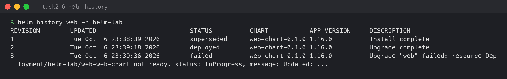

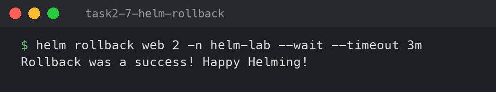

### 7. Verify after rollback

```
REVISION	UPDATED                 	STATUS    	CHART          	APP VERSION	DESCRIPTION
1       	Tue Oct  6 23:38:39 2026	superseded	web-chart-0.1.0	1.16.0     	Install complete
2       	Tue Oct  6 23:39:18 2026	superseded	web-chart-0.1.0	1.16.0     	Upgrade complete
3       	Tue Oct  6 23:39:36 2026	failed    	web-chart-0.1.0	1.16.0     	Upgrade "web" failed: ...
4       	Tue Oct  6 23:40:50 2026	deployed  	web-chart-0.1.0	1.16.0     	Rollback to 2

image=nginx:1.26  replicas=2  ready=2
NAME                             READY   STATUS    RESTARTS   AGE
web-web-chart-5c6695df77-qcx9h   1/1     Running   0          97s
web-web-chart-5c6695df77-zwfrq   1/1     Running   0          82s
USER-SUPPLIED VALUES:
image:
  tag: "1.26"
replicaCount: 2
```

Two things worth noticing. First, a rollback does **not** delete revision 3 or rewind to number
2 — it creates **revision 4**, a copy of revision 2, so the history keeps a record of the mistake.
Second, the pod names (`5c6695df77-...`) are the same as before: the Deployment went back to the
exact spec of revision 2, so Kubernetes just removed the broken pod and kept the healthy ones.

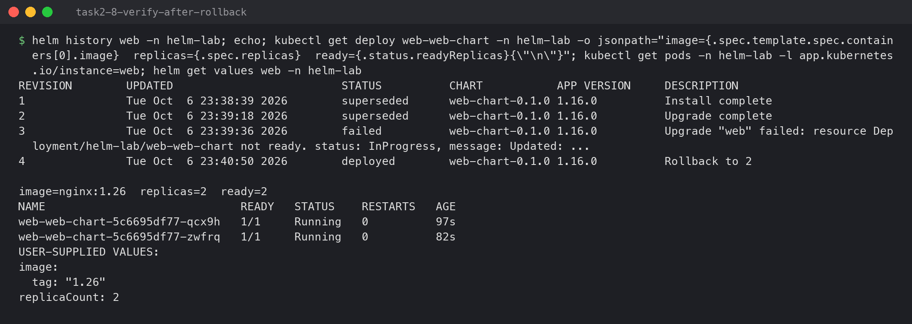

---

## Task 3: Mini project — Notes app chart

The chart is in [`notes-chart/`](notes-chart/): a ConfigMap, a Deployment that loads it with
`envFrom`, and a NodePort Service. Two values files give two environments from one chart:

| | `values.yaml` (dev) | `values-prod.yaml` (prod) |
|---|---|---|
| replicas | 1 | 3 |
| image | `nginx:1.24` | `nginx:1.25` |
| `ENVIRONMENT` | `development` | `production` |

```bash
find notes-chart -type f | sort
helm lint notes-chart
helm template notes notes-chart -f notes-chart/values-prod.yaml | grep -E "^kind:|replicas:|image:|ENVIRONMENT"
```

```
notes-chart/Chart.yaml
notes-chart/templates/configmap.yaml
notes-chart/templates/deployment.yaml
notes-chart/templates/service.yaml
notes-chart/values-prod.yaml
notes-chart/values.yaml

==> Linting notes-chart
[INFO] Chart.yaml: icon is recommended

1 chart(s) linted, 0 chart(s) failed

kind: ConfigMap
  ENVIRONMENT: "production"
kind: Service
kind: Deployment
  replicas: 3
          image: "nginx:1.25"
```

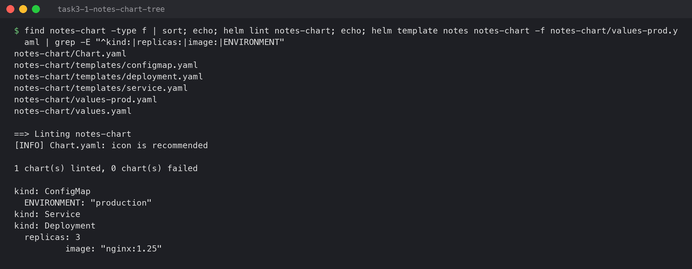

### Install (dev values)

```bash
helm install notes notes-chart -n notes --create-namespace --wait --timeout 3m
kubectl get deploy,pods,svc,cm -n notes
```

```
NAME: notes
NAMESPACE: notes
STATUS: deployed
REVISION: 1
DESCRIPTION: Install complete
NAME                           READY   UP-TO-DATE   AVAILABLE   AGE
deployment.apps/notes-deploy   1/1     1            1           13s

NAME                                READY   STATUS    RESTARTS   AGE
pod/notes-deploy-6bdbd76d95-9vpvv   1/1     Running   0          13s

NAME                TYPE       CLUSTER-IP    EXTERNAL-IP   PORT(S)        AGE
service/notes-svc   NodePort   10.96.188.2   <none>        80:30090/TCP   13s

NAME                         DATA   AGE
configmap/kube-root-ca.crt   1      13s
configmap/notes-config       2      13s
```

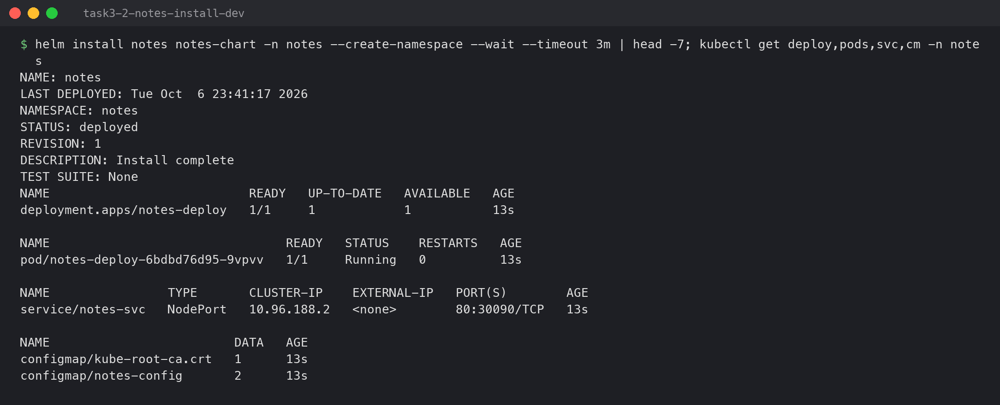

```bash
kubectl exec -n notes deploy/notes-deploy -- printenv APP_NAME ENVIRONMENT
kubectl exec -n notes deploy/notes-deploy -- nginx -v
kubectl run curl-check -n notes --rm -i --restart=Never --image=curlimages/curl:8.10.1 -q -- curl -s http://notes-svc | grep -o "<title>.*</title>"
```

```
notes-app
development
nginx version: nginx/1.24.0
<title>Welcome to nginx!</title>
```

The values made it all the way into the running container: the ConfigMap became environment
variables, and the image is the `1.24` from `values.yaml`.

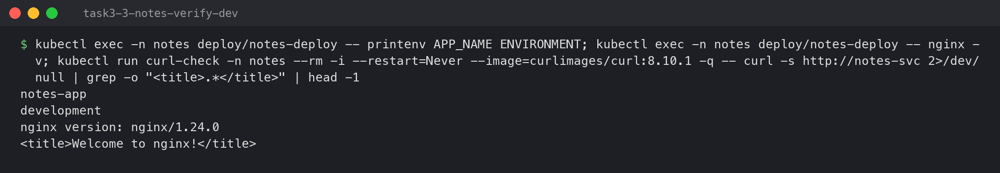

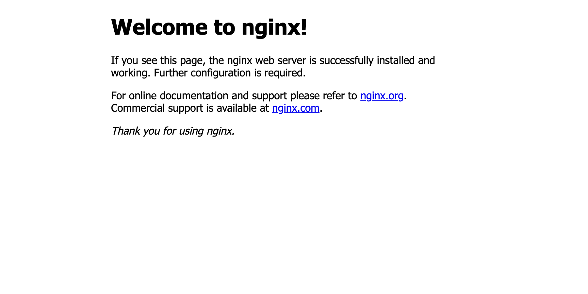

### Upgrade to prod values

```bash
helm upgrade notes notes-chart -n notes -f notes-chart/values-prod.yaml --wait --timeout 3m
kubectl get pods -n notes
kubectl get cm notes-config -n notes -o jsonpath="{.data}"
```

```
Release "notes" has been upgraded. Happy Helming!
STATUS: deployed
REVISION: 2
DESCRIPTION: Upgrade complete
NAME                            READY   STATUS      RESTARTS   AGE
notes-deploy-54f799c6f6-7kbm8   1/1     Running     0          0s
notes-deploy-54f799c6f6-c8dqr   1/1     Running     0          1s
notes-deploy-54f799c6f6-xmj6l   1/1     Running     0          1s
notes-deploy-6bdbd76d95-9vpvv   0/1     Completed   0          17s
...
{"APP_NAME":"notes-app","ENVIRONMENT":"production"}
```

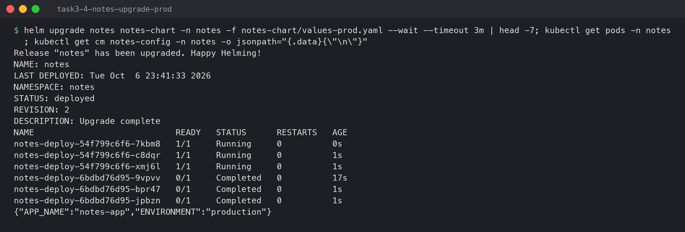

```
NAME                            READY   STATUS    RESTARTS   AGE
notes-deploy-54f799c6f6-7kbm8   1/1     Running   0          15s
notes-deploy-54f799c6f6-c8dqr   1/1     Running   0          16s
notes-deploy-54f799c6f6-xmj6l   1/1     Running   0          16s
production
nginx version: nginx/1.25.5
```

A gotcha this hides: environment variables from a ConfigMap are only read when a container
starts. Changing just the ConfigMap would *not* have changed `ENVIRONMENT` in running pods — it
worked here because the image tag also changed, which replaced every pod.

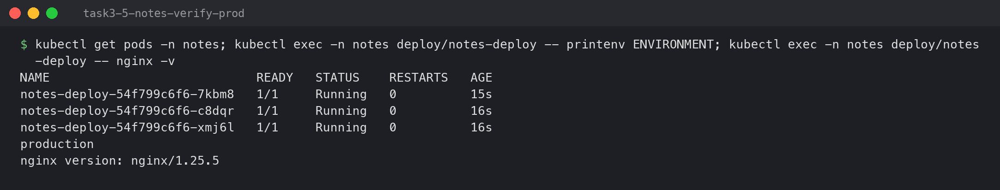

### Rollback to dev

```bash
helm rollback notes 1 -n notes --wait --timeout 3m
helm history notes -n notes
```

```
Rollback was a success! Happy Helming!
REVISION	UPDATED                 	STATUS    	CHART            	APP VERSION	DESCRIPTION
1       	Tue Oct  6 23:41:17 2026	superseded	notes-chart-0.1.0	1.0        	Install complete
2       	Tue Oct  6 23:41:33 2026	superseded	notes-chart-0.1.0	1.0        	Upgrade complete
3       	Tue Oct  6 23:41:50 2026	deployed  	notes-chart-0.1.0	1.0        	Rollback to 1
```

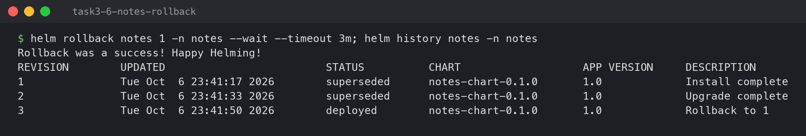

```
NAME                            READY   STATUS    RESTARTS   AGE
notes-deploy-6bdbd76d95-pwzlz   1/1     Running   0          4s
development
nginx version: nginx/1.24.0
```

Back to one pod, `development`, nginx `1.24` — and the pod-template hash `6bdbd76d95` is the same
one revision 1 had, because the spec is identical.

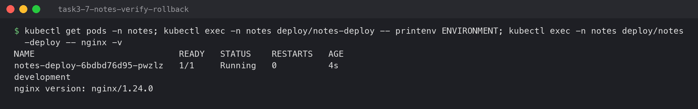

---

## Summary

| Command | What it does |
|---|---|
| `helm create` | Generate a starter chart |
| `helm lint` / `helm template` | Check the chart / render YAML without installing |
| `helm install` | Create a release (revision 1) |
| `helm list` / `helm status` | List releases / show one release and its resources |
| `helm get values\|manifest` | Show the values / exact YAML stored for a revision |
| `helm upgrade` | New revision with changed values or chart |
| `helm history` | Every revision with its status |
| `helm rollback` | New revision that copies an older one |
| `helm uninstall` | Delete everything the release created |
| `helm repo add/update/list` | Manage chart repositories |
| `helm search repo\|hub` | Find charts locally / on Artifact Hub |
