# Kubernetes Storage, HPA & Probes (Session 13)

**Name:** Sumit Akhuli
**Enrollment No:** 24bcs10158

Every command and output below was captured from a real run on my machine — Minikube
(`docker` driver), Kubernetes `v1.37.0`, with the `metrics-server` and `storage-provisioner`
addons, macOS on Apple Silicon. The mini project uses the manifests from the class repo,
`session-13-storage-hpa-probes/mini-project`. The full raw transcript is in
[`lab/transcript.txt`](lab/transcript.txt).

Session 13 answers three questions that earlier sessions avoided:

- **Where does data go when a Pod dies?** → Volumes, PV/PVC, StorageClass (Task 1)
- **How does the app grow with traffic?** → HorizontalPodAutoscaler (Task 2)
- **How does Kubernetes know the app is actually working, not just running?** → Probes (Task 3)

```text
project layout
├── 01-kubernetes-volumes/   volume documentation (README) + manifests
├── hpa/                     hpa.yml, deployment, service, load generator
├── mini-project/            PVC + Deployment with probes + Service + HPA
├── images/                  screenshots
└── lab/                     raw transcript and HPA watch log
```

### Cluster used

```bash
kubectl version; kubectl get nodes
minikube addons list | grep -E "metrics-server|storage-provisioner|default-storageclass"
kubectl get storageclass
```

```
Client Version: v1.37.0
Kustomize Version: v5.8.1
Server Version: v1.37.0
NAME       STATUS   ROLES           AGE   VERSION
minikube   Ready    control-plane   63m   v1.37.0
│ default-storageclass        │ minikube │ enabled ✅ │ Kubernetes                             │
│ metrics-server              │ minikube │ enabled ✅ │ Kubernetes                             │
│ storage-provisioner         │ minikube │ enabled ✅ │ minikube                               │
NAME                 PROVISIONER                RECLAIMPOLICY   VOLUMEBINDINGMODE   ALLOWVOLUMEEXPANSION   AGE
standard (default)   k8s.io/minikube-hostpath   Delete          Immediate           false                  63m
```

`metrics-server` is what makes `kubectl top` and CPU-based autoscaling work. Without it, an
HPA has no numbers to act on.

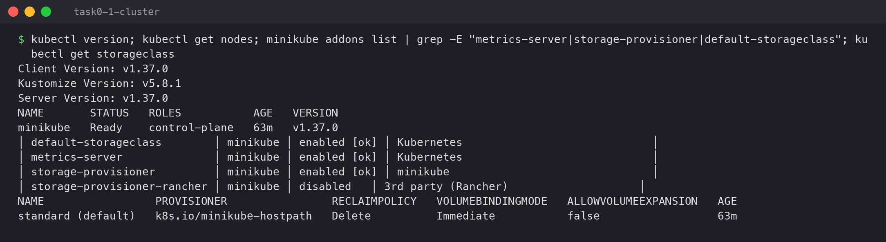

---

## Task 1: Kubernetes Volumes

The written documentation for `emptyDir`, `hostPath`, PersistentVolume, PersistentVolumeClaim,
StorageClass and dynamic provisioning is in
**[01-kubernetes-volumes/README.md](01-kubernetes-volumes/README.md)**. These are the practical
runs behind it.

### emptyDir — shared between containers, gone with the Pod

```bash
kubectl apply -f 01-kubernetes-volumes/pod-volumes.yml
kubectl exec emptydir-demo -c reader -- cat /shared/log.txt
kubectl exec emptydir-demo -c reader -- sh -c "echo hack > /shared/log.txt"
```

```
NAME            READY   STATUS    RESTARTS   AGE
emptydir-demo   2/2     Running   0          13s
Tue Oct  6 18:31:12 UTC 2026
Tue Oct  6 18:31:17 UTC 2026
Tue Oct  6 18:31:22 UTC 2026
sh: can't create /shared/log.txt: Read-only file system
command terminated with exit code 1
```

The `writer` container writes, the `reader` container (a different container, same Pod) sees the
lines. The reader's mount is `readOnly: true`, so its write fails — the volume is shared, but
each container's permission on it can be different.

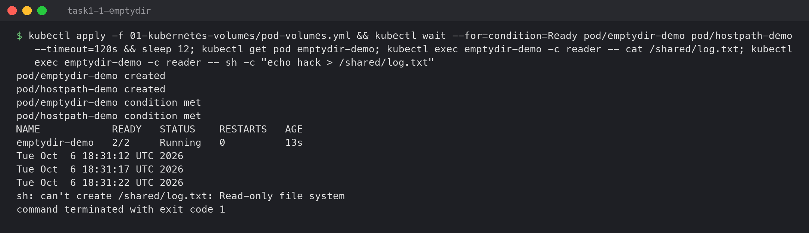

```bash
kubectl delete pod emptydir-demo
kubectl apply -f 01-kubernetes-volumes/pod-volumes.yml
kubectl exec emptydir-demo -c reader -- cat /shared/log.txt
```

```
pod "emptydir-demo" deleted from default namespace
Tue Oct  6 18:31:55 UTC 2026
```

Only one new line: the three earlier ones were deleted with the old Pod. That is what makes
`emptyDir` scratch space and not storage.

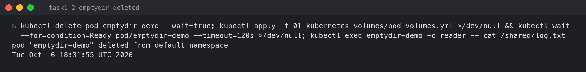

### hostPath — lives on the node

```bash
kubectl get pod hostpath-demo -o wide
kubectl exec hostpath-demo -- cat /node-data/message
minikube ssh -- cat /tmp/session13-hostpath/message
```

```
NAME            READY   STATUS    RESTARTS   AGE   IP            NODE       NOMINATED NODE   READINESS GATES
hostpath-demo   1/1     Running   0          44s   10.244.0.31   minikube   <none>           <none>
node-local-data
written-by-hostpath-demo
node-local-data
written-by-hostpath-demo
```

The same file read from inside the Pod and directly on the node through `minikube ssh`. The
first line, `node-local-data`, was written by a Pod from an **earlier** run that no longer
exists. hostPath data outlives Pods, but only on this one node.

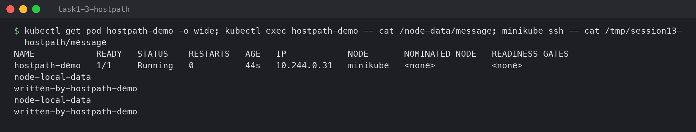

### PersistentVolume + PersistentVolumeClaim (static)

```bash
kubectl apply -f 01-kubernetes-volumes/static-pv-pvc.yml
kubectl get pv static-lab-pv
kubectl get pvc static-lab-claim
```

```
persistentvolume/static-lab-pv created
persistentvolumeclaim/static-lab-claim created
NAME            CAPACITY   ACCESS MODES   RECLAIM POLICY   STATUS   CLAIM                      STORAGECLASS   VOLUMEATTRIBUTESCLASS   REASON   AGE
static-lab-pv   1Gi        RWO            Retain           Bound    default/static-lab-claim   manual         <unset>                          3s
NAME               STATUS   VOLUME          CAPACITY   ACCESS MODES   STORAGECLASS   VOLUMEATTRIBUTESCLASS   AGE
static-lab-claim   Bound    static-lab-pv   1Gi        RWO            manual         <unset>                 3s
```

The claim asked for 500Mi and got `1Gi`. Binding is one claim to one whole volume, and the
only PV in class `manual` was 1Gi.

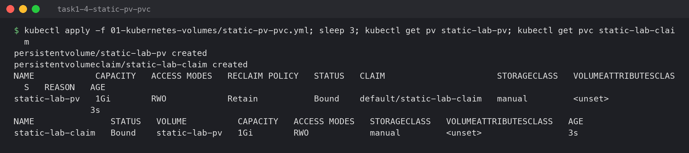

```bash
kubectl exec pvc-writer -- sh -c "echo order-1001 > /data/orders.txt; cat /data/orders.txt"
kubectl delete pod pvc-writer
kubectl apply -f 01-kubernetes-volumes/pvc-pod.yml
kubectl exec pvc-writer -- cat /data/orders.txt
```

```
order-1001
pod "pvc-writer" deleted from default namespace
--- new pod, same claim:
order-1001
```

This is what a PVC is for: the Pod is gone, a new Pod mounts the same claim, and the data is
still there.

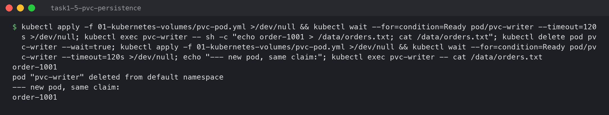

### Dynamic provisioning

```bash
kubectl get pv | grep -c dynamic-lab-claim
kubectl apply -f 01-kubernetes-volumes/dynamic-pvc.yml
kubectl get pvc dynamic-lab-claim
kubectl get pv | grep -E "NAME|dynamic-lab-claim"
kubectl describe pvc dynamic-lab-claim
```

```
0
persistentvolumeclaim/dynamic-lab-claim created
NAME                STATUS   VOLUME                                     CAPACITY   ACCESS MODES   STORAGECLASS   AGE
dynamic-lab-claim   Bound    pvc-e03fa5c4-63db-4326-85e6-657d1f1b483b   1Gi        RWO            standard       4s
NAME                                       CAPACITY   ACCESS MODES   RECLAIM POLICY   STATUS   CLAIM                       STORAGECLASS
pvc-e03fa5c4-63db-4326-85e6-657d1f1b483b   1Gi        RWO            Delete           Bound    default/dynamic-lab-claim   standard
Events:
  Normal  ExternalProvisioning   4s    persistentvolume-controller  Waiting for a volume to be created either by the external provisioner 'k8s.io/minikube-hostpath' ...
  Normal  Provisioning           4s    k8s.io/minikube-hostpath_...  External provisioner is provisioning volume for claim "default/dynamic-lab-claim"
  Normal  ProvisioningSucceeded  4s    k8s.io/minikube-hostpath_...  Successfully provisioned volume pvc-e03fa5c4-63db-4326-85e6-657d1f1b483b
```

No PV existed before. The claim named StorageClass `standard`, and its provisioner created the
volume. Note the reclaim policy is `Delete`, so deleting this claim also deletes the volume and
its data, unlike the static PV's `Retain`.

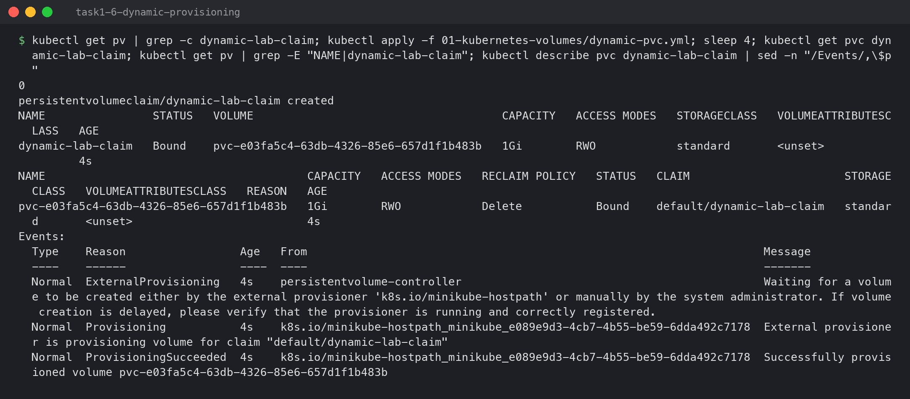

---

## Task 2: HPA hands-on

Manifests in [`hpa/`](hpa/). The app is `registry.k8s.io/hpa-example`, a PHP page that does
CPU-heavy work on every request, with `requests.cpu: 100m`.

### 1. Deploy the application

```bash
kubectl apply -f hpa/deployment.yml -f hpa/service.yml
kubectl rollout status deploy/php-apache
kubectl get deploy,svc php-apache
```

```
deployment.apps/php-apache created
service/php-apache created
deployment "php-apache" successfully rolled out
NAME                         READY   UP-TO-DATE   AVAILABLE   AGE
deployment.apps/php-apache   1/1     1            1           1s

NAME                 TYPE        CLUSTER-IP     EXTERNAL-IP   PORT(S)   AGE
service/php-apache   ClusterIP   10.103.22.66   <none>        80/TCP    1s
```

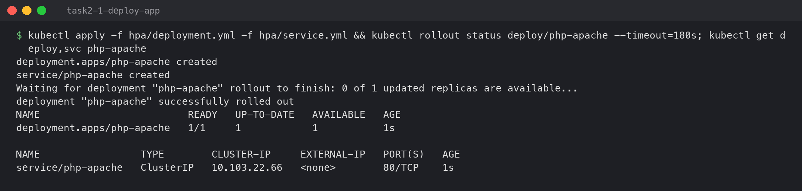

### 2. Configure the HPA

[`hpa/hpa.yml`](hpa/hpa.yml):

```yaml
apiVersion: autoscaling/v2
kind: HorizontalPodAutoscaler
metadata:
  name: php-apache
spec:
  scaleTargetRef:
    apiVersion: apps/v1
    kind: Deployment
    name: php-apache
  minReplicas: 1
  maxReplicas: 5
  metrics:
    - type: Resource
      resource:
        name: cpu
        target:
          type: Utilization
          averageUtilization: 50
```

"50%" means 50% of the **request** (100m), so the HPA tries to keep each Pod around 50m of CPU.
The rule it applies is
`desired replicas = ceil(current replicas × current% / target%)`.

```bash
kubectl apply -f hpa/hpa.yml
kubectl get hpa php-apache
kubectl top pods -l app=php-apache
kubectl describe hpa php-apache
```

```
horizontalpodautoscaler.autoscaling/php-apache created
NAME         REFERENCE               TARGETS              MINPODS   MAXPODS   REPLICAS   AGE
php-apache   Deployment/php-apache   cpu: <unknown>/50%   1         5         1          46s
NAME                          CPU(cores)   MEMORY(bytes)
php-apache-55d769b97b-kdtnh   16m          26Mi
...
  ScalingActive  False   FailedGetResourceMetric  the HPA was unable to compute the replica count: failed to get cpu utilization: did not receive metrics for targeted pods (pods might be unready)
```

`<unknown>` right after creation is normal, not a broken setup: metrics-server collects usage
every ~15 s and needs a couple of samples from a new Pod first. `kubectl top` already shows
16m because it reads the latest single sample.

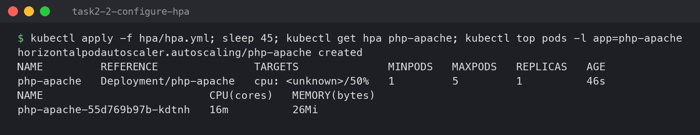

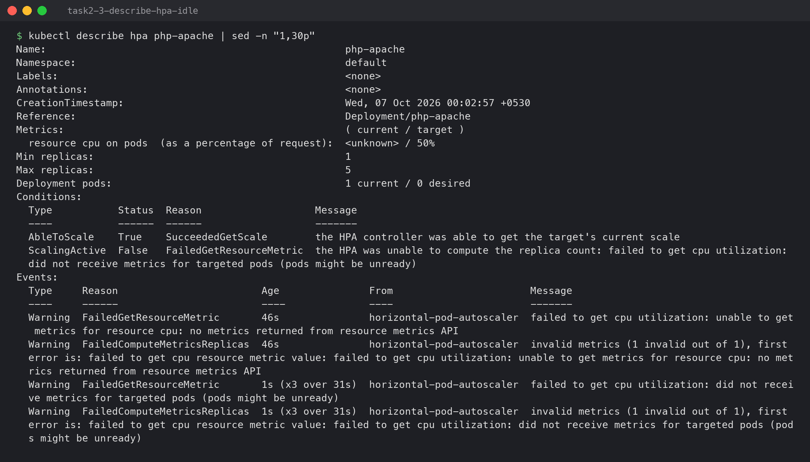

### 3. Verify the HPA

```
NAME         REFERENCE               TARGETS       MINPODS   MAXPODS   REPLICAS   AGE
php-apache   Deployment/php-apache   cpu: 1%/50%   1         5         1          84s
  resource cpu on pods  (as a percentage of request):  1% (1m) / 50%
Deployment pods:                                       1 current / 1 desired
  ScalingActive   True    ValidMetricFound    the HPA was able to successfully calculate a replica count from cpu resource utilization (percentage of request)
```

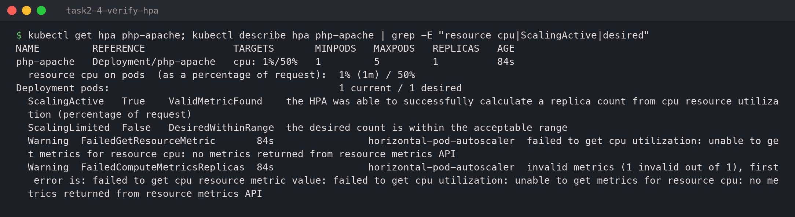

### 4–5. Deploy the load generator and increase load

```bash
kubectl apply -f hpa/load-generator.yml   # while true; do wget -q -O- http://php-apache; done
```

```
pod/load-generator created
pod/load-generator condition met
NAME             READY   STATUS    RESTARTS   AGE
load-generator   1/1     Running   0          1s
```

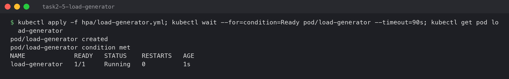

### 6–7. Observe CPU utilisation and Pod scaling

`kubectl get hpa` every 20 seconds while the load ran (full log: [`lab/hpa-watch.txt`](lab/hpa-watch.txt)):

```
--- t+0s 00:04:31
php-apache   Deployment/php-apache   cpu: 1%/50%     1     5     1     94s
--- t+40s 00:05:11
php-apache   Deployment/php-apache   cpu: 1%/50%     1     5     1     2m14s
--- t+60s 00:05:31
php-apache   Deployment/php-apache   cpu: 337%/50%   1     5     4     2m34s
--- t+80s 00:05:51
php-apache   Deployment/php-apache   cpu: 337%/50%   1     5     5     2m54s
--- t+120s 00:06:32
php-apache   Deployment/php-apache   cpu: 178%/50%   1     5     5     3m35s
--- t+180s 00:07:32
php-apache   Deployment/php-apache   cpu: 144%/50%   1     5     5     4m35s
--- t+240s 00:08:33
php-apache   Deployment/php-apache   cpu: 139%/50%   1     5     5     5m36s
```

Reading the timeline:

- **~40 s delay** before anything happens. The HPA acts on metrics-server averages, not live CPU.
- **337% with 1 pod** → `ceil(1 × 337 / 50) = 7`. The HPA went to 4 at once (scale-up is limited
  to +4 pods or ×2 per 15 s by default), then to 5, the `maxReplicas` cap.
- **CPU per pod then fell** (337% → 178% → 139%) because the same load was spread across 5
  pods. It stays above 50% only because 5 is the maximum: the load needs more than 5 × 50m.

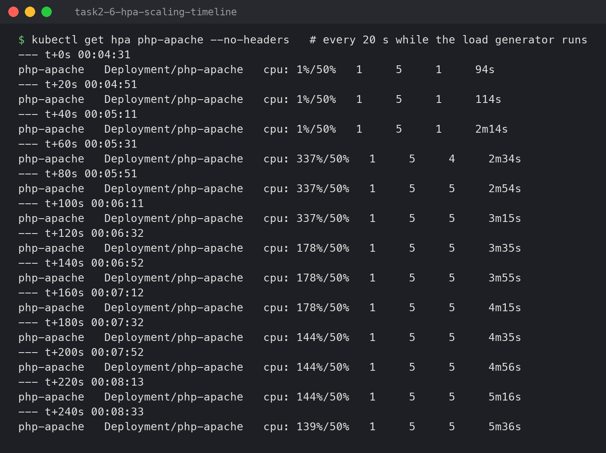

```bash
kubectl get hpa php-apache
kubectl get pods -l app=php-apache -o wide
kubectl top pods -l app=php-apache
```

```
NAME         REFERENCE               TARGETS         MINPODS   MAXPODS   REPLICAS   AGE
php-apache   Deployment/php-apache   cpu: 139%/50%   1         5         5          6m5s
NAME                          READY   STATUS    RESTARTS   AGE     IP            NODE
php-apache-55d769b97b-6xrsk   1/1     Running   0          3m49s   10.244.0.39   minikube
php-apache-55d769b97b-8htqm   1/1     Running   0          3m49s   10.244.0.40   minikube
php-apache-55d769b97b-f5fxx   1/1     Running   0          3m49s   10.244.0.38   minikube
php-apache-55d769b97b-kdtnh   1/1     Running   0          6m6s    10.244.0.36   minikube
php-apache-55d769b97b-tnm64   1/1     Running   0          3m34s   10.244.0.41   minikube
NAME                          CPU(cores)   MEMORY(bytes)
php-apache-55d769b97b-6xrsk   129m         39Mi
php-apache-55d769b97b-8htqm   150m         39Mi
php-apache-55d769b97b-f5fxx   149m         45Mi
php-apache-55d769b97b-kdtnh   136m         49Mi
php-apache-55d769b97b-tnm64   134m         37Mi
```

Each pod uses ~130–150m, above its 100m request. That is allowed because the **limit** is 500m.
The request is what the scheduler reserves and what the HPA measures against; the limit is the
hard ceiling.

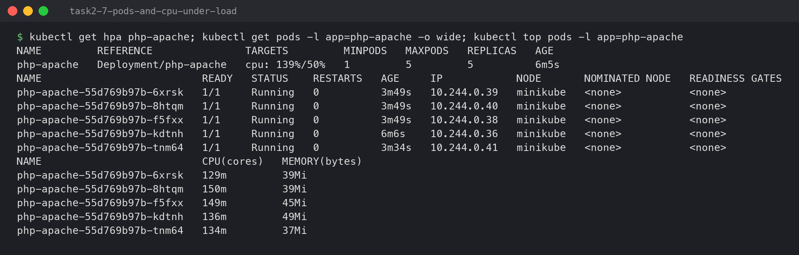

```bash
kubectl describe hpa php-apache
```

```
  resource cpu on pods  (as a percentage of request):  139% (139m) / 50%
Deployment pods:                                       5 current / 5 desired
Conditions:
  AbleToScale     True    ScaleDownStabilized  recent recommendations were higher than current one, applying the highest recent recommendation
  ScalingActive   True    ValidMetricFound     the HPA was able to successfully calculate a replica count from cpu resource utilization (percentage of request)
  ScalingLimited  True    TooManyReplicas      the desired replica count is more than the maximum replica count
Events:
  Normal   SuccessfulRescale  3m49s  horizontal-pod-autoscaler  New size: 4; reason: cpu resource utilization (percentage of request) above target
  Normal   SuccessfulRescale  3m34s  horizontal-pod-autoscaler  New size: 5; reason: cpu resource utilization (percentage of request) above target
```

`ScalingLimited True / TooManyReplicas` is the HPA reporting that it wants more pods than
`maxReplicas` allows. In production that condition is a signal to raise the max or add nodes.

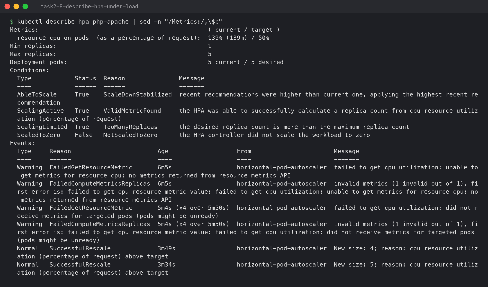

### Scale-down after the load stops

```bash
kubectl delete pod load-generator     # 00:09:32
```

Three minutes later, CPU was back at 1% but the HPA was still at 5:

```
00:14:26
NAME         REFERENCE               TARGETS       MINPODS   MAXPODS   REPLICAS   AGE
php-apache   Deployment/php-apache   cpu: 1%/50%   1         5         5          11m
```

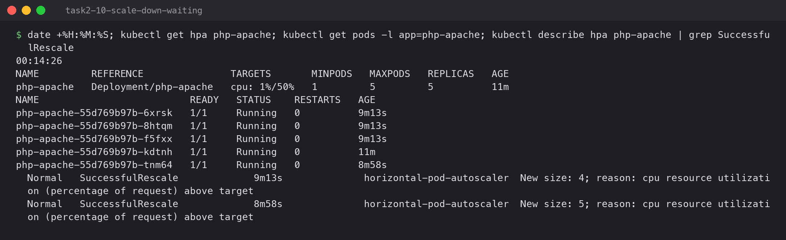

```
00:16:16
NAME         REFERENCE               TARGETS       MINPODS   MAXPODS   REPLICAS   AGE
php-apache   Deployment/php-apache   cpu: 1%/50%   1         5         1          13m
NAME                          READY   STATUS    RESTARTS   AGE
php-apache-55d769b97b-6xrsk   1/1     Running   0          11m
  Normal   SuccessfulRescale             18s                horizontal-pod-autoscaler  New size: 1; reason: All metrics below target
```

Scale-up took about a minute; scale-down took about **6.5 minutes**. The HPA deliberately waits
5 minutes (the *scale-down stabilization window*) before removing pods, so a short dip in traffic
doesn't remove pods that a returning spike would need straight away. Scaling up quickly and down
slowly is the safe default.

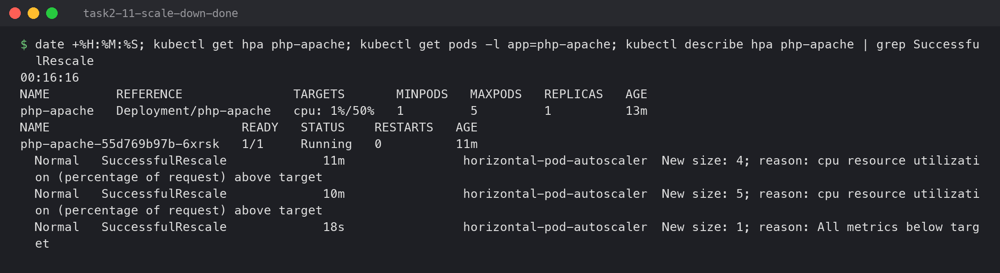

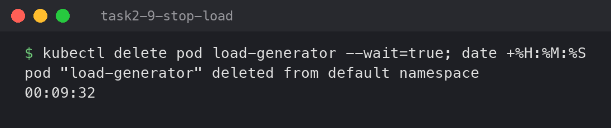

---

## Task 3: Mini project

A production-style web app combining all three topics: a **PVC** for `/data`, an **HPA**
(2–5 replicas at 50% CPU), and **startup, readiness and liveness probes**. Manifests are in
[`mini-project/`](mini-project/).

```text
               Service: web-service (ClusterIP :80)
                      │
         ┌────────────┴────────────┐
   Pod web-app (nginx)       Pod web-app (nginx)      ← HPA web-app-hpa: 2..5 pods @ 50% CPU
   ├─ startupProbe   GET /   ├─ startupProbe
   ├─ readinessProbe GET /   ├─ readinessProbe
   ├─ livenessProbe  GET /   ├─ livenessProbe
   └─ /data ─────────┬───────┘
                     ▼
        PVC web-data (500Mi, RWO) → StorageClass standard → PV (dynamic)
```

### Deploy

```bash
kubectl apply -f mini-project/namespace.yaml -f mini-project/pvc.yaml -f mini-project/deployment.yaml \
              -f mini-project/service.yaml -f mini-project/hpa.yaml
kubectl get pvc,deploy,pods,svc,hpa -n production-webapp
```

```
namespace/production-webapp created
persistentvolumeclaim/web-data created
deployment.apps/web-app created
service/web-service created
horizontalpodautoscaler.autoscaling/web-app-hpa created
deployment "web-app" successfully rolled out
NAME                             STATUS   VOLUME                                     CAPACITY   ACCESS MODES   STORAGECLASS
persistentvolumeclaim/web-data   Bound    pvc-f031b87f-affe-4dfc-9e0f-3f6329673826   500Mi      RWO            standard

NAME                      READY   UP-TO-DATE   AVAILABLE   AGE
deployment.apps/web-app   2/2     2            2           10s

NAME                         READY   STATUS    RESTARTS   AGE
pod/web-app-f9769fb4-9574s   1/1     Running   0          10s
pod/web-app-f9769fb4-ldkkn   1/1     Running   0          10s

NAME                  TYPE        CLUSTER-IP     EXTERNAL-IP   PORT(S)   AGE
service/web-service   ClusterIP   10.101.39.29   <none>        80/TCP    10s

NAME                                              REFERENCE            TARGETS              MINPODS   MAXPODS   REPLICAS
horizontalpodautoscaler.autoscaling/web-app-hpa   Deployment/web-app   cpu: <unknown>/50%   2         5         2
```

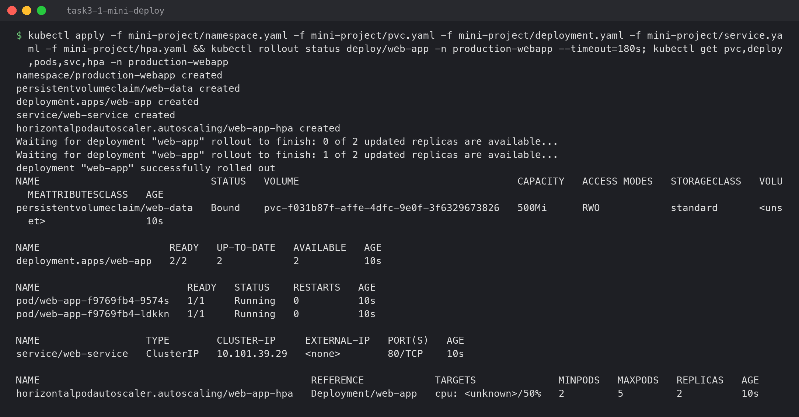

### The three probes

```bash
kubectl describe pod -n production-webapp -l app=web-app | grep -E "^Name:|Liveness|Readiness|Startup"
```

```
Name:             web-app-f9769fb4-9574s
    Liveness:     http-get http://:http/ delay=5s timeout=2s period=5s successThreshold=1 failureThreshold=3
    Readiness:    http-get http://:http/ delay=5s timeout=2s period=5s successThreshold=1 failureThreshold=2
    Startup:      http-get http://:http/ delay=0s timeout=1s period=2s successThreshold=1 failureThreshold=30
```

| Probe | Question it asks | On failure |
|---|---|---|
| **Startup** | "Has the app finished starting?" Up to 30 × 2 s = 60 s allowed | Container restarted. The other two probes don't start until this one passes |
| **Readiness** | "Can it take traffic right now?" | Pod removed from the Service's endpoints. **Not** restarted |
| **Liveness** | "Is it stuck/broken?" | Container **restarted** after 3 failures (~15 s) |

Without a startup probe, a slow-starting app would be killed by its liveness probe before it
ever finished starting.

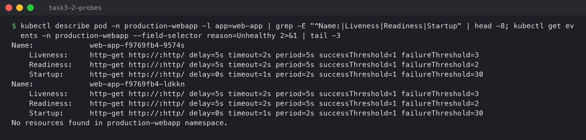

### Verify storage persistence

```bash
P=$(kubectl get pods -n production-webapp -l app=web-app -o jsonpath="{.items[0].metadata.name}")
kubectl exec -n production-webapp $P -- sh -c 'echo "Student: Sumit Akhuli (24bcs10158)" > /data/student.txt'
kubectl delete pod -n production-webapp $P
# read the file from every pod
```

```
Student: Sumit Akhuli (24bcs10158)
pod "web-app-f9769fb4-9574s" deleted from production-webapp namespace
NAME                     READY   STATUS    RESTARTS   AGE
web-app-f9769fb4-ldkkn   1/1     Running   0          31s
web-app-f9769fb4-xmzt7   1/1     Running   0          10s
pod/web-app-f9769fb4-ldkkn:
Student: Sumit Akhuli (24bcs10158)
pod/web-app-f9769fb4-xmzt7:
Student: Sumit Akhuli (24bcs10158)
```

The Deployment replaced the deleted Pod (`xmzt7`), and both the surviving Pod and the new one
read the same file. Both Pods mount the same claim. That works here because Minikube has one
node: `ReadWriteOnce` means one **node**, not one Pod.

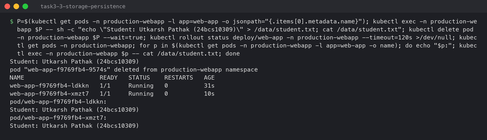

### Verify the probes — break a container on purpose

nginx returns `403` for `/` when there is no `index.html`, which makes every probe fail:

```bash
kubectl exec -n production-webapp web-app-f9769fb4-ldkkn -- rm /usr/share/nginx/html/index.html
sleep 25; kubectl get pods -n production-webapp
```

```
NAME                     READY   STATUS    RESTARTS      AGE
web-app-f9769fb4-ldkkn   1/1     Running   1 (10s ago)   56s
web-app-f9769fb4-xmzt7   1/1     Running   0             35s
web-app-f9769fb4-ldkkn ready=true
web-app-f9769fb4-xmzt7 ready=true
```

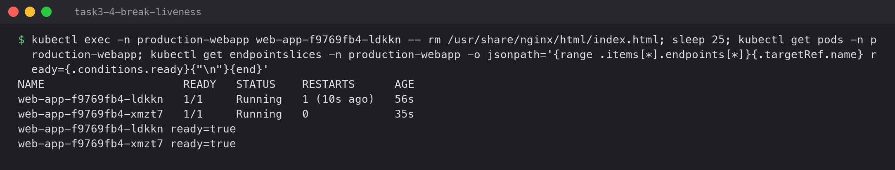

```bash
kubectl get events -n production-webapp --sort-by=.lastTimestamp | grep -E 'Unhealthy|Killing|Started'
kubectl exec -n production-webapp web-app-f9769fb4-ldkkn -- ls /usr/share/nginx/html
```

```
25s   Warning   Unhealthy   pod/web-app-f9769fb4-ldkkn   Readiness probe failed: HTTP probe failed with statuscode: 403
25s   Warning   Unhealthy   pod/web-app-f9769fb4-ldkkn   Liveness probe failed: HTTP probe failed with statuscode: 403
25s   Normal    Killing     pod/web-app-f9769fb4-ldkkn   Container nginx failed liveness probe, will be restarted
25s   Normal    Started     pod/web-app-f9769fb4-ldkkn   Container started
50x.html
index.html
```

The sequence: readiness failed (which marks the pod not-ready, so the Service stops sending it
traffic), liveness failed 3 times, and the kubelet restarted the container. The not-ready window
was only a few seconds, so it was already over when I checked the endpoints. The restart brought
`index.html` back, because it comes from the image, not from the volume. By the time I looked,
both pods were ready again. I didn't have to do anything; the probes fixed it.

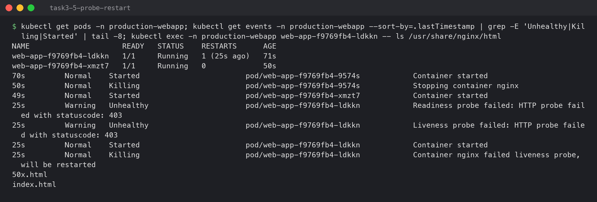

### The app and its HPA


```bash
kubectl get hpa -n production-webapp
kubectl top pods -n production-webapp
```

```
NAME          REFERENCE            TARGETS       MINPODS   MAXPODS   REPLICAS   AGE
web-app-hpa   Deployment/web-app   cpu: 1%/50%   2         5         2          6m35s
NAME                     CPU(cores)   MEMORY(bytes)
web-app-f9769fb4-ldkkn   1m           8Mi
web-app-f9769fb4-xmzt7   1m           8Mi
```

The HPA is active and holding the minimum of 2 replicas at idle. Scaling under load works
exactly as shown in Task 2.

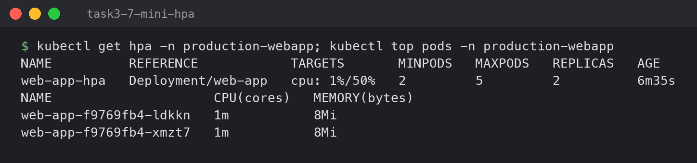

---

## Cleanup

```bash
kubectl delete -f hpa/
kubectl delete -f 01-kubernetes-volumes/ && kubectl delete pv static-lab-pv
kubectl delete namespace production-webapp
```
