# Kubernetes Troubleshooting (Session 14)

**Name:** Sumit Akhuli
**Enrollment No:** 24bcs10158

Every command and every output below was captured from a real run on my machine — Docker Desktop
Kubernetes, client `v1.37.0`, server `v1.34.3`, single node `desktop-control-plane`, macOS on
Apple Silicon. The manifests are the ones from the class repo,
`session-14-kubernetes-troubleshooting`.

The whole session answers one question:

> "My Kubernetes application is not working. How do I find out why?"

The answer is not "restart it". It is a fixed order of four commands, each of which tells you
something the previous one could not:

```text
kubectl get        →  WHAT is happening      (status)
kubectl describe   →  WHY is it happening    (spec + events)
kubectl logs       →  what the APP says      (container stdout/stderr)
kubectl exec       →  what it looks like from INSIDE
```

`get` narrows the problem to a resource. `describe` and events explain what the control plane
tried to do. `logs` explains what the application did. `exec` is the last resort when the first
three say the pod is fine but something still does not work.

---

## Task 1: `kubectl get` — what is happening

```bash
kubectl apply -f 01-kubectl-get/sample-workload.yaml
kubectl get pods
```

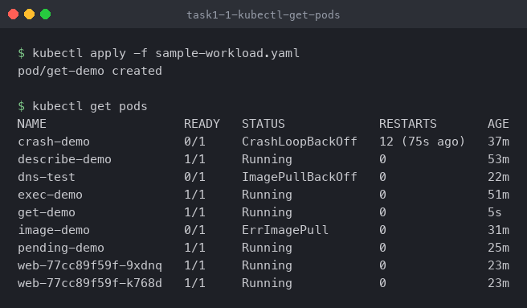

This one screen is the whole reason `get` comes first. Nine pods, and three of them are already
telling me where to look:

| Column | What it tells you |
| --- | --- |
| `READY` | `0/1` means the container exists but is not serving |
| `STATUS` | `CrashLoopBackOff`, `ImagePullBackOff`, `Pending` — each points at a different layer |
| `RESTARTS` | A climbing count means the container starts and dies repeatedly |
| `AGE` | A pod that is minutes old and already has 12 restarts is worse than one with 12 over a week |

`crash-demo` has 12 restarts, so the image pulled fine and the *application* is failing.
`image-demo` never got an image, so the application never ran at all. Those are two completely
different investigations, and `get` separated them before I ran anything else.

```bash
kubectl get all
```

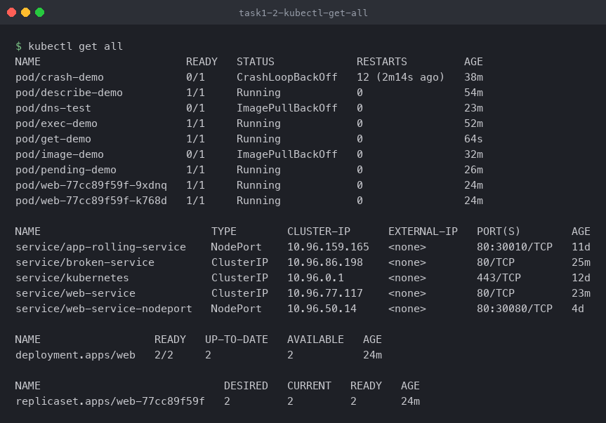

`get all` widens from pods to the objects around them. Worth noticing here: `deployment.apps/web`
reports `2/2` READY while `service/web-service` exists alongside it. The deployment being healthy
says nothing about whether the Service can actually reach it — that gap is what Task 9 is about.

---

## Task 2: `kubectl describe` — why is it happening

```bash
kubectl describe pod describe-demo
```

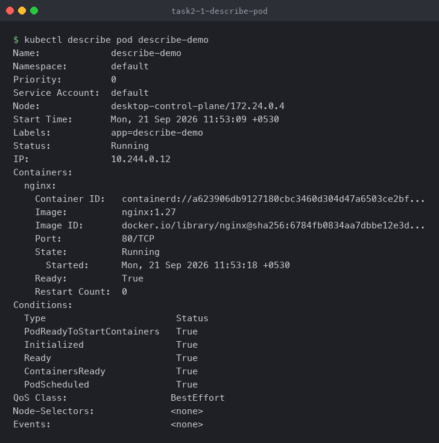

`get` gave me one line per pod. `describe` gives me the full object: which image actually
resolved (`nginx@sha256:6784fb…`, not just the `nginx:1.27` tag I asked for), which node it landed
on, the container state, the five `Conditions`, and the Events at the bottom.

`Events: <none>` here is not a bug — this pod started 74 minutes ago and Kubernetes events expire
from etcd after about an hour by default. That expiry matters during a real incident: if you come
back to a broken pod the next morning, the events that explained it are already gone. Describe it
while it is still failing.

The `Conditions` block is the quickest read in the whole output:

```text
PodScheduled      True   → the scheduler found a node
Initialized       True   → init containers finished
ContainersReady   True   → the container passed its checks
Ready             True   → the pod is in Service endpoints
```

Whichever one is `False` first is the layer where the problem lives. Task 8 is a pod where
`PodScheduled` is `False`, so nothing below it ever happens.

---

## Task 3: `kubectl logs` — what the application says

```bash
kubectl apply -f 03-kubectl-logs/pod.yaml
kubectl get pod logs-demo
kubectl logs logs-demo | head -7
```

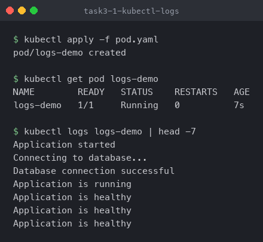

`describe` tells you what Kubernetes did to the container. `logs` tells you what the process
inside it wrote to stdout and stderr — everything Kubernetes itself cannot know.

The four startup lines followed by repeating `Application is healthy` are exactly the script in
`pod.yaml`, so the container is doing what it was asked. Two flags worth having in hand:

```bash
kubectl logs logs-demo -f          # follow, like tail -f
kubectl logs logs-demo --previous  # logs of the container that died, not the one running now
```

`--previous` is the important one and it comes back in Task 6.

---

## Task 4: `kubectl exec` — check from inside

```bash
kubectl exec exec-demo -- hostname
kubectl exec exec-demo -- ls /usr/share/nginx/html
kubectl exec exec-demo -- curl -s localhost
```

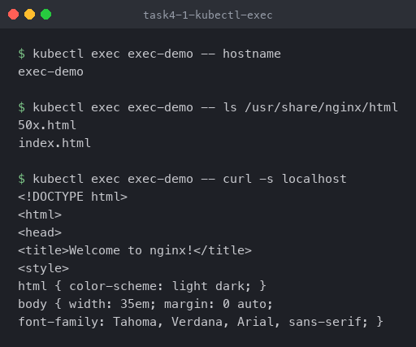

`curl localhost` from inside the container is the single most useful troubleshooting question when
a Service is not working, because it splits the problem cleanly in two:

```text
curl localhost works inside the pod
        │
        ├── yes → the app is fine, the problem is Service / DNS / networking
        └── no  → the app itself is broken, stop looking at the Service
```

Here nginx answers on `localhost`, so any failure to reach it from elsewhere is a networking
problem, not an application problem.

One limit: `exec` needs a *running* container. A pod in `CrashLoopBackOff` has no stable process
to attach to, which is why Task 6 uses `logs --previous` instead.

---

## Task 5: Events — what the control plane tried to do

```bash
kubectl apply -f 05-events/pod.yaml
kubectl events --for pod/events-demo
```

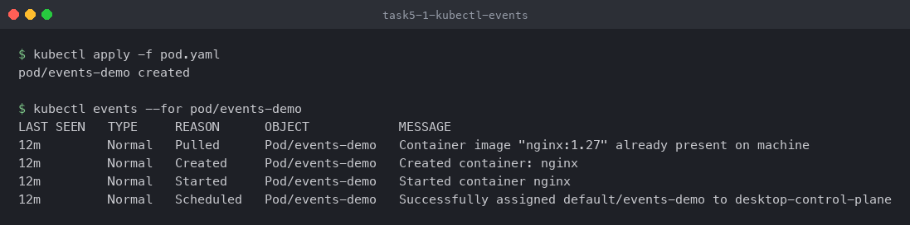

This is the successful path written out in full: `Scheduled` → `Pulled` → `Created` → `Started`.
Learning what a *healthy* sequence looks like is what makes a broken one obvious — in the next
three tasks the failure is always a missing or repeating step in this same chain.

Note `Container image "nginx:1.27" already present on machine` — the image was cached from an
earlier pod, so there is no `Pulling` event at all. On a cold node you would see `Pulling` first.

Useful variants:

```bash
kubectl get events --sort-by=.lastTimestamp
kubectl get events --field-selector type=Warning   # cuts the noise during an incident
kubectl events --watch
```

---

## Task 6: `CrashLoopBackOff` — the image is fine, the app is not

```bash
kubectl apply -f 06-crashloopbackoff/broken-pod.yaml
kubectl get pod crash-demo
kubectl logs crash-demo
kubectl logs crash-demo --previous
```

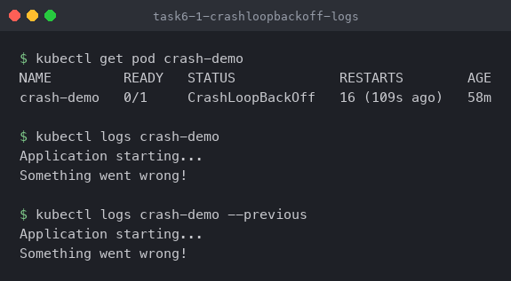

`CrashLoopBackOff` is not an error — it is Kubernetes telling you it has given up restarting
quickly and is now waiting between attempts:

```text
container starts → app exits non-zero → kubelet restarts it → it exits again
        │
        ▼
kubelet backs off (10s, 20s, 40s … capped at 5 min)  ← this is the "BackOff"
```

The status is the symptom. The logs are the cause:

```text
Application starting...
Something went wrong!
```

```bash
kubectl describe pod crash-demo
```

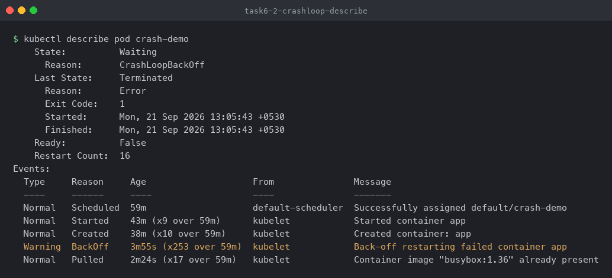

The `State` / `Last State` pair is the part to read:

- `State: Waiting, Reason: CrashLoopBackOff` — what it is doing *now* (sitting out the backoff)
- `Last State: Terminated, Reason: Error, Exit Code: 1` — what happened on the *previous* attempt

**Exit code 1 is the actual finding.** The container ran, the process chose to exit with an error.
That points at the application, not at Kubernetes. And in `broken-pod.yaml` the cause is literal:

```yaml
command:
  - sh
  - -c
  - |
    echo "Application starting..."
    echo "Something went wrong!"
    exit 1
```

Also note `Started: 13:05:43` and `Finished: 13:05:43` — the container lived for under a second.
A container that dies instantly is almost always a bad command or a missing config; one that dies
after 30 seconds is usually a failed dependency or a probe.

### The fix

```bash
kubectl delete pod crash-demo
kubectl apply -f 06-crashloopbackoff/fixed-pod.yaml
kubectl get pod crash-demo
kubectl logs crash-demo
```

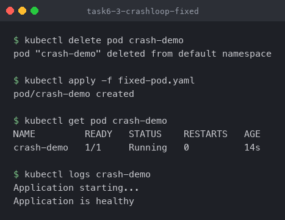

`0` restarts and `Application is healthy` in the logs. A bare pod has to be deleted and recreated
because `spec.containers[].command` is immutable — `kubectl apply` alone would be rejected. Under
a Deployment you would edit the template and let the rollout replace the pods.

---

## Task 7: `ImagePullBackOff` — the app never even started

```bash
kubectl apply -f 07-imagepullbackoff/broken-pod.yaml
kubectl get pod image-demo
kubectl describe pod image-demo
```

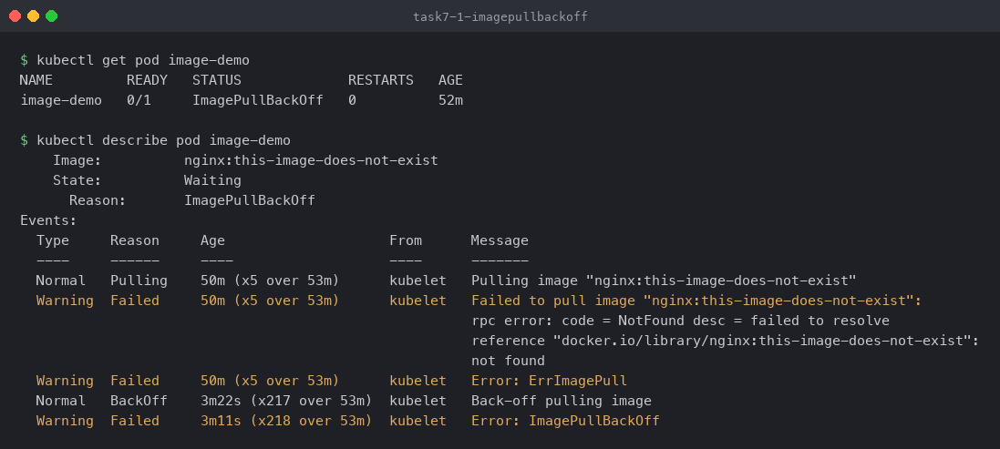

The distinction that matters:

```text
CrashLoopBackOff   = Kubernetes got the image, the container ran, the app failed
ImagePullBackOff   = Kubernetes never got the image, nothing ran at all
```

There are no logs to read here — there was never a process. Everything is in the events, and the
message is specific enough to act on immediately:

```text
failed to resolve reference "docker.io/library/nginx:this-image-does-not-exist": not found
```

`NotFound` means the registry answered and said that tag does not exist — so this is a typo, not a
network or credentials problem. A `401`/`403` would point at registry authentication instead, and
a timeout at network reachability. Reading *which* failure it is saves checking the wrong thing.

There are also two `Failed` events with different reasons: `ErrImagePull` is the first attempt,
`ImagePullBackOff` is every retry after it (217 of them here).

### The fix

```bash
kubectl delete pod image-demo
kubectl apply -f 07-imagepullbackoff/fixed-pod.yaml
kubectl get pod image-demo
```

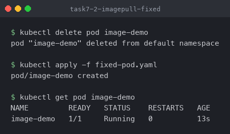

---

## Task 8: `Pending` — the scheduler could not place it

```bash
kubectl apply -f 08-pending-pods/broken-pod.yaml
kubectl get pod pending-demo
kubectl describe pod pending-demo
```

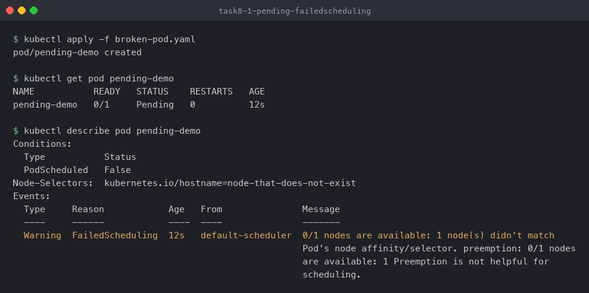

`Pending` means the pod object exists in etcd but no kubelet has been told to run it. Notice what
is *missing* from the describe output compared with Task 2: no `Container ID`, no `State`, no pod
IP. None of that exists yet because nothing has been scheduled.

`PodScheduled: False` is the first condition to fail, so the problem is above the container layer
entirely, and the `FailedScheduling` event says exactly why:

```text
0/1 nodes are available: 1 node(s) didn't match Pod's node affinity/selector.
```

Cross-referenced with the spec two lines up:

```text
Node-Selectors:  kubernetes.io/hostname=node-that-does-not-exist
```

The pod is asking for a node that is not in this cluster, so the scheduler has nowhere to put it.
The usual causes of `Pending` are all variations of the same thing — the scheduler cannot satisfy
a constraint:

- a `nodeSelector` / affinity rule no node matches (this case)
- not enough CPU or memory left on any node
- a taint with no matching toleration
- a PersistentVolumeClaim that is not bound yet

The count `0/1 nodes are available` is the tell: read it as "of my N nodes, none qualified".

### The fix

```bash
kubectl delete pod pending-demo
kubectl apply -f 08-pending-pods/fixed-pod.yaml
kubectl get pod pending-demo
```

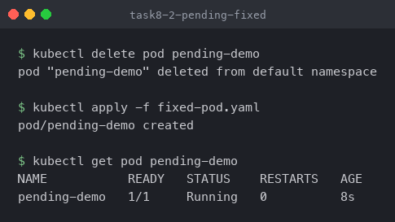

---

## Task 9: Service and DNS troubleshooting

This is the case where every pod is `Running` and the application still does not work. The link
between a Service and its pods is not the Service's name or its port — it is the **selector**, and
a selector that matches nothing fails completely silently.

```bash
kubectl apply -f 09-service-dns-troubleshooting/broken-service.yaml
kubectl get endpoints
kubectl describe service broken-service
```

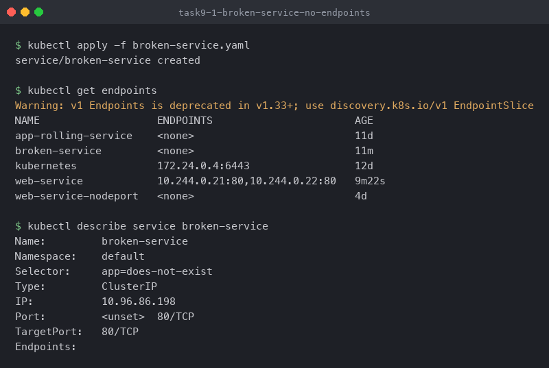

`broken-service` was created successfully. It has a ClusterIP, `10.96.86.198`. Nothing errored.
But `ENDPOINTS` is `<none>`, and its selector is `app=does-not-exist`.

**`kubectl get endpoints` is the single most useful Service troubleshooting command.** A Service is
really two things: a stable virtual IP, and a list of real pod IPs behind it that the endpoints
controller maintains by matching the selector against pod labels. An empty endpoints list means the
match failed — the Service is a front door with nothing behind it.

### The same bug in the Service that is supposed to work

```bash
kubectl apply -f 09-service-dns-troubleshooting/service.yaml
kubectl get endpoints web-service
kubectl get svc web-service -o jsonpath='{.spec.selector}'
kubectl get pods -l app=web --show-labels
```

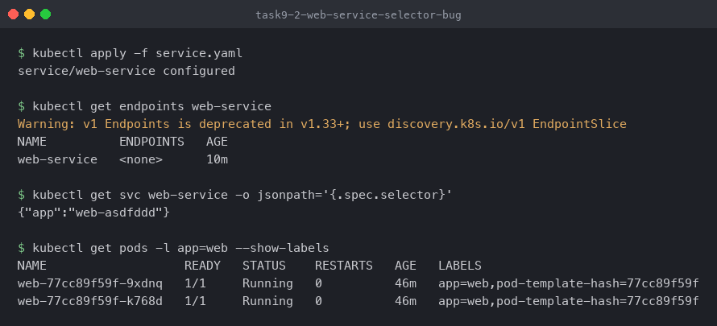

This one is worth reading carefully, because it is the realistic version of the bug.
`web-service` **had** endpoints — `10.244.0.21:80, 10.244.0.22:80`, visible in Task 1. Applying
`service.yaml` reported `service/web-service configured` and the endpoints dropped to `<none>`.

A one-character-class typo in a selector took a working Service down, and `apply` reported success:

```text
Service selector:  app=web-asdfddd
Pod labels:        app=web,pod-template-hash=77cc89f59f
                       └── they do not match, so the endpoints list is empty
```

`--show-labels` next to the selector is how you confirm it. Nothing in `get pods` would ever show
this — all the pods are `Running` and healthy. The failure lives entirely in the gap between two
strings.

### The fix

```bash
kubectl patch service web-service -p '{"spec":{"selector":{"app":"web"}}}'
kubectl get endpoints web-service
```

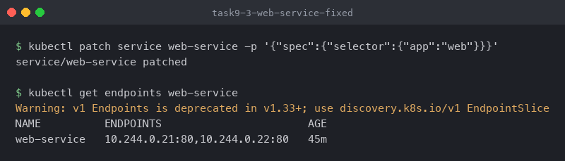

The endpoints come back the moment the selector matches — the controller reconciles within a
second, no restart needed. (I used `patch` rather than editing `service.yaml` so the class repo's
manifest stays as it is; fixing the selector in the file and re-applying does the same thing.)

### A DNS client — and a third ImagePullBackOff

```bash
kubectl apply -f 09-service-dns-troubleshooting/dns-test-pod.yaml
kubectl get pod dns-test
kubectl describe pod dns-test
```

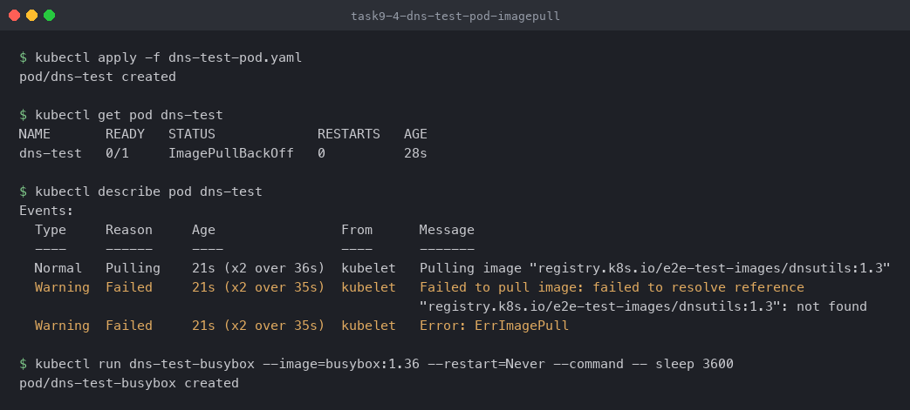

The lab's `dns-test-pod.yaml` would not start: `registry.k8s.io/e2e-test-images/dnsutils:1.3` is
`not found`. Same failure class as Task 7, and diagnosed the same way — the registry answered
`NotFound`, so the tag is wrong rather than the network being down. `busybox:1.36` has `nslookup`
and `wget` built in, so I used that as the DNS client instead:

```bash
kubectl run dns-test-busybox --image=busybox:1.36 --restart=Never --command -- sleep 3600
```

### Cluster DNS, working

```bash
kubectl exec dns-test-busybox -- cat /etc/resolv.conf
kubectl exec dns-test-busybox -- nslookup web-service
kubectl exec dns-test-busybox -- wget -qO- http://web-service
```

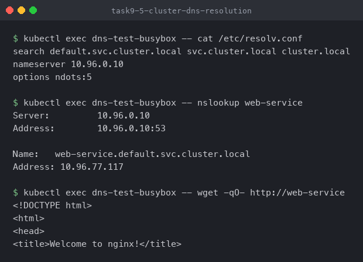

Three things in `/etc/resolv.conf` explain how the short name `web-service` works at all:

```text
nameserver 10.96.0.10                                    → CoreDNS, itself a ClusterIP Service
search default.svc.cluster.local svc.cluster.local ...   → what gets appended to a short name
options ndots:5                                          → names with <5 dots try the search path first
```

`web-service` has no dots, so the resolver appends `default.svc.cluster.local` and gets
`10.96.77.117` — the ClusterIP from Task 1. The short name only works from a pod in the *same*
namespace, because it depends on that first search entry. Use the full
`web-service.default.svc.cluster.local` in anything that might move namespaces.

### The trap: DNS working proves nothing

```bash
kubectl exec dns-test-busybox -- nslookup broken-service
kubectl exec dns-test-busybox -- wget -qO- --timeout=5 http://broken-service
```

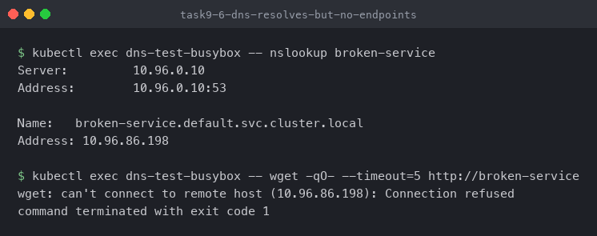

This is the most useful result in the session. `broken-service` — the one with the selector that
matches nothing — **resolves perfectly**:

```text
Name:    broken-service.default.svc.cluster.local
Address: 10.96.86.198
```

And then the connection is refused.

DNS answers from the Service *object*, which exists. Traffic needs the *endpoints*, which are
empty. So "DNS resolves fine" is not evidence that a Service works, and a successful `nslookup`
during an incident can send you looking at the wrong layer for an hour.

```text
nslookup works, connection refused
        │
        ▼
kubectl get endpoints <service>     ← always check this next
        │
        ├── endpoints listed  → networking / port / targetPort problem
        └── endpoints <none>  → selector does not match pod labels
```

`Connection refused` specifically (rather than a timeout) is consistent with this: kube-proxy has
rules for the ClusterIP but no backend to forward to, so the packet is rejected immediately
instead of hanging.

---

## Task 10: Mini project — everything at once

```bash
kubectl apply -f mini-project/service.yaml
kubectl apply -f mini-project/deployment.yaml
kubectl get pods -l app=troubleshooting-app
kubectl get endpoints troubleshooting-service
```

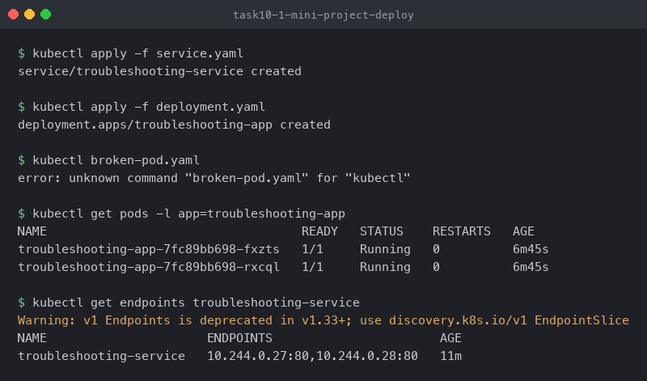

Two pods `Running`, and `troubleshooting-service` shows `10.244.0.27:80, 10.244.0.28:80`. Both
endpoints present is the check that the selector `app=troubleshooting-app` actually matches the
deployment's pod template — the thing that was broken in Task 9, verified here in one command.

The error in the middle of that capture is mine and I left it in: `kubectl broken-pod.yaml` is
missing `apply -f`, so kubectl read `broken-pod.yaml` as a subcommand name.

```bash
kubectl apply -f mini-project/broken-pod.yaml
kubectl get pod project-broken-pod
kubectl describe pod project-broken-pod
```

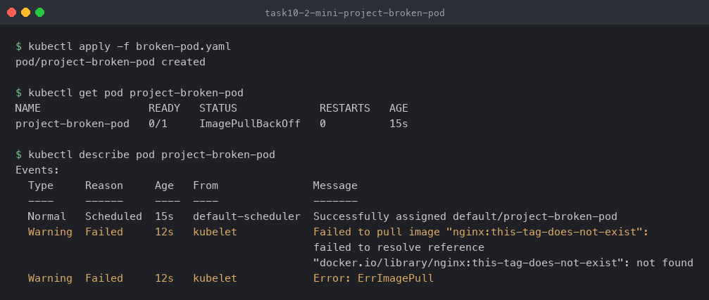

The full loop on an unknown pod, in order:

1. `kubectl get pod project-broken-pod` → `ImagePullBackOff`. Not a crash, not `Pending`.
2. `ImagePullBackOff` means there are no logs to read — skip `kubectl logs` entirely.
3. `kubectl describe pod` → `Failed to pull image "nginx:this-tag-does-not-exist": not found`.
4. `NotFound` from the registry → the tag is wrong. Fix the tag, recreate the pod.

Four steps, no guessing, and `kubectl logs` was correctly skipped because the status already ruled
it out.

---

## Summary

| Status | What it means | Where the answer is |
| --- | --- | --- |
| `Running` but app broken | Container is up, something above or below it is not | `kubectl logs`, then `kubectl exec` |
| `CrashLoopBackOff` | Image pulled, app exits non-zero | `kubectl logs --previous`, `Last State` / `Exit Code` |
| `ImagePullBackOff` / `ErrImagePull` | Image never downloaded, nothing ran | `describe` → Events. No logs exist |
| `Pending` | Scheduler found no node | `describe` → `FailedScheduling` event |
| Service unreachable | Usually a selector that matches nothing | `kubectl get endpoints <service>` |
| DNS resolves, connection refused | Service object exists, endpoints are empty | `kubectl get endpoints <service>` |

Three things that changed how I read failures:

1. **The status name is the symptom, not the cause.** `CrashLoopBackOff` only tells you the
   container keeps dying. `Exit Code: 1` in `Last State` is the actual finding.
2. **The status tells you which command to skip.** `ImagePullBackOff` means no container ever ran,
   so `kubectl logs` will always be empty — go straight to events.
3. **Empty endpoints is silent.** Nothing errors, every pod is `Running`, DNS resolves, and the
   Service is still completely dead. `kubectl get endpoints` is the only command that shows it.

### Two bugs in the class manifests

Both found by running them, both the same class of error as the ones the session is teaching:

- `09-service-dns-troubleshooting/service.yaml` has selector `app: web-asdfddd`, but the pods in
  `deployment.yaml` are labelled `app: web`. Applying it silently empties `web-service`'s endpoints
  (Task 9).
- `09-service-dns-troubleshooting/dns-test-pod.yaml` uses
  `registry.k8s.io/e2e-test-images/dnsutils:1.3`, which the registry reports as `not found`
  (Task 9).

---

## References

- Debug Running Pods — https://kubernetes.io/docs/tasks/debug/debug-application/debug-pods/
- Debug Services — https://kubernetes.io/docs/tasks/debug/debug-application/debug-service/
- DNS for Services and Pods — https://kubernetes.io/docs/concepts/services-networking/dns-pod-service/
- Pod Lifecycle — https://kubernetes.io/docs/concepts/workloads/pods/pod-lifecycle/
- kubectl reference — https://kubernetes.io/docs/reference/kubectl/
