# Monitoring, Observability & GitOps (Session 20)

**Name:** Sumit Akhuli
**Enrollment No:** 24bcs10158

Three demos, all run for real on my machine (macOS, Apple Silicon, Docker Desktop, Minikube
with Kubernetes `v1.37.0`):

| Task | What I built | Tools |
|---|---|---|
| 1. Monitoring | An instrumented API, a dashboard, 4 alert rules, and a simulated incident that fires them | Prometheus `v3.5.0`, Grafana `12.1.1` |
| 2. Observability | The same API sending **metrics, logs and traces**, with a log line linked to its trace | OpenTelemetry, Jaeger `2.10.0` |
| 3. GitOps | A Kubernetes app whose only source of truth is a Git repo | Argo CD `v3.5.3`, Gitea `1.24` |

Raw command transcript: [`lab/transcript.txt`](lab/transcript.txt).

```text
Monitoring_Observability_GitOps/
├── monitoring/
│   ├── app/                  shop-api (Flask): /metrics, JSON logs, OpenTelemetry traces
│   ├── prometheus/           prometheus.yml + alerts.yml (4 alert rules)
│   ├── grafana/              provisioned datasources + "Shop API" dashboard
│   └── docker-compose.yml    shop-api, loadgen, prometheus, grafana, jaeger
├── gitops/
│   ├── argocd-application.yaml
│   └── gitops-config/        final contents of the Git repo Argo CD watches (+ GIT_HISTORY.txt)
├── images/  lab/
```

---

## Monitoring vs observability

- **Monitoring** answers questions you *knew to ask in advance*. "Is the app up? Is CPU above
  50%? Are more than 5% of requests failing?" You decide the metric and the threshold
  beforehand, and an alert tells you when it is crossed.
- **Observability** is being able to answer questions you *didn't* think of in advance. "Why
  are only checkouts slow, and only for some requests?" It comes from the app emitting enough
  detail (metrics, logs, traces) that you can dig into a new problem without shipping new code.

Monitoring tells you **that** something is wrong. Observability helps you find **why**.

---

## Task 1: Monitoring

### The demo app

[`monitoring/app/app.py`](monitoring/app/app.py) is a small "shop" API with three endpoints:
`/api/products` (quick), `/api/checkout` (calls a fake payment provider that is sometimes slow
and fails 10% of the time) and `/api/report` (CPU-heavy). A `loadgen` container calls all three
in a loop, about 6 requests per second.

```bash
cd monitoring && docker compose up -d --build
docker compose ps
```

```
NAME             IMAGE                         STATUS          PORTS
s20-grafana      grafana/grafana:12.1.1        Up 13 minutes   0.0.0.0:3001->3000/tcp
s20-jaeger       jaegertracing/jaeger:2.10.0   Up 13 minutes   0.0.0.0:4318->4318/tcp, 0.0.0.0:16686->16686/tcp
s20-loadgen      curlimages/curl:8.10.1        Up 13 minutes
s20-prometheus   prom/prometheus:v3.5.0        Up 13 minutes   0.0.0.0:9090->9090/tcp
s20-shop-api     monitoring-shop-api           Up 13 minutes   0.0.0.0:8000->8000/tcp
```

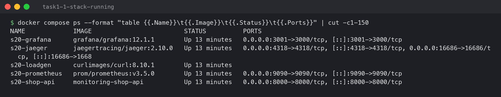

### Metrics

The app exposes its numbers as plain text on `/metrics`. Prometheus scrapes that page every
5 seconds and stores every value with a timestamp.

```bash
curl -s localhost:8000/metrics | grep -E "shop_http_requests_total|process_cpu|process_resident|shop_app_healthy"
```

```
process_resident_memory_bytes 5.0331648e+07
process_cpu_seconds_total 5.21
# HELP shop_http_requests_total HTTP requests
# TYPE shop_http_requests_total counter
shop_http_requests_total{endpoint="/api/products",status="200"} 188.0
shop_http_requests_total{endpoint="/api/checkout",status="200"} 167.0
shop_http_requests_total{endpoint="/api/report",status="200"} 187.0
shop_http_requests_total{endpoint="/api/checkout",status="502"} 21.0
shop_http_request_duration_seconds_count{endpoint="/api/checkout"} 188.0
shop_http_request_duration_seconds_sum{endpoint="/api/checkout"} 43.39433301500139
shop_app_healthy 1.0
```

Three metric types appear here:

- A **counter** only goes up, like `requests_total`. Prometheus turns it into a rate, i.e.
  requests per second.
- A **gauge** goes up and down, like memory or `shop_app_healthy`.
- A **histogram** counts requests into latency buckets, so percentiles like p95 can be
  calculated later.

`process_cpu_seconds_total` and `process_resident_memory_bytes` come free with the Python
client library.

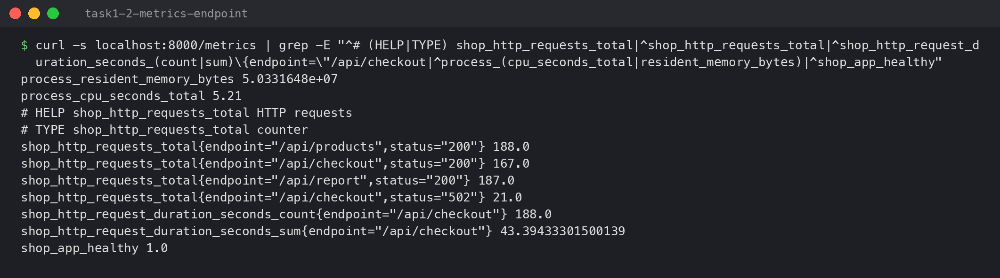

### CPU, memory, application health — as PromQL queries

```
# health: up (1 = scrape worked)
  shop-api   1
  prometheus   1
# CPU utilisation (cores)                      rate(process_cpu_seconds_total{job="shop-api"}[1m])
  shop-api   0.05527272727272727
# memory (MiB)                                 process_resident_memory_bytes / 1024 / 1024
  shop-api   48
# requests per second by endpoint/status       sum by (endpoint, status) (rate(shop_http_requests_total[1m]))
  /api/products 200  2.036363636363636
  /api/checkout 200  1.7454545454545454
  /api/report 200  2.036363636363636
  /api/checkout 502  0.2909090909090909
# error ratio
     0.04761904761904762
# p95 latency (s)                              histogram_quantile(0.95, ...)
  /api/report   0.04786666666666666
  /api/products   0.0494074074074074
  /api/checkout   0.8879999999999999
```

- **CPU** comes from a counter of CPU-seconds used. Its per-second rate *is* the number of
  cores in use, here about 0.055 of one core.
- **Application health** comes from `up`, which Prometheus sets itself: 1 if the scrape
  worked, 0 if not.
- **p95 latency** shows something the average hides. Checkout's p95 is **0.89 s** while the
  other endpoints are around 50 ms, because 1 in 4 payment calls takes 0.6 s.

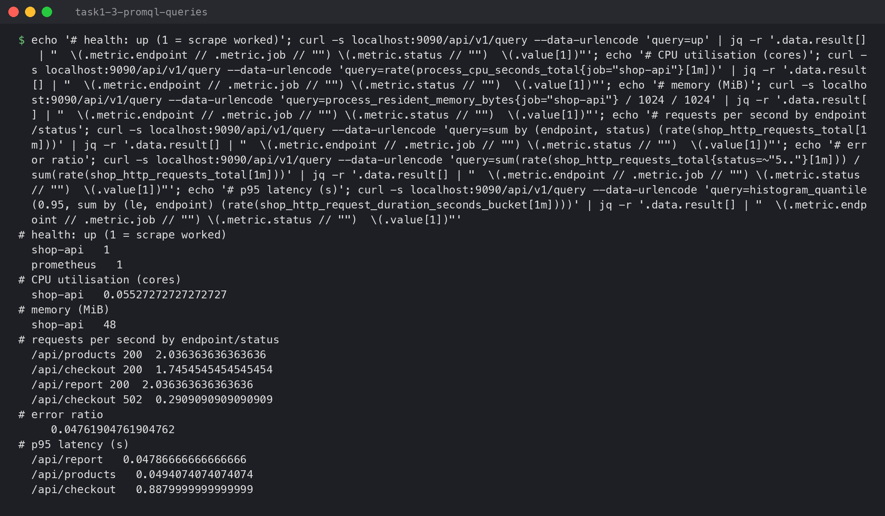

### Logs

Every request writes one **JSON** line, including the `trace_id` of that request:

```
{"ts": "2026-10-06T19:12:17", "level": "ERROR", "msg": "POST /api/checkout 502", "trace_id": "25327a27685c04a364c41514523bb3fd", "endpoint": "/api/checkout", "status": 502, "duration_ms": 90.4}
{"ts": "2026-10-06T19:12:17", "level": "INFO", "msg": "GET /api/report 200", "trace_id": "1d3784ca875a24b3e64544e3fadc62f4", "endpoint": "/api/report", "status": 200, "duration_ms": 21.2}
...
# only errors, as fields:
{"ts":"2026-10-06T19:12:17","msg":"POST /api/checkout 502","duration_ms":90.4,"trace_id":"25327a27685c04a364c41514523bb3fd"}

errors in last 2 min:       18
```

Because each line is JSON and not free text, it can be filtered by field (`select(.level=="ERROR")`)
and counted. That's what Loki, Elasticsearch or CloudWatch Logs Insights do at scale.

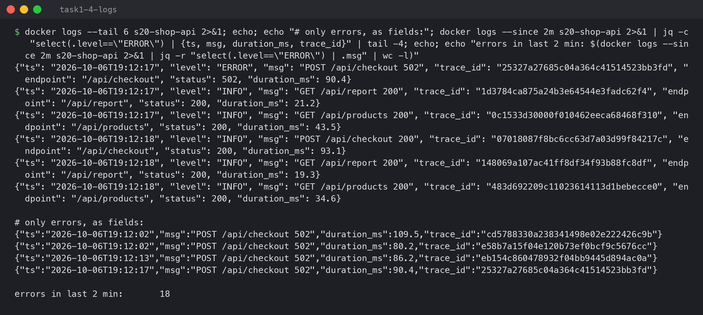

### Dashboard

Grafana is provisioned from files: [`datasources.yml`](monitoring/grafana/provisioning/datasources/datasources.yml)
and the dashboard JSON [`shop-api.json`](monitoring/grafana/dashboards/shop-api.json). Starting
the container gives the same dashboard every time, with nothing to click.

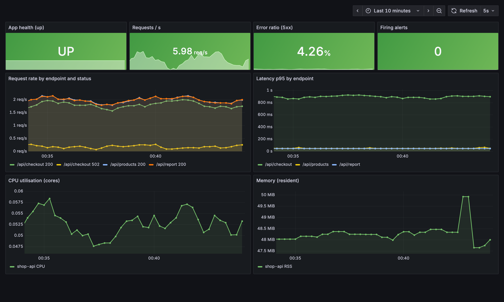

### Alerts

[`prometheus/alerts.yml`](monitoring/prometheus/alerts.yml):

| Alert | Fires when | `for` | Severity |
|---|---|---|---|
| `ShopApiDown` | `up{job="shop-api"} == 0` | 15s | critical |
| `HighErrorRate` | 5xx ÷ all requests > 5% over 1 minute | 30s | warning |
| `HighCpuUsage` | more than 0.5 CPU cores over 1 minute | 30s | warning |
| `HighMemoryUsage` | resident memory > 200 MiB | 30s | warning |

`for:` means the condition must stay true that long before the alert fires. This prevents
one slow scrape from waking someone up at 3 a.m. Before the incident, all four were inactive:

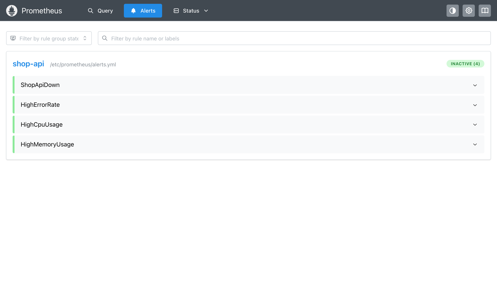

### Simulated incident

**1. CPU spike.** Four extra containers hammer the CPU-heavy `/api/report` endpoint, and the
payment failure rate is raised to 60% (`PAYMENT_FAILURE_RATE=0.6`):

```
00:45:31
 Container s20-shop-api Started
s20-cpu-burst-4 Up Less than a second
...
```

```
00:52:40
HighCpuUsage  state=firing  value=1.0173990509608575e+00  since=2026-10-06T19:16:00.572278861Z

# CPU cores used by shop-api:
1.0158366515754833
NAME           CPU %     MEM USAGE / LIMIT
s20-shop-api   101.47%   42.78MiB / 7.75GiB
```

The app used one full core, and the metric and `docker stats` agree (1.016 cores vs 101.47%).
It can't go above one core because Python runs one thread at a time (the GIL).

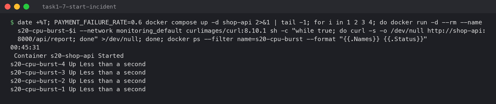

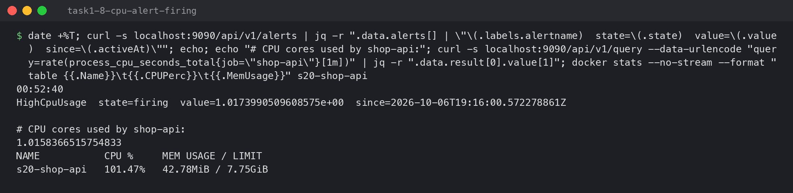

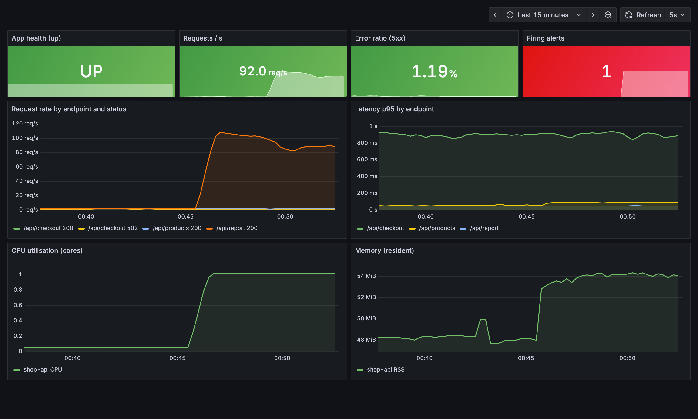

**2. Errors.** `HighErrorRate` did **not** fire during the CPU spike, even with 60% of checkouts
failing. The burst made thousands of extra *successful* `/api/report` calls, which pulled the
overall error ratio under 5%. A ratio-based alert can be hidden by unrelated traffic.
A per-endpoint alert (`by (endpoint)`) would have caught it. After stopping the burst:

```
00:54:21
HighErrorRate  state=firing  value=1.829652996845426e-01

# error ratio:
0.1829652996845426

# matching log lines (last 30 s):
2026-10-06T19:24:15 POST /api/checkout 502 trace=4229bb0764c4ca4492d884cfbd8c5037
2026-10-06T19:24:19 POST /api/checkout 502 trace=16426475f9ab3228c89bce41eb1ae2ef
...
```

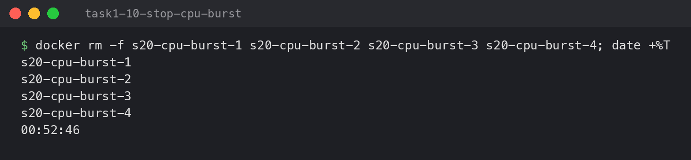

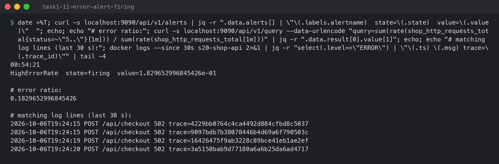

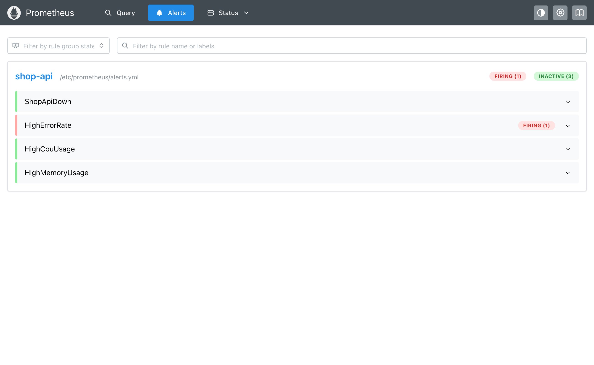

**3. App down.**

```
00:55:17
shop-api stopped
00:55:37
ShopApiDown [critical] state=firing  shop-api is not responding to scrapes
HighErrorRate [warning] state=firing  More than 5% of requests are failing

prometheus  health=up
shop-api  health=down  Get "http://shop-api:8000/metrics": dial tcp: lookup shop-api on 127.0.0.11:53: no such host
```

20 seconds from stop to firing: 15 s of `for`, plus the 5 s scrape and evaluation interval.
The target page even says why: the container is gone, so its DNS name doesn't resolve.

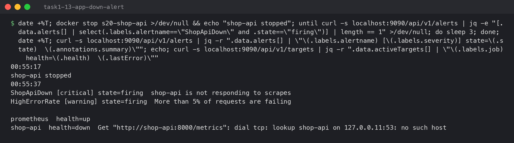

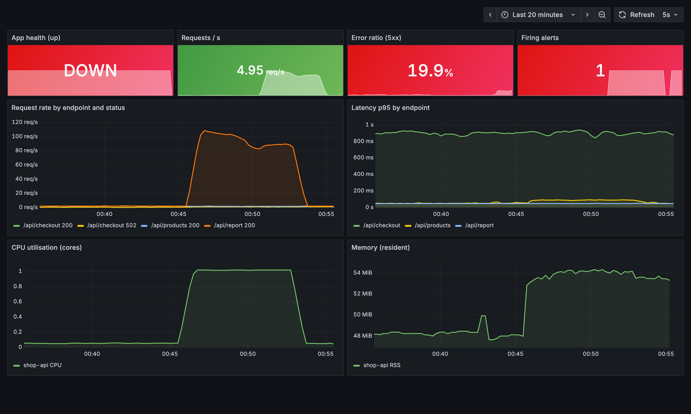

(The "Firing alerts" panel still says 1 here: the screenshot was taken a few seconds after
`ShopApiDown` fired, before Grafana's next refresh picked it up.)

**4. Recovery.**

```
 Container s20-shop-api Started
00:55:48
HighErrorRate state=firing
up{job=shop-api} = 1
```

`ShopApiDown` cleared 11 seconds after restart. `HighErrorRate` stayed for about another
minute, because it is computed over a **1-minute window** that still contained the bad period.

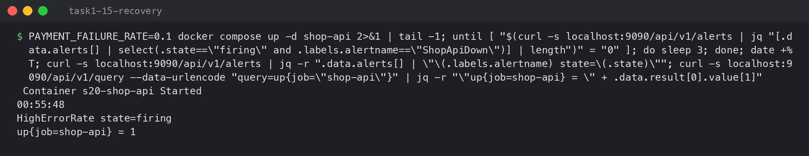

---

## Task 2: Observability — the three pillars

| Pillar | What it is | Answers | In this demo |
|---|---|---|---|
| **Metrics** | Numbers over time, cheap to store, easy to alert on | *Is something wrong, and how much?* | Prometheus scraping `/metrics` |
| **Logs** | One record per event, with details | *What exactly happened in this request?* | JSON lines on stdout |
| **Traces** | The path of one request through every step/service, with timings | *Where did the time go, and which step failed?* | OpenTelemetry → Jaeger |

**Why observability is needed:** in a system with many services, a single user request can
touch ten of them. A metric can say "checkout p95 is 0.9 s", but not which of the ten is slow.
Logs from ten services are hard to line up by hand. A trace shows the whole request as one
timeline. Used together, each pillar answers the question the previous one raised:

```text
alert (metric): error ratio 18%  →  logs: which requests? "POST /api/checkout 502 trace=e3b8…"
                                  →  trace e3b8…: which step? payment.charge → "card declined"
```

### From a log line to its trace

```
# 1. a log line says checkout failed, with trace_id e3b8abdbc0142f1304965cb9f40f5d72
{"ts": "2026-10-06T19:24:25", "level": "ERROR", "msg": "POST /api/checkout 502", "trace_id": "e3b8abdbc0142f1304965cb9f40f5d72", "endpoint": "/api/checkout", "status": 502, "duration_ms": 89.4}

# 2. the same id in Jaeger shows where the time went and what failed:
POST /api/checkout  90 ms  error=true
inventory.reserve  38 ms  error=
payment.charge  50 ms  error=true card declined by provider
```

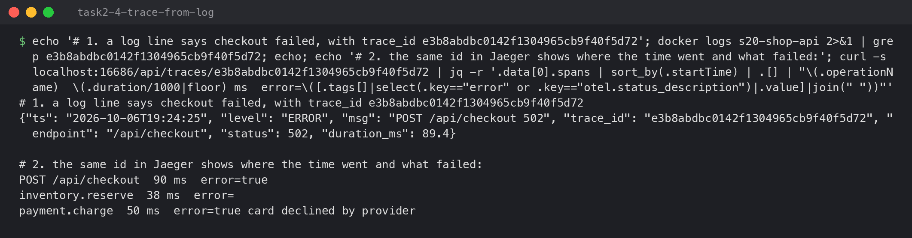

The same trace in the Jaeger UI. The request is split into **spans**: `inventory.reserve`
succeeded in 38 ms, then `payment.charge` failed (red marker) after 51 ms:

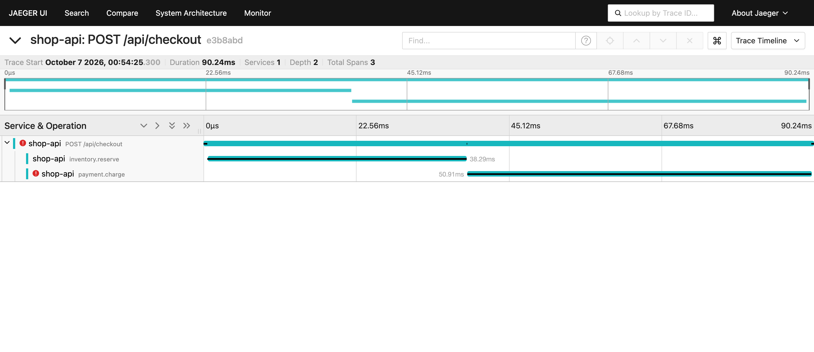

Searching all checkout traces shows the two patterns the metrics hinted at: most finish in
about 100 ms, a cluster takes about 650 ms (the slow payment provider), and some are errors:

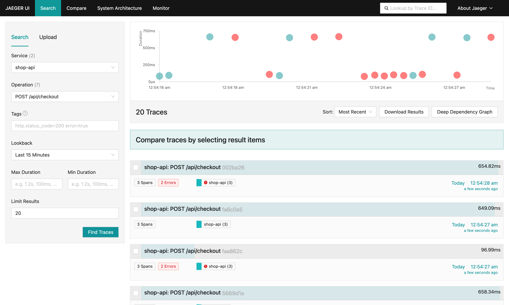

### Common tools

| Pillar | Open source | Managed |
|---|---|---|
| Metrics | Prometheus, Grafana, VictoriaMetrics, Thanos | CloudWatch, Datadog, Grafana Cloud |
| Logs | Loki, Elasticsearch/OpenSearch + Fluent Bit, Fluentd | CloudWatch Logs, Datadog, Splunk |
| Traces | Jaeger, Grafana Tempo, Zipkin | AWS X-Ray, Datadog APM, Honeycomb |
| Instrumentation (all three) | **OpenTelemetry**, the vendor-neutral standard used in this demo | |

### Kubernetes observability

Kubernetes has built-in signals at each level. Shown here on the Minikube cluster from Task 3:

```bash
kubectl top nodes; kubectl top pods -n session20; kubectl top pods -n argocd --sort-by=memory
kubectl get events -n session20 --sort-by=.lastTimestamp
kubectl logs -n session20 deploy/session20-mini --tail=3
```

```
NAME       CPU(cores)   CPU(%)   MEMORY(bytes)   MEMORY(%)
minikube   217m         2%       1982Mi          24%

NAME                              CPU(cores)   MEMORY(bytes)
session20-mini-65c66c8bf4-66gzn   0m           8Mi
...
argocd-application-controller-0                     14m          164Mi
...
6m44s       Normal   ScalingReplicaSet   deployment/session20-mini   Scaled up replica set session20-mini-65c66c8bf4 from 3 to 6
6m43s       Normal   ScalingReplicaSet   deployment/session20-mini   Scaled down replica set session20-mini-65c66c8bf4 from 6 to
...
2026/10/06 19:00:06 [notice] 1#1: start worker process 37
```

| Signal | Built-in source | Production tool |
|---|---|---|
| Node/pod CPU & memory | metrics-server → `kubectl top` (used by HPA) | Prometheus + node-exporter + kube-state-metrics (`kube-prometheus-stack` Helm chart) |
| Object state | `kubectl get/describe`, **events** | kube-state-metrics, Argo CD/Lens dashboards |
| Container logs | `kubectl logs` (stdout of each container) | Fluent Bit DaemonSet → Loki/Elasticsearch |
| Traces | none | OpenTelemetry Collector → Jaeger/Tempo |
| Health | liveness/readiness probes (Session 13) | alerts on `kube_pod_container_status_restarts_total` etc. |

The events above are the record of Task 3's self-heal test: someone scaled to 6, and Argo CD
scaled it straight back to 3.

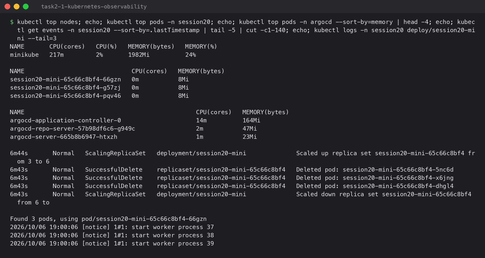

---

## Task 3: GitOps

### What GitOps is

- **Git is the source of truth.** The desired state of the cluster (every Deployment, Service
  and ConfigMap) lives in a Git repo. If it's not in Git, it shouldn't be in the cluster.
- **Declarative configuration.** The repo says *what* should exist (`replicas: 3`), not the
  steps to get there (`kubectl scale ...`).
- **Continuous reconciliation.** An agent in the cluster (Argo CD) keeps comparing the cluster
  with Git, and changes the cluster to match whenever they differ. It works in both directions:
  a new commit gets applied, and a manual change in the cluster gets undone.
- **Pull, not push.** CI never needs cluster credentials. Argo CD pulls from Git from inside
  the cluster.

```text
 developer ──git push──► Git repo (desired state) ◄──── Argo CD polls / webhook
                                                          │ compare
                                                          ▼
                                     Kubernetes (live state) ◄── apply / prune / self-heal
```

**Setup:** Argo CD `v3.5.3` was installed on Minikube from the official manifest. Nothing was
pushed to GitHub at this stage, so the Git server is **Gitea** running as a Docker container on
Minikube's network (`http://192.168.49.3:3000/utkarsh/gitops-config.git`). The workflow is
identical to using GitHub; only the URL in
[`argocd-application.yaml`](gitops/argocd-application.yaml) changes. The repo's final contents
are in [`gitops/gitops-config/`](gitops/gitops-config/).

Argo CD checks Git every 3 minutes by default. In the steps below I set the
`argocd.argoproj.io/refresh` annotation after each push, so it checked straight away instead of
waiting. That is what a Git webhook does in a real setup.

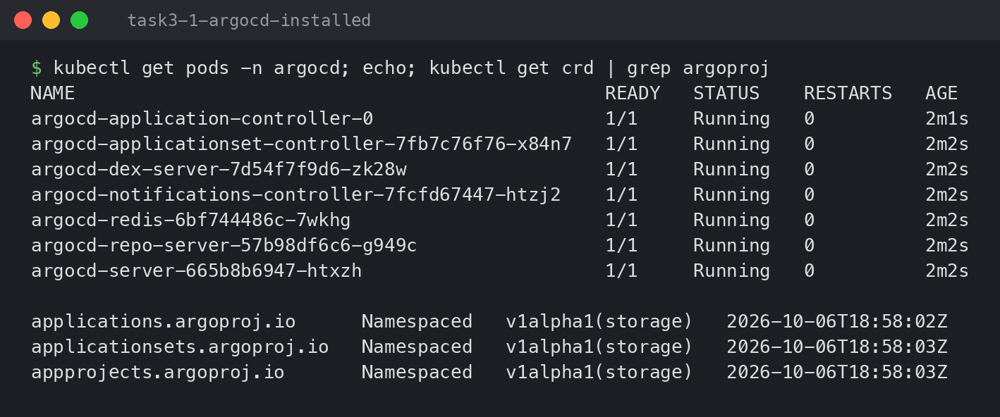

### 1. Git repo v1 and the Application

```
6360907 v1: session20-mini with 2 replicas
app/configmap.yaml
app/deployment.yaml
app/namespace.yaml
app/service.yaml
  replicas: 2
          image: nginx:1.27-alpine
```

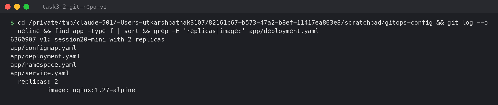

```bash
kubectl apply -f gitops/argocd-application.yaml
```

```
application.argoproj.io/session20-mini created
NAME             SYNC STATUS   HEALTH STATUS   REVISION                                   PROJECT
session20-mini   Synced        Healthy         6360907495980bc46bf3b36f74bd64d5bb162e90   default
...
deployment.apps/session20-mini   2/2     2            2           2s
service/session20-mini   ClusterIP   10.104.143.84   <none>        80/TCP    2s
configmap/web-content        1      2s
```

The `kubectl apply` of the Application is the **only** `kubectl apply` in the whole task. Argo
CD created the namespace, ConfigMap, Deployment and Service from commit `6360907`.

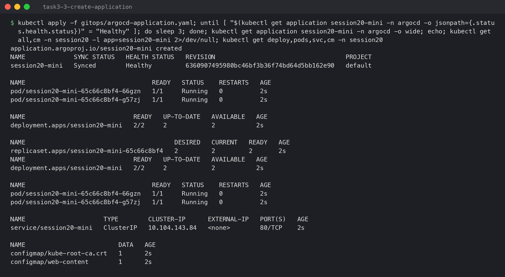

### 2. Change by commit — and a bad commit

Change replicas from 2 to 3 and the page from v1 to v2, then commit and push:

```
 app/configmap.yaml  | 4 ++--
 app/deployment.yaml | 2 +-
-    <p>Version: v1 - deployed by Argo CD from Git</p>
+    <p>Version: v2 - deployed by Argo CD from Git</p>
-  replicas: 2
+  replicas: 3
76ecc4f v2: scale to 3 replicas, new page
```

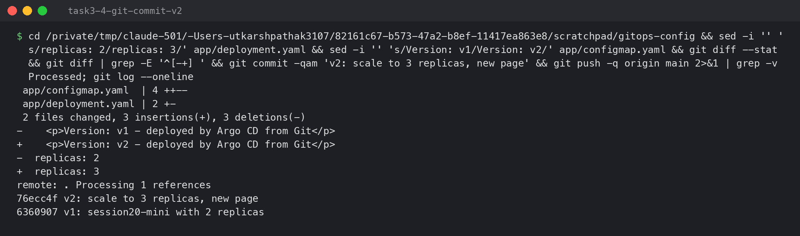

That commit had a mistake I didn't notice: `configmap.yaml` shows **4** changed lines, not 2.
My `sed 's/Version: v1/Version: v2/'` also matched `apiVersion: v1` and turned it into
`apiVersion: v2`, which doesn't exist for a ConfigMap. Argo CD refused it:

```
NAME             SYNC STATUS   HEALTH STATUS
session20-mini   OutOfSync     Healthy

Failed: one or more synchronization tasks are not valid: failed to discover server resources for group version v2: ...
ConfigMap/web-content: SyncFailed - The Kubernetes API could not find version "v2" of /ConfigMap ... Version "v1" of /ConfigMap is installed on the destination cluster.

NAME             READY   UP-TO-DATE   AVAILABLE   AGE
session20-mini   2/2     2            2           5m45s
-apiVersion: v1
+apiVersion: v2
```

This was an accidental test of GitOps, and it worked well:

- Argo CD validated the **whole** commit before applying any of it, so the Deployment wasn't
  half-updated to 3 replicas while the ConfigMap failed.
- The app kept running the last good state (2 pods, page v1). The status shows
  `OutOfSync / Healthy`: Git and the cluster differ, but the app works.
- The `git diff` showed exactly what was wrong.

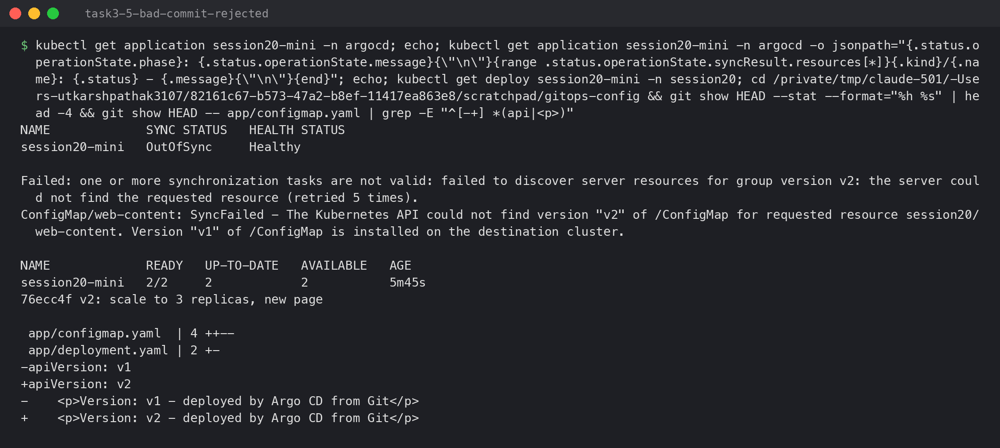

The GitOps fix is another commit, not a `kubectl` command:

```
-apiVersion: v2
+apiVersion: v1
7100c47 fix: configmap apiVersion must be v1
76ecc4f v2: scale to 3 replicas, new page
6360907 v1: session20-mini with 2 replicas
```

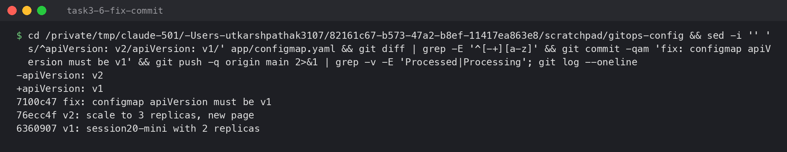

```
NAME             SYNC STATUS   HEALTH STATUS
session20-mini   Synced        Healthy
deployment.apps/session20-mini   3/3     3            3           5m48s
pod/session20-mini-65c66c8bf4-66gzn   1/1     Running   0          5m48s
pod/session20-mini-65c66c8bf4-g57zj   1/1     Running   0          5m48s
pod/session20-mini-65c66c8bf4-pqv46   1/1     Running   0          3s
<h1>Session 20 - GitOps demo</h1>
<p>Version: v2 - deployed by Argo CD from Git</p>
```

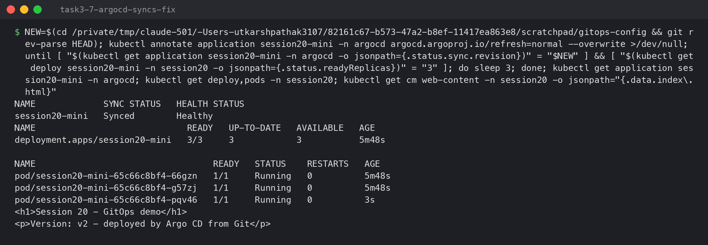

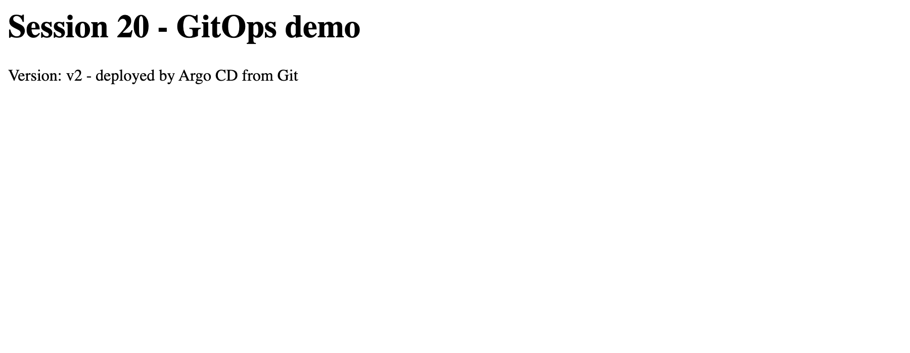

### 3. Self-heal: manual changes get reverted

Someone changes the cluster directly, bypassing Git:

```
00:36:03
deployment.apps/session20-mini scaled                       # kubectl scale --replicas=6
configmap/web-content patched                               # page replaced with "hacked by hand"
NAME             READY   UP-TO-DATE   AVAILABLE   AGE
session20-mini   3/6     6            3           5m58s
00:36:10
NAME             READY   UP-TO-DATE   AVAILABLE   AGE
session20-mini   3/3     3            3           6m4s
<h1>Session 20 - GitOps demo</h1>
<p>Version: v2 - deployed by Argo CD from Git</p>
... Scaled up replica set session20-mini-65c66c8bf4 from 3 to 6
... Scaled down replica set session20-mini-65c66c8bf4 from 6 to 3
```

**7 seconds** later, both changes were undone (`selfHeal: true`). Argo CD watches the live
objects, so a manual change is noticed immediately, without waiting for the 3-minute Git poll.
This is "continuous reconciliation": a hotfix applied with `kubectl` can't quietly drift from
what's in Git.

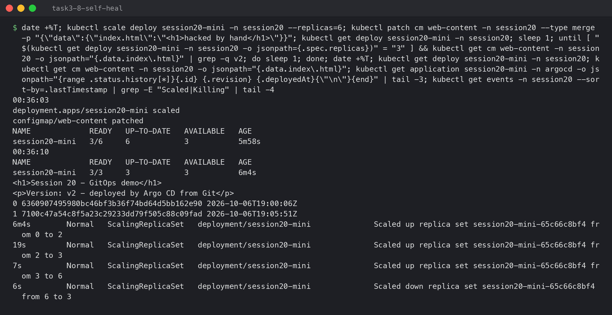

### 4. Prune: deleting from Git deletes from the cluster

```
NAME             TYPE        CLUSTER-IP      EXTERNAL-IP   PORT(S)   AGE
session20-mini   ClusterIP   10.104.143.84   <none>        80/TCP    6m15s
0af5a80 remove the service
Service/session20-mini: Pruned pruned
Namespace/session20: Synced namespace/session20 unchanged
ConfigMap/web-content: Synced configmap/web-content unchanged
Deployment/session20-mini: Synced deployment.apps/session20-mini unchanged
No resources found in session20 namespace.
```

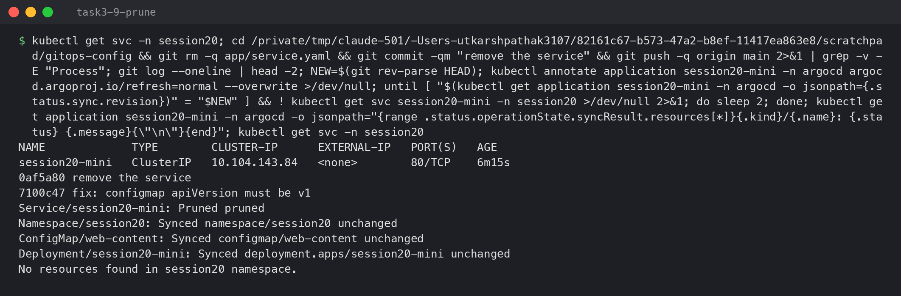

### 5. Rollback = `git revert`

```
fdb8e98 Revert "remove the service"
0af5a80 remove the service
7100c47 fix: configmap apiVersion must be v1
76ecc4f v2: scale to 3 replicas, new page
6360907 v1: session20-mini with 2 replicas
NAME             SYNC STATUS   HEALTH STATUS
session20-mini   Synced        Healthy
service/session20-mini   ClusterIP   10.96.215.45   <none>        80/TCP    2s
```

With GitOps, the deployment history *is* the Git history. Rolling back means reverting a commit,
and the revert is recorded like any other change: who did it, when, and why.

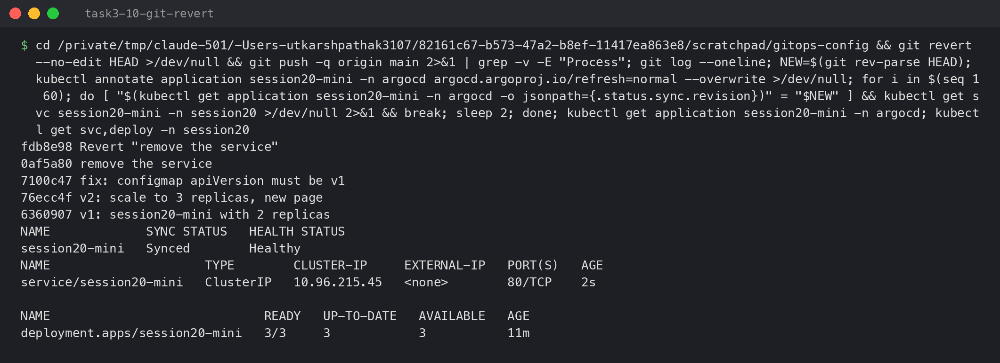

### Argo CD and Gitea

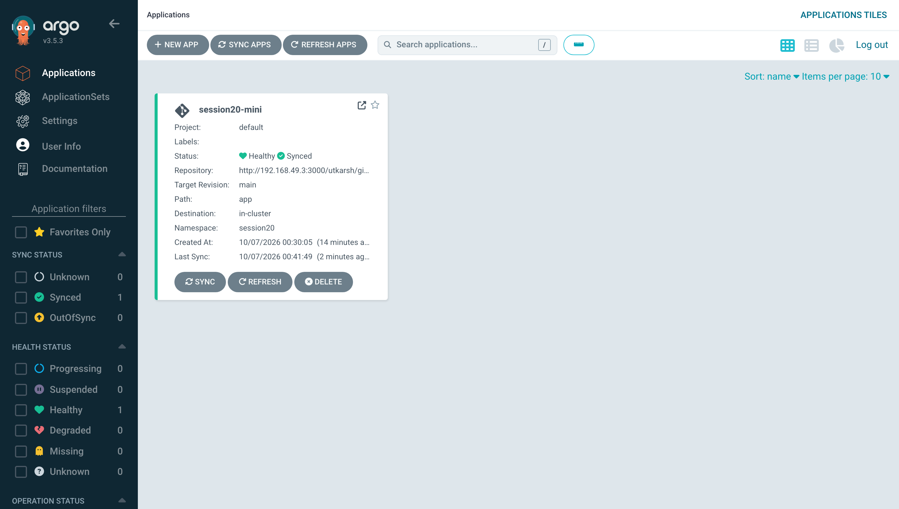

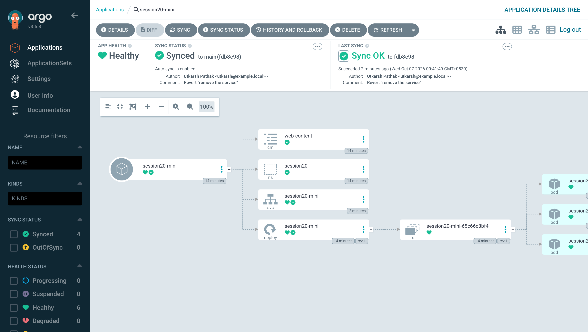

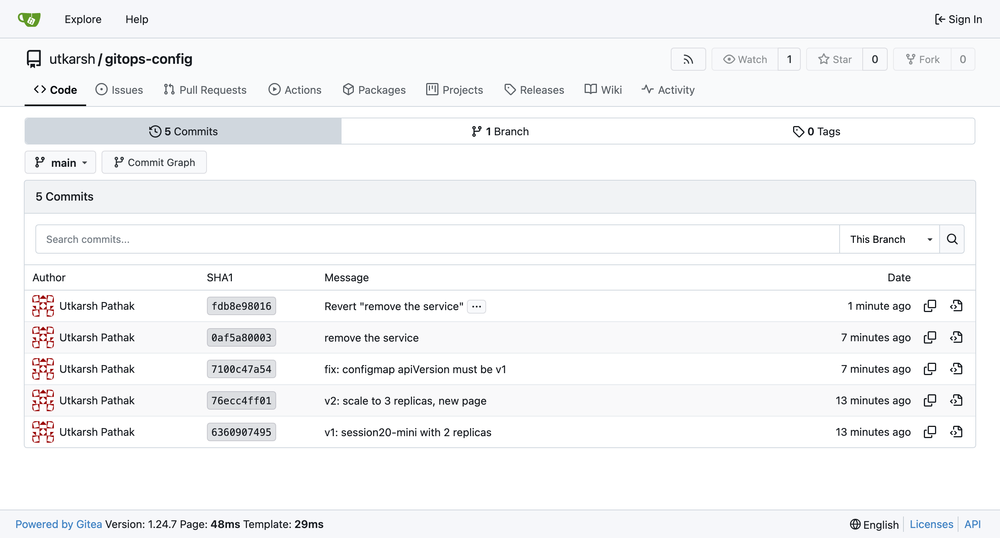

### Kubernetes + GitOps workflow summary

```text
1. Developer edits app/deployment.yaml   →  git commit && git push      (review in a PR)
2. Argo CD sees new commit               →  diff Git vs cluster          (OutOfSync)
3. Argo CD applies the diff              →  kubectl apply equivalent     (Synced)
4. Someone runs kubectl by hand          →  selfHeal reverts it          (seconds)
5. A file is deleted in Git              →  prune deletes the object
6. Something breaks                      →  git revert                    (rollback = commit)
```

---

## Running it

```bash
# Tasks 1-2
cd monitoring && docker compose up -d --build
# Grafana http://localhost:3001  ·  Prometheus http://localhost:9090  ·  Jaeger http://localhost:16686

# Task 3
kubectl create namespace argocd
kubectl apply -n argocd --server-side -f https://raw.githubusercontent.com/argoproj/argo-cd/v3.5.3/manifests/install.yaml
# push gitops-config/ to a Git repo, set its URL in gitops/argocd-application.yaml, then:
kubectl apply -f gitops/argocd-application.yaml
```
