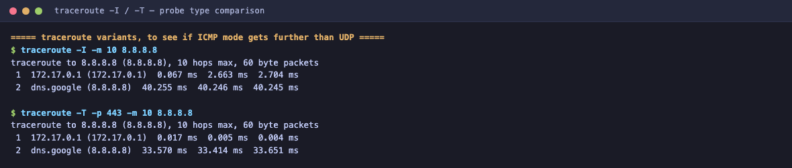
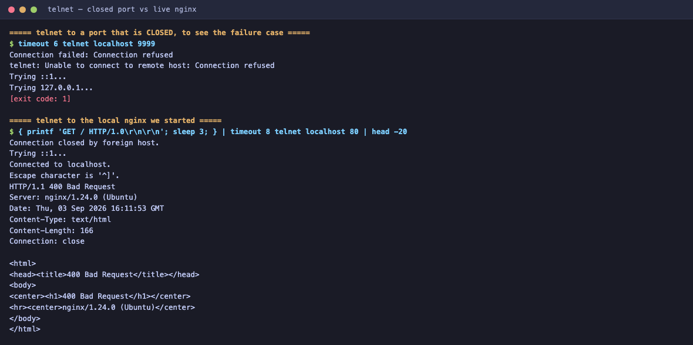

# Networking Fundamentals

**Name:** Sumit Akhuli
**Enrollment No:** 24bcs10158

---

## Tasks

**Task 1** — Practice the commands and repo shared in the `devops-heros` GitHub repo.
**Task 2** — Create a Markdown file, execute the networking commands, add the output, and add a short explanation of what I understood about each command.

### Where it was run

macOS does not have `ip`, `ss`, `tracepath` or `traceroute`, so I ran these in an Ubuntu 24.04
container with real network tooling and internet access.

Script and full transcript: [`lab/net_task.sh`](lab/net_task.sh), [`lab/net_output.txt`](lab/net_output.txt)

---

## 1. hostname

### Command

```bash
hostname
hostname -f
```

### Output

```
devops-lab
devops-lab
```


### Explanation

`hostname` prints the machine's own name. It is the simplest possible identity check — useful when you are SSH'd into several servers and need to be certain which one your command is about to run on.

`-f` asks for the **fully qualified domain name** (FQDN), i.e. hostname plus DNS domain, like `web01.example.com`. Here it returns just `devops-lab` because the container has no DNS domain configured — a bare name means the box is not part of a DNS domain.

---

## 2. whoami

### Command

```bash
whoami
id
```

### Output

```
root

uid=0(root) gid=0(root) groups=0(root)
```


### Explanation

`whoami` prints the current **effective** username. `id` gives the full picture: numeric user ID, group ID and all group memberships.

The important detail here is `uid=0`. **UID 0 is root** — that is what actually grants administrative privilege, not the name "root". The name is just a label in `/etc/passwd`; the kernel only cares about the number. Together these two commands answer "who am I and what am I allowed to do", which is the first thing to check when a command fails with *Permission denied*.

---

## 3. ip a

### Command

```bash
ip a
```

### Output

```
1: lo: <LOOPBACK,UP,LOWER_UP> mtu 65536 qdisc noqueue state UNKNOWN group default qlen 1000
    link/loopback 00:00:00:00:00:00 brd 00:00:00:00:00:00
    inet 127.0.0.1/8 scope host lo
       valid_lft forever preferred_lft forever
    inet6 ::1/128 scope host
       valid_lft forever preferred_lft forever
2: eth0@if57: <BROADCAST,MULTICAST,UP,LOWER_UP> mtu 65535 qdisc noqueue state UP group default
    link/ether 02:42:ac:11:00:02 brd ff:ff:ff:ff:ff:ff link-netnsid 0
    inet 172.17.0.2/16 brd 172.17.255.255 scope global eth0
       valid_lft forever preferred_lft forever
```


### Explanation

`ip a` (short for `ip address show`) lists every network interface and the addresses assigned to it. This is the modern replacement for `ifconfig`, which is deprecated on Linux.

Reading the output:

- **`lo`** is the loopback interface, always `127.0.0.1/8`. Traffic to it never leaves the machine. This is what `localhost` resolves to.
- **`eth0`** is the real network interface, with IP **`172.17.0.2/16`**.
- **`/16`** is the CIDR prefix — 16 bits of network, so the subnet is `172.17.0.0` – `172.17.255.255`. Anything in that range is reachable directly without a router.
- **`link/ether 02:42:ac:11:00:02`** is the MAC address, the layer-2 hardware address. The `02:42:ac` prefix is Docker's signature, and the last four octets `ac:11:00:02` are literally the IP `172.17.0.2` in hex — Docker derives the MAC from the IP.
- **`state UP`** and **`LOWER_UP`** mean the interface is administratively up *and* the physical link is live. An interface can be `UP` with `NO-CARRIER` — configured but unplugged.
- **`mtu 65535`** is the largest packet the interface will send. Normally 1500 on Ethernet; it is huge here because this is a virtual interface inside a VM.

---

## 4. hostname -I

### Command

```bash
hostname -I
```

### Output

```
172.17.0.2
```


### Explanation

`hostname -I` (capital i) prints just the IP address or addresses of the machine, with no other output.

The point of this over `ip a` is that it is **script-friendly**. `ip a` produces a dozen lines meant for humans; `hostname -I` gives you exactly the address, so you can use it directly in a script:

```bash
MY_IP=$(hostname -I | awk '{print $1}')
```

Two caveats worth knowing: it can return **multiple** addresses separated by spaces if the host has several interfaces, and it deliberately **excludes** the loopback address, which is why `127.0.0.1` does not appear.

---

## 5. ip route

### Command

```bash
ip route
ip route get 8.8.8.8
```

### Output

```
default via 172.17.0.1 dev eth0
172.17.0.0/16 dev eth0 proto kernel scope link src 172.17.0.2

8.8.8.8 via 172.17.0.1 dev eth0 src 172.17.0.2 uid 0
    cache
```


### Explanation

`ip route` prints the kernel **routing table** — the rules deciding where a packet goes based on its destination.

Two rules here, and the kernel picks the **most specific match** first:

1. `172.17.0.0/16 dev eth0 ... scope link` — anything inside my own subnet is **directly reachable** on `eth0`, no router involved. `scope link` means "on the same link as me". `proto kernel` means the kernel added this automatically when the IP was configured.
2. `default via 172.17.0.1 dev eth0` — everything else goes to the **default gateway** `172.17.0.1`. This is the catch-all, equivalent to `0.0.0.0/0`.

`ip route get 8.8.8.8` is the genuinely useful one: instead of making you read the table and work it out, it asks the kernel to **decide** for a specific destination and show the answer. It confirms 8.8.8.8 will leave via the gateway `172.17.0.1` out of `eth0`, sourced from `172.17.0.2`.

This is the command for "I have an IP and DNS works, but I still cannot reach anything" — a missing or wrong default route is a very common cause.

---

## 6. ping

### Command

```bash
ping -c 4 8.8.8.8
ping -c 3 google.com
```

### Output

```
PING 8.8.8.8 (8.8.8.8) 56(84) bytes of data.
64 bytes from 8.8.8.8: icmp_seq=1 ttl=63 time=13.1 ms
64 bytes from 8.8.8.8: icmp_seq=2 ttl=63 time=11.6 ms
64 bytes from 8.8.8.8: icmp_seq=3 ttl=63 time=11.5 ms
64 bytes from 8.8.8.8: icmp_seq=4 ttl=63 time=11.5 ms

--- 8.8.8.8 ping statistics ---
4 packets transmitted, 4 received, 0% packet loss, time 3020ms
rtt min/avg/max/mdev = 11.457/11.911/13.056/0.662 ms
```

```
PING google.com (142.250.207.174) 56(84) bytes of data.
64 bytes from pnbomb-bl-in-f14.1e100.net (142.250.207.174): icmp_seq=1 ttl=63 time=28.8 ms
64 bytes from pnbomb-bl-in-f14.1e100.net (142.250.207.174): icmp_seq=2 ttl=63 time=27.4 ms
64 bytes from pnbomb-bl-in-f14.1e100.net (142.250.207.174): icmp_seq=3 ttl=63 time=34.1 ms

--- google.com ping statistics ---
3 packets transmitted, 3 received, 0% packet loss, time 2011ms
rtt min/avg/max/mdev = 27.413/30.128/34.124/2.885 ms
```


### Explanation

`ping` sends **ICMP echo request** packets and waits for echo replies. It answers one question: is the host reachable, and how long does a round trip take. `-c N` limits it to N packets, otherwise it runs until interrupted.

What the fields mean:

- **`icmp_seq`** — sequence number. Gaps mean dropped packets.
- **`time`** — round-trip time. ~11 ms to Google DNS, ~28 ms to google.com.
- **`ttl=63`** — Time To Live remaining. Each router decrements it by one, and a packet is discarded at zero, which prevents infinite loops. Linux typically starts at 64, so `63` means the reply crossed **one** hop.
- **`0% packet loss`** — the number that matters. Loss indicates congestion or a bad link; high `mdev` (jitter) indicates an unstable path.

Running it against a **name** rather than an IP is a deliberately useful trick: the first line shows `PING google.com (142.250.207.174)`, which proves DNS resolution worked *before* any packet was sent. So a successful `ping google.com` tests DNS **and** connectivity, while `ping 8.8.8.8` isolates connectivity only. If the IP pings but the name does not, the fault is DNS.

The reverse name `pnbomb-bl-in-f14.1e100.net` comes from a reverse DNS lookup of the replying address — `1e100.net` is Google's infrastructure domain (1e100 = 10^100 = a googol).

An important limitation: **no reply does not prove a host is down.** Plenty of hosts and firewalls simply drop ICMP. Failing to ping a server that is happily serving HTTP is common.

---

## 7. nslookup

### Command

```bash
nslookup google.com
nslookup github.com
```

### Output

```
Server:		192.168.65.7
Address:	192.168.65.7#53

Non-authoritative answer:
Name:	google.com
Address: 142.250.207.174
```

```
Server:		192.168.65.7
Address:	192.168.65.7#53

Non-authoritative answer:
Name:	github.com
Address: 20.207.73.82
```


### Explanation

`nslookup` queries DNS to turn a name into an IP address.

- **`Server` / `Address`** — *which* DNS resolver answered. `192.168.65.7#53` is the resolver's IP, and `#53` is the DNS port. This is valuable on its own: it tells you which resolver you are actually using, which is often not the one you assumed.
- **`Non-authoritative answer`** — the answer came from a **cache**, not from the domain's own authoritative nameserver. This is normal and expected; it is why DNS is fast. An authoritative answer would come directly from Google's own nameservers.
- **`Address`** — the resolved IP.

`nslookup` isolates DNS from everything else. If `nslookup google.com` works but the browser cannot load the page, DNS is fine and the problem lies elsewhere. If `nslookup` itself fails, nothing that uses hostnames will work.

Worth noting: `dig` is the preferred modern tool for real DNS debugging — it shows the full query, TTLs, and record sections. `nslookup` is the older, simpler one, still installed everywhere.

---

## 8. curl

### Command

```bash
curl -I https://www.google.com
curl -s https://api.github.com/zen
curl -s -o /dev/null -w 'http_code=%{http_code} time_total=%{time_total}s size=%{size_download}bytes\n' https://www.google.com
```

### Output

```
HTTP/2 200
content-type: text/html; charset=ISO-8859-1
date: Thu, 03 Sep 2026 16:10:44 GMT
server: gws
x-xss-protection: 0
x-frame-options: SAMEORIGIN
expires: Thu, 03 Sep 2026 16:10:44 GMT
cache-control: private
alt-svc: h3=":443"; ma=2592000,h3-29=":443"; ma=2592000
```
*(`set-cookie` and CSP headers trimmed for readability — the full response is in the transcript.)*

```
Mind your words, they are important.
```

```
http_code=200 time_total=0.178381s size=85676bytes
```


### Explanation

`curl` makes HTTP(S) requests from the command line. Where `ping` tests whether a *host* is up, `curl` tests whether the *application* is actually working — which is a completely different question.

The flags I used:

- **`-I`** — send a `HEAD` request: fetch **headers only**, no body. Ideal for checking whether a service is alive without downloading a megabyte of HTML.
- **`-s`** — silent, suppresses the progress meter. Essential when piping output.
- **`-o /dev/null`** — discard the body.
- **`-w`** — write out chosen variables afterwards, so you get a clean one-line summary.

Reading the header output:

- **`HTTP/2 200`** — protocol version and status code. `200` is success. This is the single most important line.
- **`server: gws`** — Google Web Server.
- **`content-type`** — what the body actually is.
- **`alt-svc: h3=":443"`** — the server advertises HTTP/3 over QUIC on port 443.

The `-w` form is the practical one for scripting and health checks: `http_code=200`, a total time of **0.178 s**, and **85676 bytes** downloaded. That is enough to build a monitoring check that alerts on a non-200 or on latency.

---

## 9. ss

### Command

```bash
ss -tuln
ss -tp state listening
```

### Output

```
Netid State  Recv-Q Send-Q Local Address:Port Peer Address:Port Process
tcp   LISTEN 0      511          0.0.0.0:80        0.0.0.0:*
tcp   LISTEN 0      4096         0.0.0.0:22        0.0.0.0:*
tcp   LISTEN 0      511             [::]:80           [::]:*
tcp   LISTEN 0      4096            [::]:22           [::]:*
```

```
Recv-Q Send-Q Local Address:Port Peer Address:Port Process
0      511          0.0.0.0:http      0.0.0.0:*    users:(("nginx",pid=234,fd=5),("nginx",pid=233,fd=5),...)
0      4096         0.0.0.0:ssh       0.0.0.0:*    users:(("sshd",pid=71,fd=3),("systemd",pid=1,fd=46))
```


### Explanation

`ss` (socket statistics) shows network sockets. It replaces the deprecated `netstat` and is considerably faster, because it reads kernel data directly instead of parsing `/proc`.

The flags, which are worth memorising as a set — **`ss -tuln`**:

- **`-t`** TCP, **`-u`** UDP
- **`-l`** listening sockets only
- **`-n`** numeric — do **not** resolve port numbers to names, so you see `80` instead of `http`. This also makes it much faster, since no DNS lookups happen.

Reading it:

- **`0.0.0.0:80`** — listening on port 80 on **all** IPv4 interfaces. This matters for security: `0.0.0.0` is reachable from the network, whereas `127.0.0.1:80` would only accept local connections.
- **`[::]:80`** — the same on IPv6.
- **`Send-Q`** on a listening socket is the **accept backlog** (511 for nginx, 4096 for sshd) — how many pending connections may queue before new ones are refused.
- **`Recv-Q`** on a listening socket is the number of connections waiting to be accepted. Persistently non-zero means the application is not keeping up.

Adding **`-p`** shows the owning process. This is the answer to "what is already using this port" — exactly the situation I hit while doing the Docker homework, where port 3001 was occupied. The nginx line shows one master plus many workers all sharing the same listening socket, which is how nginx's worker model operates.

---

## 10. /etc/hosts

### Command

```bash
cat /etc/hosts
cat /etc/resolv.conf
```

### Output

```
127.0.0.1	localhost
::1	localhost ip6-localhost ip6-loopback
fe00::	ip6-localnet
ff00::	ip6-mcastprefix
ff02::1	ip6-allnodes
ff02::2	ip6-allrouters
172.17.0.2	devops-lab
```

```
# Generated by Docker Engine.
nameserver 192.168.65.7
```


### Explanation

`/etc/hosts` is a **static, local** name-to-IP mapping file. It is consulted **before** DNS, so an entry here overrides whatever DNS would say.

Reading it: `127.0.0.1 localhost` is why `localhost` works without any DNS at all. The last line, `172.17.0.2 devops-lab`, was added by Docker so the container can resolve its own hostname.

`/etc/resolv.conf` is the companion file: it lists the **DNS servers** to use when a name is *not* in `/etc/hosts`. So the resolution order is: `/etc/hosts` first, then the `nameserver` from `resolv.conf`.

### Proving the override works

```bash
echo '127.0.0.1   myapp.local' >> /etc/hosts
ping -c 2 myapp.local
```

```
PING myapp.local (127.0.0.1) 56(84) bytes of data.
64 bytes from localhost (127.0.0.1): icmp_seq=1 ttl=64 time=0.056 ms
64 bytes from localhost (127.0.0.1): icmp_seq=2 ttl=64 time=0.074 ms

--- myapp.local ping statistics ---
2 packets transmitted, 2 received, 0% packet loss, time 0.065 ms
```

`myapp.local` is not a real domain and no DNS server anywhere knows it, yet it resolved to `127.0.0.1` immediately — because `/etc/hosts` was checked first.

This is genuinely useful in practice: pointing a production hostname at a staging server to test it, or at `127.0.0.1` to block a domain. It is also the first thing to check when a machine resolves a name "wrongly" and no DNS change explains it — a stale `/etc/hosts` entry is a classic and very confusing bug.

---

## 11. tracepath

### Command

```bash
tracepath -m 8 8.8.8.8
```

### Output

```
 1:  172.17.0.1                                            0.168ms
 2:  no reply
 3:  no reply
 4:  no reply
 5:  no reply
 6:  no reply
 7:  no reply
 8:  no reply
     Too many hops: pmtu 65535
     Resume: pmtu 65535
```


### Explanation

`tracepath` traces the route to a destination and additionally discovers the **path MTU** — the largest packet size that can cross the whole path without fragmentation. It needs no root privileges, which is its main advantage over classic `traceroute`.

It works by sending packets with a deliberately small **TTL**. TTL 1 expires at the first router, which returns an ICMP "time exceeded" naming itself; TTL 2 expires at the second, and so on. Each expiry reveals one hop.

**Being honest about this output:** only hop 1 answered — `172.17.0.1`, the Docker bridge gateway, which matches the `default via 172.17.0.1` route from command 5. Everything after that is `no reply`.

This is **not** a broken network — commands 6, 7 and 8 above prove the internet is fully reachable from this container. The cause is that Docker Desktop's NAT layer does not return the ICMP "time exceeded" messages that `tracepath` relies on, so the intermediate hops are invisible. I confirmed this by re-running the trace in ICMP mode, which does work — see the next section.

`pmtu 65535` is the MTU of the local virtual interface, consistent with the `mtu 65535` on `eth0` in command 3.

---

## 12. traceroute

### Command

```bash
traceroute -m 8 8.8.8.8
```

### Output

```
traceroute to 8.8.8.8 (8.8.8.8), 8 hops max, 60 byte packets
 1  172.17.0.1 (172.17.0.1)  0.599 ms  0.401 ms  0.381 ms
 2  * * *
 3  * * *
 4  * * *
 5  * * *
 6  * * *
 7  * * *
 8  * * *
```


### Explanation

`traceroute` does the same TTL trick as `tracepath`, but sends **three** probes per hop, which is why each line has three timings. Three numbers per hop let you spot an unstable or congested router, where one probe is much slower than its neighbours.

`* * *` means no reply for any of the three probes at that TTL — the same NAT behaviour described above.

### Confirming the diagnosis

By default Linux `traceroute` probes with **UDP**. It can also use ICMP (`-I`) or TCP (`-T`). Since the `* * *` looked like a probe-type problem rather than a real routing failure, I tested that directly:

```bash
traceroute -I -m 10 8.8.8.8        # ICMP echo probes
traceroute -T -p 443 -m 10 8.8.8.8 # TCP SYN probes to port 443
```

```
traceroute to 8.8.8.8 (8.8.8.8), 10 hops max, 60 byte packets
 1  172.17.0.1 (172.17.0.1)  0.067 ms  2.663 ms  2.704 ms
 2  dns.google (8.8.8.8)  40.255 ms  40.246 ms  40.245 ms
```

```
traceroute to 8.8.8.8 (8.8.8.8), 10 hops max, 60 byte packets
 1  172.17.0.1 (172.17.0.1)  0.017 ms  0.005 ms  0.004 ms
 2  dns.google (8.8.8.8)  33.570 ms  33.416 ms  33.651 ms
```



Both reach **`dns.google (8.8.8.8)`** in two hops. So the path was fine all along; only the **UDP** probes were being dropped.

That is the real lesson from this pair of commands, and it is more useful than a clean textbook trace would have been: **`* * *` does not mean the route is broken.** It means those particular probes got no reply. Firewalls very commonly permit ICMP or TCP while dropping UDP, or rate-limit ICMP responses. When a trace looks dead, change the probe type (`-I`, `-T`) before concluding anything — and if the final destination still responds, the path works regardless of what the middle hops show.

Real-world use: `traceroute -T -p 443` is the practical choice for diagnosing a path to an HTTPS service, since it probes with the same protocol and port the real traffic will use.

---

## 13. telnet

### Command

```bash
{ printf 'GET / HTTP/1.0\r\n\r\n'; sleep 3; } | telnet localhost 80
timeout 6 telnet localhost 9999
```

### Output — port that is open

```
Trying ::1...
Connected to localhost.
Escape character is '^]'.
HTTP/1.1 400 Bad Request
Server: nginx/1.24.0 (Ubuntu)
Date: Thu, 03 Sep 2026 16:11:53 GMT
Content-Type: text/html
Content-Length: 166
Connection: close

<html>
<head><title>400 Bad Request</title></head>
<body>
<center><h1>400 Bad Request</h1></center>
<hr><center>nginx/1.24.0 (Ubuntu)</center>
</body>
</html>
Connection closed by foreign host.
```

### Output — port that is closed

```
Trying ::1...
Trying 127.0.0.1...
telnet: Unable to connect to remote host: Connection refused
[exit code: 1]
```


### Explanation

`telnet <host> <port>` opens a raw TCP connection. The original remote-login protocol is obsolete and must never be used for that — it transmits passwords in cleartext, and SSH replaced it. But as a **TCP connectivity tester** it is still genuinely useful and installed nearly everywhere.



The two outputs above are the two answers you are looking for:

- **`Connected to localhost.`** — the TCP three-way handshake succeeded. Something is listening and accepting on that port.
- **`Connection refused`** — the host was reachable but **nothing is listening** on that port. The host actively sent a TCP RST. This is a different failure from a **timeout**, which usually means a firewall silently dropped the packet. Distinguishing "refused" from "timed out" is the single most useful thing this command tells you.

Because the connection is raw, you can then type protocol commands by hand — which is why I sent `GET / HTTP/1.0` and got a real HTTP response back from nginx, complete with `Server: nginx/1.24.0 (Ubuntu)`.

**About the `400 Bad Request`:** that is telnet's own doing, and worth understanding rather than hiding. HTTP requires lines to end with a literal CRLF, but telnet operates in line mode and transforms carriage returns as it sends them, so nginx received a malformed request line. The connection, the server, and the response are all completely real — the request was simply mangled in transit. It is a good illustration of why telnet is the right tool for *"is this port open"* and the wrong tool for *"is this HTTP endpoint returning correct data"*. For the latter, use `curl` (command 8), or `nc` / `openssl s_client` for raw sockets.

For reference, `nc -zv host port` is the cleaner modern equivalent for a pure port check, and it can test UDP too.

---

## What I took away

The commands split into layers, and the skill is knowing which layer you are testing:

| Layer | Question | Commands |
|---|---|---|
| Identity | Who and where am I? | `hostname`, `hostname -I`, `whoami`, `id` |
| Interface | Do I have an IP? | `ip a` |
| Routing | Where do my packets go? | `ip route` |
| Reachability | Can I reach that host? | `ping`, `telnet` |
| Path | What route do they take? | `traceroute`, `tracepath` |
| Naming | Does the name resolve? | `nslookup`, `/etc/hosts` |
| Local sockets | What is listening here? | `ss -tuln` |
| Application | Does the service work? | `curl` |

A practical order for debugging "the website is down":

1. `ip a` — do I have an address?
2. `ip route` — is there a default gateway?
3. `ping 8.8.8.8` — internet reachable by IP? *(rules DNS out)*
4. `nslookup <site>` — does the name resolve? *(if 3 works and this fails, it is DNS)*
5. `curl -I https://<site>` — is the app returning 200?
6. `ss -tuln` — if it is my server, is it listening on the right address?

Two things this run taught me that a textbook would not:

- `* * *` in a traceroute usually means the **probe type** is filtered, not that the route is broken.
- `telnet` returning an HTTP error still proves the TCP layer works.
