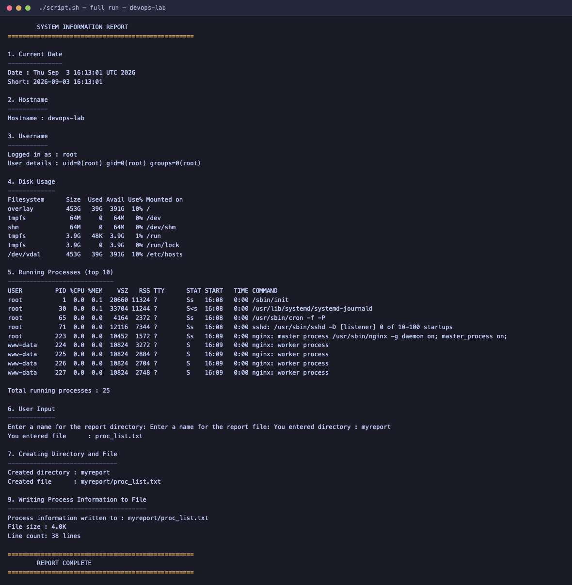
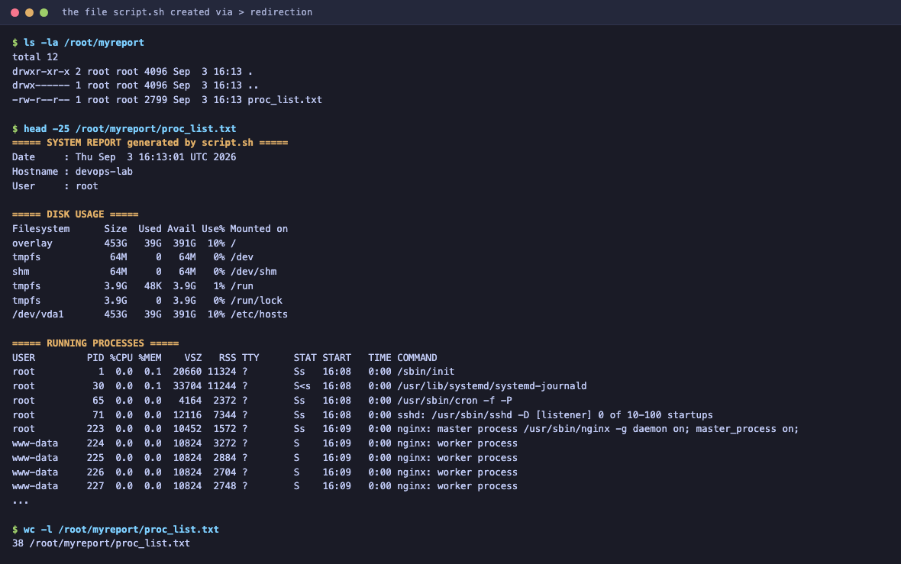

# Shell Scripting

**Name:** Sumit Akhuli
**Enrollment No:** 24bcs10158

---

## Task: System Information Script

Create a shell script that:

- Prints the current date
- Prints the hostname
- Prints the username
- Prints the disk usage
- Prints the running processes
- Uses variables to store and use data
- Takes user input using `read -p`
- Creates a directory using `mkdir`
- Creates a file using `touch`
- Stores the running processes information in the file using `>` output redirection

### Where it was run

The script is [`script.sh`](script.sh). It was executed on Ubuntu 24.04 (`bash`), because `df`, `ps` and `/etc/os-release` behave differently on macOS and I wanted output that matches what the commands do on Linux. The complete captured run is in [`run_output.txt`](run_output.txt).

---

## Requirement checklist

Every required item, and where it is in the script:

| Requirement | Command used | Where |
|---|---|---|
| Current date | `date` | `CURRENT_DATE=$(date)`, section 1 |
| Hostname | `hostname` | `HOST_NAME=$(hostname)`, section 2 |
| Username | `whoami` | `USER_NAME=$(whoami)`, section 3 |
| Disk usage | `df -h` | section 4 |
| Running processes | `ps aux` | section 5 |
| Variables | `CURRENT_DATE`, `HOST_NAME`, `USER_NAME`, `DIR_NAME`, `FILE_NAME`, `TOTAL_PROCS`, `REPORT_PATH` | throughout |
| User input | `read -p` | section 6 |
| Create directory | `mkdir -p` | section 7 |
| Create file | `touch` | section 8 |
| Output redirection | `>` then `>>` | section 9 |
| `echo` | `echo` | throughout |

---

## script.sh

```bash
#!/bin/bash
# ============================================================
#  System Information Script
#  Shell Scripting Homework
#  Name        : Sumit Akhuli
#  Enrollment  : 24bcs10158
#
#  Demonstrates: variables, echo, date, hostname, whoami, df,
#                ps, read -p, mkdir, touch, > output redirection
# ============================================================

# ---------- variables ----------
CURRENT_DATE=$(date)
HOST_NAME=$(hostname)
USER_NAME=$(whoami)
SCRIPT_NAME=$(basename "$0")

echo "==================================================="
echo "        SYSTEM INFORMATION REPORT"
echo "==================================================="
echo

# ---------- 1. current date ----------
echo "1. Current Date"
echo "---------------"
echo "Date : $CURRENT_DATE"
echo "Short: $(date '+%Y-%m-%d %H:%M:%S')"
echo

# ---------- 2. hostname ----------
echo "2. Hostname"
echo "-----------"
echo "Hostname : $HOST_NAME"
echo

# ---------- 3. username ----------
echo "3. Username"
echo "-----------"
echo "Logged in as : $USER_NAME"
echo "User details : $(id)"
echo

# ---------- 4. disk usage ----------
echo "4. Disk Usage"
echo "-------------"
df -h
echo

# ---------- 5. running processes ----------
echo "5. Running Processes (top 10)"
echo "-----------------------------"
ps aux | head -10
echo
TOTAL_PROCS=$(ps aux | tail -n +2 | wc -l)
echo "Total running processes : $TOTAL_PROCS"
echo

# ---------- 6. user input with read -p ----------
echo "6. User Input"
echo "-------------"
read -p "Enter a name for the report directory: " DIR_NAME
read -p "Enter a name for the report file: " FILE_NAME

# fall back to defaults if the user just pressed Enter
DIR_NAME=${DIR_NAME:-system_report}
FILE_NAME=${FILE_NAME:-processes.txt}

echo "You entered directory : $DIR_NAME"
echo "You entered file      : $FILE_NAME"
echo

# ---------- 7. create directory with mkdir ----------
echo "7. Creating Directory and File"
echo "------------------------------"
mkdir -p "$DIR_NAME"
echo "Created directory : $DIR_NAME"

# ---------- 8. create file with touch ----------
touch "$DIR_NAME/$FILE_NAME"
echo "Created file      : $DIR_NAME/$FILE_NAME"
echo

# ---------- 9. store process info in the file using > redirection ----------
echo "9. Writing Process Information to File"
echo "--------------------------------------"
REPORT_PATH="$DIR_NAME/$FILE_NAME"

# '>' overwrites / creates the file
echo "===== SYSTEM REPORT generated by $SCRIPT_NAME =====" > "$REPORT_PATH"

# '>>' appends the rest
{
  echo "Date     : $CURRENT_DATE"
  echo "Hostname : $HOST_NAME"
  echo "User     : $USER_NAME"
  echo
  echo "===== DISK USAGE ====="
  df -h
  echo
  echo "===== RUNNING PROCESSES ====="
  ps aux
} >> "$REPORT_PATH"

echo "Process information written to : $REPORT_PATH"
echo "File size : $(du -h "$REPORT_PATH" | cut -f1)"
echo "Line count: $(wc -l < "$REPORT_PATH") lines"
echo

echo "==================================================="
echo "        REPORT COMPLETE"
echo "==================================================="
```

---

## Running it

```bash
chmod +x script.sh
./script.sh
```

I typed `myreport` and `proc_list.txt` at the two prompts.

### Full output

```
===================================================
        SYSTEM INFORMATION REPORT
===================================================

1. Current Date
---------------
Date : Thu Sep  3 16:12:43 UTC 2026
Short: 2026-09-03 16:12:43

2. Hostname
-----------
Hostname : devops-lab

3. Username
-----------
Logged in as : root
User details : uid=0(root) gid=0(root) groups=0(root)

4. Disk Usage
-------------
Filesystem      Size  Used Avail Use% Mounted on
overlay         453G   39G  391G  10% /
tmpfs            64M     0   64M   0% /dev
shm              64M     0   64M   0% /dev/shm
tmpfs           3.9G   48K  3.9G   1% /run
tmpfs           3.9G     0  3.9G   0% /run/lock
/dev/vda1       453G   39G  391G  10% /etc/hosts

5. Running Processes (top 10)
-----------------------------
USER         PID %CPU %MEM    VSZ   RSS TTY      STAT START   TIME COMMAND
root           1  0.0  0.1  20660 11324 ?        Ss   16:08   0:00 /sbin/init
root          30  0.0  0.1  33704 11244 ?        S<s  16:08   0:00 /usr/lib/systemd/systemd-journald
root          65  0.0  0.0   4164  2372 ?        Ss   16:08   0:00 /usr/sbin/cron -f -P
root          71  0.0  0.0  12116  7344 ?        Ss   16:08   0:00 sshd: /usr/sbin/sshd -D [listener] 0 of 10-100 startups
root         223  0.0  0.0  10452  1572 ?        Ss   16:09   0:00 nginx: master process /usr/sbin/nginx -g daemon on; master_process on;
www-data     224  0.0  0.0  10824  3272 ?        S    16:09   0:00 nginx: worker process
www-data     225  0.0  0.0  10824  2884 ?        S    16:09   0:00 nginx: worker process
www-data     226  0.0  0.0  10824  2704 ?        S    16:09   0:00 nginx: worker process
www-data     227  0.0  0.0  10824  2748 ?        S    16:09   0:00 nginx: worker process

Total running processes : 23

6. User Input
-------------
Enter a name for the report directory: Enter a name for the report file: You entered directory : myreport
You entered file      : proc_list.txt

7. Creating Directory and File
------------------------------
Created directory : myreport
Created file      : myreport/proc_list.txt

9. Writing Process Information to File
--------------------------------------
Process information written to : myreport/proc_list.txt
File size : 4.0K
Line count: 38 lines

===================================================
        REPORT COMPLETE
===================================================
```

---




## The file the script created

The task's last requirement is that the running-process information ends up **in a file** via `>` redirection. Verifying that the file really exists with real content:

```bash
ls -la /root/myreport
```

```
total 12
drwxr-xr-x 2 root root 4096 Sep  3 16:13 .
drwx------ 1 root root 4096 Sep  3 16:13 ..
-rw-r--r-- 1 root root 2799 Sep  3 16:13 proc_list.txt
```

```bash
head -25 /root/myreport/proc_list.txt
```

```
===== SYSTEM REPORT generated by script.sh =====
Date     : Thu Sep  3 16:13:01 UTC 2026
Hostname : devops-lab
User     : root

===== DISK USAGE =====
Filesystem      Size  Used Avail Use% Mounted on
overlay         453G   39G  391G  10% /
tmpfs            64M     0   64M   0% /dev
shm              64M     0   64M   0% /dev/shm
tmpfs           3.9G   48K  3.9G   1% /run
tmpfs           3.9G     0  3.9G   0% /run/lock
/dev/vda1       453G   39G  391G  10% /etc/hosts

===== RUNNING PROCESSES =====
USER         PID %CPU %MEM    VSZ   RSS TTY      STAT START   TIME COMMAND
root           1  0.0  0.1  20660 11324 ?        Ss   16:08   0:00 /sbin/init
root          30  0.0  0.1  33704 11244 ?        S<s  16:08   0:00 /usr/lib/systemd/systemd-journald
root          65  0.0  0.0   4164  2372 ?        Ss   16:08   0:00 /usr/sbin/cron -f -P
root          71  0.0  0.0  12116  7344 ?        Ss   16:08   0:00 sshd: /usr/sbin/sshd -D [listener] 0 of 10-100 startups
root         223  0.0  0.0  10452  1572 ?        Ss   16:09   0:00 nginx: master process /usr/sbin/nginx
www-data     224  0.0  0.0  10824  3272 ?        S    16:09   0:00 nginx: worker process
www-data     225  0.0  0.0  10824  2884 ?        S    16:09   0:00 nginx: worker process
www-data     226  0.0  0.0  10824  2704 ?        S    16:09   0:00 nginx: worker process
www-data     227  0.0  0.0  10824  2748 ?        S    16:09   0:00 nginx: worker process
```

```bash
wc -l /root/myreport/proc_list.txt
```

```
38 /root/myreport/proc_list.txt
```



38 lines, 2799 bytes, containing the header, the disk usage and the full process table.

---

## Explanation of what each part does

### Variables and command substitution

```bash
CURRENT_DATE=$(date)
```

`$(...)` is **command substitution** — it runs `date` and substitutes its output. Two rules that matter and bite people:

- **No spaces around `=`.** `CURRENT_DATE = $(date)` does not assign; bash reads it as running a command called `CURRENT_DATE`.
- **Quote when expanding.** I wrote `mkdir -p "$DIR_NAME"`, not `mkdir -p $DIR_NAME`. Unquoted, a directory name with a space becomes two arguments and creates two directories.

### `read -p`

```bash
read -p "Enter a name for the report directory: " DIR_NAME
```

`read` takes a line from stdin into a variable; `-p` prints a prompt first.

One thing to know: bash only shows the `-p` prompt when stdin is a terminal. Both prompts appear on
one line above because the second printed as soon as the first input was consumed.

### Default values

```bash
DIR_NAME=${DIR_NAME:-system_report}
```

`${VAR:-default}` expands to `$VAR`, or to `default` if `$VAR` is unset **or empty**. This stops the script breaking if the user just presses Enter. (`${VAR-default}` without the colon only substitutes when *unset*, not when empty — a subtle difference.)

### `mkdir -p` and `touch`

```bash
mkdir -p "$DIR_NAME"
touch "$DIR_NAME/$FILE_NAME"
```

`-p` does two useful things: it creates intermediate parent directories, and it **does not error if the directory already exists** — so re-running the script is safe.

`touch` creates an empty file if it does not exist, and updates the modification timestamp if it does.

### `>` vs `>>`

This is the part the task is really testing:

```bash
echo "===== SYSTEM REPORT =====" > "$REPORT_PATH"   # truncate / create
{
  ...
} >> "$REPORT_PATH"                                  # append
```

- `>` **truncates the file to zero and writes.** It does this even if the command then fails, and it happens *before* the command runs.
- `>>` **appends** to the end, creating the file if needed.

I used `>` once to start the report cleanly, then `>>` for everything after. Using `>` throughout would leave only the last block, since each write would wipe the previous one.

The `{ ... } >> file` form groups many commands and redirects them **all** with one redirection, instead of repeating `>> "$REPORT_PATH"` on every line.

### `ps aux | tail -n +2 | wc -l`

```bash
TOTAL_PROCS=$(ps aux | tail -n +2 | wc -l)
```

`tail -n +2` means "start from line 2", dropping the `USER PID %CPU ...` header so the count is processes only, not processes-plus-one.

### `df -h` and `ps aux`

- `df -h` — free space per mounted filesystem, `-h` for human-readable units.
- `ps aux` — every process on the system in BSD syntax: `a` all users, `u` user-oriented detail, `x` including processes without a terminal.

### `#!/bin/bash`

The shebang tells the kernel which interpreter to run the file with when it is executed directly as `./script.sh`. Without it the script would be run by whatever shell happened to invoke it, and `read -p` and `${VAR:-default}` are bash features that plain `sh` (dash on Ubuntu) does not fully support.

---

## Reproducing this

```bash
chmod +x script.sh
./script.sh
# then type a directory name and a file name at the two prompts
```
