# Terraform S3 Demo

**Name:** Sumit Akhuli
**Enrollment No:** 24bcs10158

Create an AWS S3 bucket with Terraform and walk through the full workflow:
`init → fmt → validate → plan → apply → show → output → destroy`.

All output below is from a real run — Terraform `v1.16.4`, AWS provider `v6.67.0`, macOS on
Apple Silicon. **The AWS API was LocalStack** (`localstack/localstack:4.0`, community edition), a
local emulator of AWS that runs in Docker and answers the same API calls on
`http://localhost:4566`. Terraform and the AWS CLI talk to it exactly as they would talk to AWS.
I used it because I don't have working AWS credentials on this machine, and it means nothing
can cost money. The only difference is in [`provider.tf`](provider.tf): with
`use_localstack = true` the provider gets dummy credentials and the LocalStack endpoint, and
setting it to `false` uses real AWS with no other changes.

## Files

```text
terraform-s3-demo/
├── provider.tf        # terraform block (version pins) + aws provider + default tags
├── variables.tf       # inputs, with a validation rule on bucket_name
├── main.tf            # bucket, versioning, encryption, public access block, one object
├── outputs.tf         # bucket name, ARN, region, versioning status, object URI
├── terraform.tfvars   # the actual values for this run
└── README.md
```

| File | Role |
|---|---|
| `provider.tf` | **Which** plugin to use (`hashicorp/aws ~> 6.0`) and **where** (region, endpoint). `default_tags` are added to every resource |
| `variables.tf` | **Inputs.** Declared with a type, description and default, so the same code works for dev/prod |
| `terraform.tfvars` | **Values** for those inputs. Loaded automatically |
| `main.tf` | **Resources** — the infrastructure itself |
| `outputs.tf` | **Outputs** — values printed after apply, and readable by other tools/modules |

### What gets created

| Resource | Why |
|---|---|
| `aws_s3_bucket.demo` | The bucket. `force_destroy = true` lets `destroy` delete it even with objects inside |
| `aws_s3_bucket_versioning.demo` | Keep every version of every object (undo for overwrites/deletes) |
| `aws_s3_bucket_server_side_encryption_configuration.demo` | Encrypt objects at rest with AES-256 |
| `aws_s3_bucket_public_access_block.demo` | Block all public access — the setting behind most S3 data leaks |
| `aws_s3_object.welcome` | One sample object, to show a resource that **depends** on the bucket |

The last four all reference `aws_s3_bucket.demo.id`. Terraform reads those references, works
out that the bucket must exist first, and creates the other four in parallel after it.

---

## The workflow

### 0. LocalStack running

```bash
docker run -d --name localstack -p 4566:4566 -e SERVICES=s3,ec2,iam,sts localstack/localstack:4.0
```

```
NAMES        IMAGE                       STATUS                    PORTS
localstack   localstack/localstack:4.0   Up 34 seconds (healthy)   0.0.0.0:4566->4566/tcp, [::]:4566->4566/tcp
edition: community  version: 4.0.3
{'ec2': 'available', 'iam': 'available', 's3': 'available', 'sts': 'available'}
```

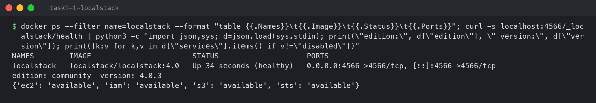

### 1. `terraform init`

```bash
terraform init
```

```
Initializing the backend...

Initializing provider plugins...
- Finding hashicorp/aws versions matching "~> 6.0"...
- Installing hashicorp/aws v6.67.0...
- Installed hashicorp/aws v6.67.0 (signed by HashiCorp)

Terraform has created a lock file .terraform.lock.hcl to record the provider
selections it made above. ...

Terraform has been successfully initialized!
```

`init` downloads the provider plugin into `.terraform/` and writes `.terraform.lock.hcl`, which
pins the exact version (`6.67.0`) so everyone running this code gets the same provider. The lock
file is committed to Git; `.terraform/` is not.

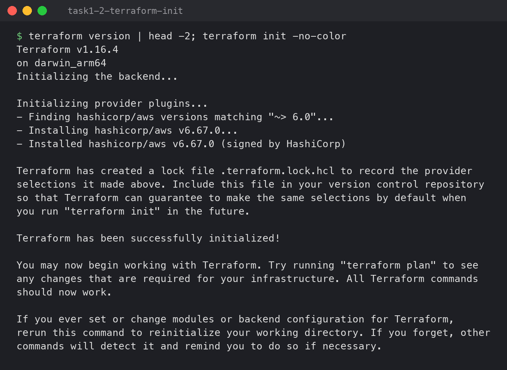

### 2. `terraform fmt`

```bash
terraform fmt -check -diff     # report only
terraform fmt                  # fix
terraform fmt -check && echo "all files formatted"
```

```
terraform.tfvars
--- old/terraform.tfvars
+++ new/terraform.tfvars
@@ -1,5 +1,5 @@
 aws_region        = "ap-south-1"
 bucket_name       = "sumit-24bcs10158-terraform-demo"
-environment     = "dev"
+environment       = "dev"
 enable_versioning = true
 use_localstack    = true
fmt -check exit code: 3
terraform.tfvars
all files formatted
```

I left one line misaligned on purpose. `fmt -check` exits non-zero (`3`) without changing
anything, which is what a CI pipeline runs. Plain `fmt` rewrites the file in the standard style.

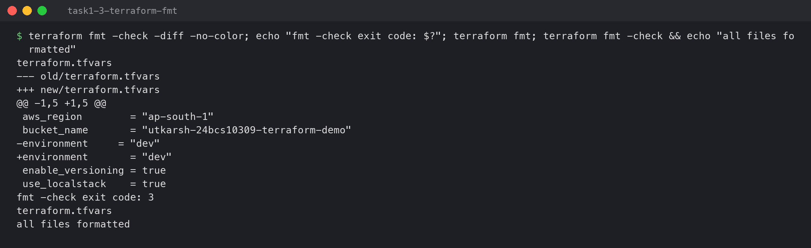

### 3. `terraform validate`

```bash
terraform validate
```

```
Success! The configuration is valid.
```

`validate` checks syntax, types and references **without** contacting AWS — e.g. a typo like
`aws_s3_bucket.dmeo.id` fails here, before any plan.

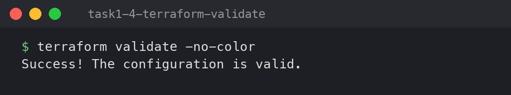

### 4. `terraform plan`

```bash
terraform plan -out=tfplan
```

```
  # aws_s3_bucket.demo will be created
  + resource "aws_s3_bucket" "demo" {
      + bucket                      = "sumit-24bcs10158-terraform-demo"
  # aws_s3_bucket_public_access_block.demo will be created
  # aws_s3_bucket_server_side_encryption_configuration.demo will be created
              + sse_algorithm     = "AES256"
  # aws_s3_bucket_versioning.demo will be created
          + status     = "Enabled"
  # aws_s3_object.welcome will be created
Plan: 5 to add, 0 to change, 0 to destroy.

Changes to Outputs:
  + bucket_name        = "sumit-24bcs10158-terraform-demo"
  + bucket_region      = "ap-south-1"
  + versioning_status  = "Enabled"
  + welcome_object_url = "s3://sumit-24bcs10158-terraform-demo/welcome.txt"

Saved the plan to: tfplan
```

(Shortened. The full plan is in [`../lab/transcript.txt`](../lab/transcript.txt).) The plan is
a dry run: Terraform compares the code with the state file and with what really exists, and
lists what it *would* do — `+` create, `~` change, `-` destroy. `(known after apply)` values,
like the ARN, are decided by AWS. `-out=tfplan` saves this exact plan so `apply` does exactly
what was reviewed.

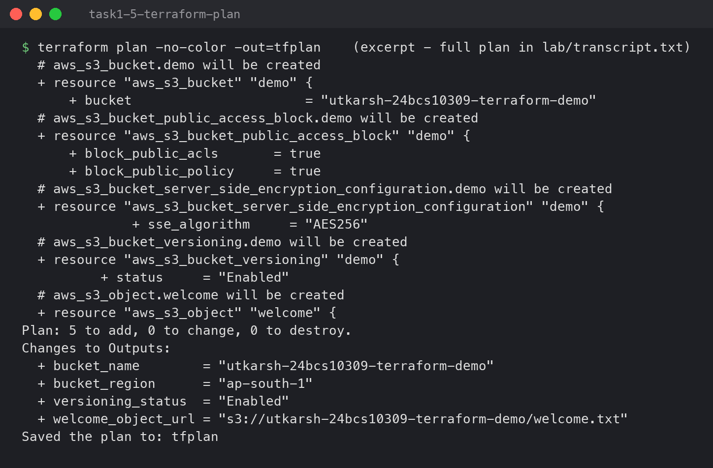

### 5. `terraform apply`

```bash
terraform apply tfplan
```

```
aws_s3_bucket.demo: Creating...
aws_s3_bucket.demo: Creation complete after 1s [id=sumit-24bcs10158-terraform-demo]
aws_s3_bucket_public_access_block.demo: Creating...
aws_s3_bucket_server_side_encryption_configuration.demo: Creating...
aws_s3_bucket_versioning.demo: Creating...
aws_s3_object.welcome: Creating...
...
Apply complete! Resources: 5 added, 0 changed, 0 destroyed.

Outputs:

bucket_arn = "arn:aws:s3:::sumit-24bcs10158-terraform-demo"
bucket_name = "sumit-24bcs10158-terraform-demo"
bucket_region = "ap-south-1"
versioning_status = "Enabled"
welcome_object_url = "s3://sumit-24bcs10158-terraform-demo/welcome.txt"
```

The ordering is the dependency graph in action. The bucket was created first and on its own,
then the four resources that reference it were created together.

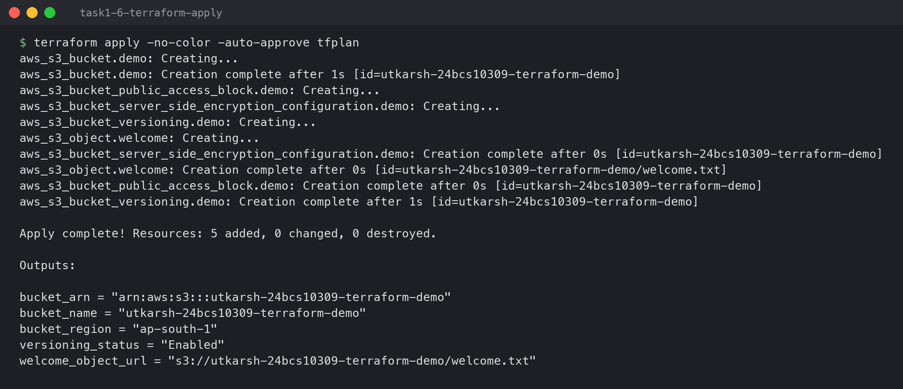

**Checking with a different tool** — the AWS CLI, not Terraform:

```bash
aws --endpoint-url=http://localhost:4566 s3 ls
aws --endpoint-url=http://localhost:4566 s3 ls s3://sumit-24bcs10158-terraform-demo/
aws --endpoint-url=http://localhost:4566 s3 cp s3://sumit-24bcs10158-terraform-demo/welcome.txt -
aws --endpoint-url=http://localhost:4566 s3api get-bucket-versioning --bucket sumit-24bcs10158-terraform-demo
aws --endpoint-url=http://localhost:4566 s3api get-bucket-encryption --bucket sumit-24bcs10158-terraform-demo
aws --endpoint-url=http://localhost:4566 s3api get-bucket-tagging --bucket sumit-24bcs10158-terraform-demo
```

```
2026-10-07 00:19:42 sumit-24bcs10158-terraform-demo
2026-10-07 00:19:42         42 welcome.txt
Created by Terraform for Session 18 - dev
{
    "Status": "Enabled"
}
{
    "ApplyServerSideEncryptionByDefault": {
        "SSEAlgorithm": "AES256"
    },
    "BucketKeyEnabled": false
}

aws: [ERROR]: An error occurred (NoSuchTagSet) when calling the GetBucketTagging operation: The TagSet does not exist
```

Bucket, object, versioning and encryption are all really there — but **the bucket has no
tags**, even though Terraform said it created it with five. See step 8.

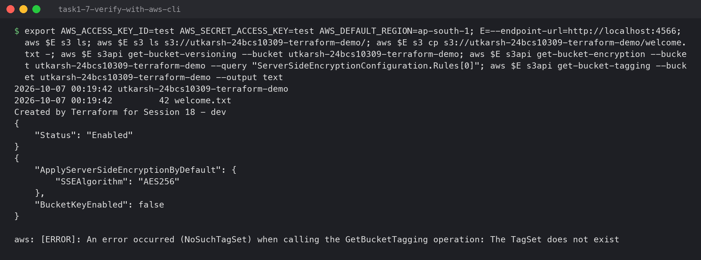

### 6. `terraform show`

```bash
terraform show | head -45
```

```
# aws_s3_bucket.demo:
resource "aws_s3_bucket" "demo" {
    arn                         = "arn:aws:s3:::sumit-24bcs10158-terraform-demo"
    bucket                      = "sumit-24bcs10158-terraform-demo"
    bucket_domain_name          = "sumit-24bcs10158-terraform-demo.s3.amazonaws.com"
    bucket_region               = "ap-south-1"
    force_destroy               = true
    id                          = "sumit-24bcs10158-terraform-demo"
    region                      = "ap-south-1"
    tags                        = {}
    tags_all                    = {}
    ...
```

`show` prints the **state** — Terraform's record of everything it manages, kept in
`terraform.tfstate`. The state already shows the problem: `tags = {}`. When Terraform read the
bucket back after creating it, the tags weren't there.

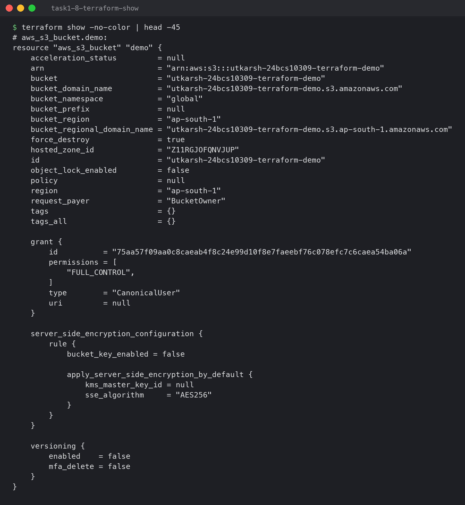

### 7. `terraform output`

```bash
terraform output
terraform output -raw bucket_arn
terraform state list
```

```
bucket_arn = "arn:aws:s3:::sumit-24bcs10158-terraform-demo"
bucket_name = "sumit-24bcs10158-terraform-demo"
bucket_region = "ap-south-1"
versioning_status = "Enabled"
welcome_object_url = "s3://sumit-24bcs10158-terraform-demo/welcome.txt"

arn:aws:s3:::sumit-24bcs10158-terraform-demo
aws_s3_bucket.demo
aws_s3_bucket_public_access_block.demo
aws_s3_bucket_server_side_encryption_configuration.demo
aws_s3_bucket_versioning.demo
aws_s3_object.welcome
```

`-raw` prints just the value with no quotes, which is how scripts consume outputs
(`ARN=$(terraform output -raw bucket_arn)`).

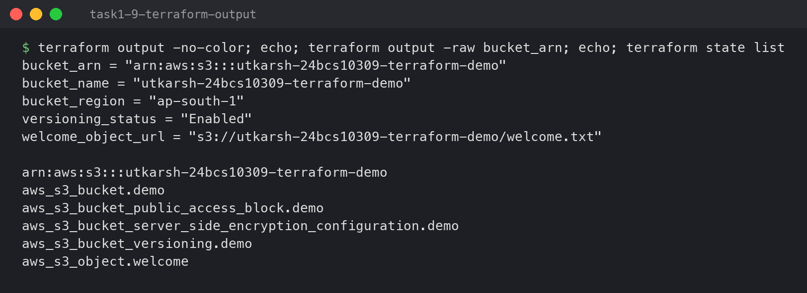

### 8. Plan again — drift detection

Running `plan` right after a successful `apply` should say "No changes". It didn't:

```
  # aws_s3_bucket.demo will be updated in-place
  ~ resource "aws_s3_bucket" "demo" {
        id                          = "sumit-24bcs10158-terraform-demo"
      ~ tags                        = {
          + "Environment" = "dev"
          + "Name"        = "sumit-24bcs10158-terraform-demo"
        }
      ~ tags_all                    = {
          + "Environment" = "dev"
          + "ManagedBy"   = "Terraform"
          + "Name"        = "sumit-24bcs10158-terraform-demo"
          + "Owner"       = "Sumit Akhuli"
          + "Project"     = "Session18"
        }
    }
Plan: 0 to add, 1 to change, 0 to destroy.
```

This is **drift**: the real infrastructure no longer matches the code, and `plan` noticed by
refreshing the real bucket. Here the cause is a version mismatch, not a person. LocalStack's
request log shows that on create the provider made only a `CreateBucket` call (it passes the
tags inside it, a newer S3 feature) and no separate tagging call. LocalStack 4.0, released in
2024, ignores tags passed that way. On real AWS the same drift happens when someone changes a resource by
hand in the console. Either way, the fix is the same: apply the code again.

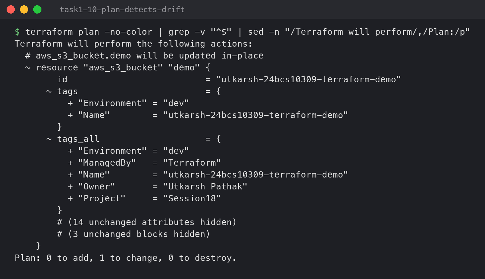

```bash
terraform apply -auto-approve
aws --endpoint-url=http://localhost:4566 s3api get-bucket-tagging --bucket sumit-24bcs10158-terraform-demo --output table
terraform plan
```

```
aws_s3_bucket.demo: Modifying... [id=sumit-24bcs10158-terraform-demo]
aws_s3_bucket.demo: Modifications complete after 0s [id=sumit-24bcs10158-terraform-demo]
Apply complete! Resources: 0 added, 1 changed, 0 destroyed.
--------------------------------------------------------
|                   GetBucketTagging                   |
+------------------------------------------------------+
||      Key     |                Value                ||
|+--------------+-------------------------------------+|
||  ManagedBy   |  Terraform                          ||
||  Name        |  sumit-24bcs10158-terraform-demo  ||
||  Owner       |  Sumit Akhuli                     ||
||  Project     |  Session18                          ||
||  Environment |  dev                                ||
No changes. Your infrastructure matches the configuration.
```

For an update, the provider used the separate `PutBucketTagging` call (LocalStack's log shows
`s3.PutBucketTagging => 204`), which LocalStack supports.
The tags are now on the bucket, and `plan` reports **No changes**.

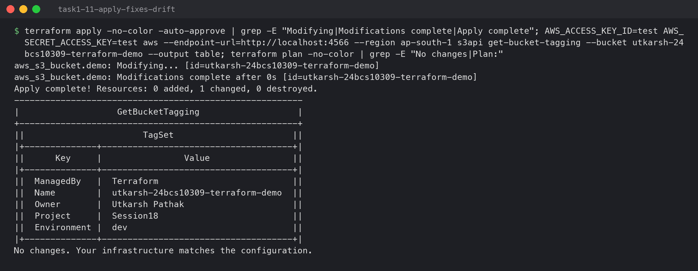

### 9. `terraform destroy`

```bash
terraform destroy -auto-approve
terraform state list | wc -l
aws --endpoint-url=http://localhost:4566 s3 ls
```

```
aws_s3_bucket_public_access_block.demo: Destroying... [id=sumit-24bcs10158-terraform-demo]
aws_s3_bucket_server_side_encryption_configuration.demo: Destroying... [id=sumit-24bcs10158-terraform-demo]
aws_s3_bucket_versioning.demo: Destroying... [id=sumit-24bcs10158-terraform-demo]
aws_s3_object.welcome: Destroying... [id=sumit-24bcs10158-terraform-demo/welcome.txt]
...
aws_s3_bucket.demo: Destroying... [id=sumit-24bcs10158-terraform-demo]
aws_s3_bucket.demo: Destruction complete after 0s
Destroy complete! Resources: 5 destroyed.
       0
buckets left:        0
```

Destroy goes in **reverse** dependency order: the four dependent resources first, the bucket
last. The state is empty and the bucket is gone.

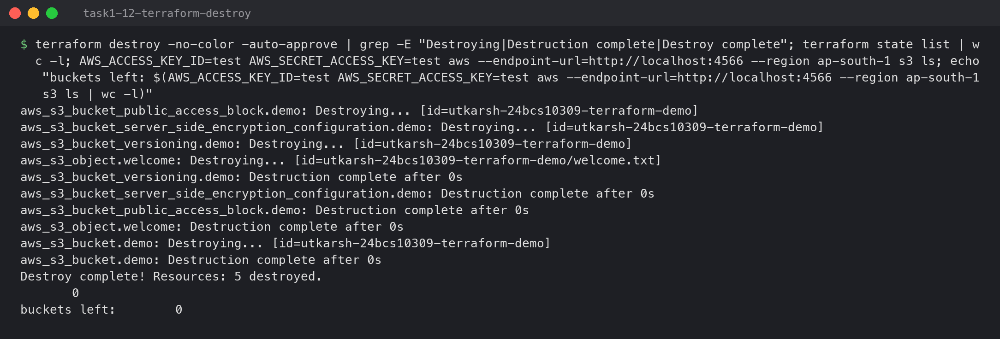

---

## Commands summary

| Command | What it does | Touches AWS? |
|---|---|---|
| `terraform init` | Download providers, set up backend, write lock file | No |
| `terraform fmt` | Rewrite `.tf` files in standard style | No |
| `terraform validate` | Check syntax, types, references | No |
| `terraform plan` | Compare code vs state vs reality; show the diff | Reads only |
| `terraform apply` | Make reality match the code | **Yes** |
| `terraform show` | Print the state | No |
| `terraform output` | Print output values | No |
| `terraform destroy` | Delete everything in the state | **Yes** |

`terraform.tfstate` is in `.gitignore`. It can contain secrets and must not be edited by two
people at once. Real projects keep it in a remote backend, e.g. an S3 bucket with state locking.
